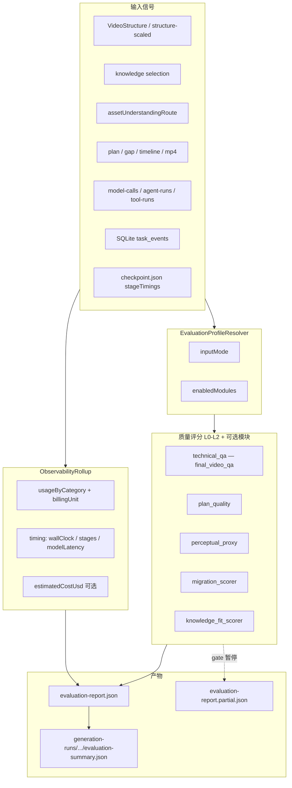

# VideoMaker 评测与可观测性体系 — 技术架构文档

> **文档日期：** 2026-07-04  
> **实现状态：** 已落地（L0–L2 + 可插拔 migration/knowledge_fit + 可观测性汇总）  
> **范围：** 不含 L3 定向 VLM / 成片创意 judge  
> **关联计划：** [`docs/superpowers/plans/2026-07-04-evaluation-system-plan.md`](../superpowers/plans/2026-07-04-evaluation-system-plan.md)  
> **E2E 清单：** [`docs/demos/evaluation-system-e2e-checklist.md`](../demos/evaluation-system-e2e-checklist.md)

---

## 1. 设计目标

VideoMaker 生成链路长、模型类别多（文本 / 视觉 / TTS / 生图 / 生视频）、且存在多个人工审核 gate。评测体系需要同时回答两类问题：

1. **质量如何？** — 成片技术合规、计划完整性、感知代理分，以及（按输入模式）结构迁移或知识模板契合度。
2. **成本与耗时如何？** — 按计费维度汇总用量，并按墙钟 / 管线阶段 / 模型延迟三层拆解耗时。

核心约束：

- **可插拔**：同一套 `report_builder` 根据 `EvaluationProfile` 决定启用哪些评分模块。
- **不重跑 pipeline**：历史任务可通过 lazy build 从磁盘 artifacts + 日志现场构建报告。
- **计费诚实**：禁止将 TTS / 生图 / 生视频折算为 token；报告按 `billingUnit` 分卡展示。
- **L2 为代理分**：当前 L2 不使用 VLM，仅基于 material review 分数与启发式规则；`scoreKind: "proxy"`。

---

## 2. 整体架构



### 2.1 代码分层

| 层级 | 路径 | 职责 |
|------|------|------|
| **契约** | `packages/contracts/schemas/evaluation-*.json`、`src/evaluation-types.ts` | JSON Schema + TypeScript 类型 |
| **共享内核** | `services/shared/evaluation/` | Profile 解析、各 scorer、可观测性 rollup、报告组装 |
| **Worker 钩子** | `services/worker/app/evaluation_hook.py` | 生成成功 / gate 暂停时写报告 |
| **API 服务** | `services/api/app/services/evaluation.py` | lazy build、rebuild、run 级汇总 |
| **API 路由** | `services/api/app/routers/generations.py` | `GET/POST .../evaluation` |
| **工作台** | `apps/web/features/evaluation/EvaluationPanel.tsx` | 质量分、用量五卡、阶段耗时展示 |

共享包通过 `PYTHONPATH` 同时被 Worker 与 API 引用，保证 **lazy build 与 pipeline 内写报告使用同一套评分逻辑**。

---

## 3. 评估方向与模块拆分

评测方向分为 **核心三层（L0–L2）**、**模式扩展模块**、**可观测性（非质量分，但与报告同落盘）** 三大类。

### 3.1 核心质量分（`enabledModules` 含 `core`）

| 层级 | 模块 ID | 实现文件 | 评估对象 | 说明 |
|------|---------|----------|----------|------|
| **L0 技术** | `technical_qa` | `final_video_qa.py` | 最终 MP4 | ffprobe 容器 / 时长 / 分辨率 / 音轨；无成片则 0 分 |
| **L1 计划** | `plan_quality` | `plan_quality.py` | generation-plan、gap-report、material-reviews | 分镜完整性、gap 覆盖、文字分镜占比、审核通过率 |
| **L2 感知代理** | `perceptual_proxy` | `perceptual_proxy.py` | material-reviews 分数 + storyboard role 分布 | **非 VLM**；`scoreKind: "proxy"` |

**综合分（`scores.core.weighted`）** 固定加权：

```text
core.weighted = L0 × 0.35 + L1 × 0.35 + L2 × 0.30
```

当 `partial: true` 或尚无 MP4 时，`scores.core.technical` 为 `null`，加权计算时 **按 0 计入**。

### 3.2 模式扩展模块（按 `inputMode` 启用）

| `inputMode` | 触发条件 | 额外模块 | 实现文件 |
|-------------|----------|----------|----------|
| `sample_migration` | 真实 sample structure（`sourceKind != "knowledge"`）或项目有 `primarySampleId` | `migration` | `migration_scorer.py` |
| `knowledge_guided` | knowledge 伪 sample / `structure-from-knowledge` / 非 baseline_only 且有 slots | `knowledge_fit` | `knowledge_fit_scorer.py` |
| `greenfield` | 无 reference structure，brief-only | 仅 `core` | — |

Profile 由 `profile_resolver.py` 读取 `structure-scaled.json`（或 synthesized / video-structure）、`asset-inventory.json`、`sample-selection.json` 自动推断。

### 3.3 可观测性（`observability`）

不属于 L0–L2 质量分，但与 `evaluation-report.json` 同文件输出，供复盘与成本分析：

| 子块 | 内容 |
|------|------|
| `usageByCategory` | 五类模型用量（见 §6） |
| `timing.wallClock` | 用户等待视角总耗时、排队、活跃、人工等待 |
| `timing.stages[]` | 管线阶段墙钟（含 `kind: human_gate`） |
| `timing.modelLatency` | 各类 model-call 延迟之和（与 stage 正交） |
| `estimatedCostUsd` | 基于 `price_table.yaml` 的估算（可选） |
| `incomplete` / `warnings` / `notes` | 采集不完整、ACP 不可追溯等标注 |

### 3.4 不在范围内（Out of Scope）

- L3 VLM / 成片创意 judge
- Langfuse 改造
- L4 人工标定集 UI
- 修改 generation Agent prompt

---

## 4. 报告产物与触发方式

| 模式 | 触发点 | 产物路径 |
|------|--------|----------|
| **同步全量** | Worker：`generation` `succeeded` 前（`evaluation_hook.maybe_write_generation_evaluation`） | `generations/{id}/evaluation-report.json` |
| **分段 partial** | Worker：各 human gate `_pause_for_review`（`VIDEOMAKER_EVAL_PARTIAL_ON_GATE=true`） | `generations/{id}/evaluation-report.partial.json` |
| **历史 lazy build** | API：`GET .../evaluation` 且缓存不存在（`VIDEOMAKER_EVAL_LAZY_BUILD=true`） | 现场写入 `evaluation-report.json` |
| **强制重算** | API：`POST .../evaluation/rebuild` | 覆盖已有报告，**不重跑** pipeline |
| **Run 级汇总** | API：双变体 run 全部终态 | `generation-runs/{runId}/evaluation-summary.json` |
| **样例分析** | Worker：sample analysis 成功 | `samples/{sampleId}/analysis/evaluation-report.json`（仅 observability + scope 标记） |

### 4.1 报告结构（`evaluation-report.json`）

```json
{
  "version": "1.0",
  "generationId": "...",
  "projectId": "...",
  "taskId": "...",
  "evaluatedAt": "ISO8601",
  "partial": false,
  "profile": {
    "inputMode": "sample_migration",
    "enabledModules": ["core", "migration"],
    "referenceStructureId": "...",
    "variantId": "high_conversion"
  },
  "verdict": {
    "status": "pass | warn | block | partial",
    "blockingIssues": [],
    "warnings": []
  },
  "scores": {
    "core": { "technical": 100, "plan": 100, "perceptual": 87.5, "weighted": 96.2 },
    "migration": { "weighted": 35.0, "slotCoverage": 1.0, ... }
  },
  "modules": { "technical_qa": {}, "plan_quality": {}, ... },
  "observability": { ... }
}
```

`verdict.status` 规则（`report_builder.py`）：

- 存在 `blockingIssues` → `block`
- 否则有 `warnings` → `warn`（partial 时可为 `partial`）
- 否则 → `pass`（partial 报告为 `partial`）

---

## 5. 实现方式

### 5.1 报告组装主流程（`report_builder.py`）

```text
build_evaluation_report(storage_root, project_id, generation_id, ...)
  ├─ resolve_evaluation_profile(generation_root)     → profile
  ├─ build_observability_summary(...)                → observability + cost
  ├─ score_plan_quality(generation_root)           → L1
  ├─ score_perceptual_proxy(generation_root)       → L2
  ├─ technical_qa（参数传入或 lazy 时 API 侧 ffprobe）→ L0
  ├─ 若 profile 含 migration → score_migration(...)
  ├─ 若 profile 含 knowledge_fit → score_knowledge_fit(...)
  ├─ 合并 verdict / scores / modules
  └─ validate_evaluation_report（可选 strict）
```

Worker 与 API 的差异仅在于 **谁负责跑 L0**：

- Worker：在 `maybe_write_generation_evaluation` 内调用 `find_generation_mp4` + `run_final_video_qa`
- API lazy build：`evaluation.py` 的 `_technical_qa_for_generation` 做同样的事

### 5.2 成片路径解析（`artifacts.find_generation_mp4`）

最终 MP4 **标准落盘路径**（与 Result 区播放 URL 一致）：

```text
storage/projects/{projectId}/renders/{generationId}/output.mp4
```

`find_generation_mp4` 按以下顺序查找非空文件：

1. `generations/{id}/output.mp4`
2. `generations/{id}/render/output.mp4`
3. `generations/{id}/preview/output.mp4`
4. `renders/{id}/output.mp4` ← **FFmpeg 渲染默认路径**

> **常见误解：** 仅检查 `generations/.../output.mp4` 会误判「无成片」；成功任务成片通常在 `renders/` 下。

### 5.3 Worker 集成点

- `services/worker/app/evaluation_hook.py` — 统一入口
- `services/worker/app/pipelines/videomaker_pipeline.py` — 成功前 / gate 暂停时调用 hook
- 失败写报告：gate partial 时 `partial=True`，`technical` 为 `null`

### 5.4 API 集成点

```http
GET  /api/generations/{generation_id}/evaluation
POST /api/generations/{generation_id}/evaluation/rebuild
GET  /api/projects/{project_id}/generation-runs/{run_id}/evaluation-summary
POST /api/projects/{project_id}/generation-runs/{run_id}/evaluation-summary/rebuild
```

`get_or_build_generation_evaluation` 逻辑：

1. 若 `evaluation-report.json` 存在且非 rebuild → 直接返回缓存
2. 否则 lazy build：读 SQLite `task_events`、磁盘 artifacts、`model-calls`
3. 写回 `evaluation-report.json`

路径段 `project_id` / `generation_id` 经 `validate_storage_segment` 校验。

### 5.5 工作台

`EvaluationPanel` 挂载于项目 Result 区，按当前 `generationId`：

- 自动 `GET .../evaluation`
- 展示 core / migration / knowledgeFit 分、五类用量卡、墙钟与 `stages[]` 条形图
- 「重算」按钮 → `POST .../evaluation/rebuild`

---

## 6. 可观测性：用量与耗时

### 6.1 用量五类（`observability_rollup.py`）

**禁止**提供跨类别「总 token」汇总行。

| 类别 | `billingUnit` | 汇总字段 | 数据来源 |
|------|---------------|----------|----------|
| `text_chat` | `tokens` | calls, promptTokens, completionTokens, totalTokens, latencyMs | `model-calls`（profile=text） |
| `vision_chat` | `tokens` | 同上 | profile=vision / video_understanding |
| `tts` | `chars` | calls, totalChars, latencyMs | `usageUnits.kind=chars` 或 output.charCount |
| `image_gen` | `images` | successfulImages, failedCalls, latencyMs | outputValid 计数 |
| `video_gen` | `video_seconds` | successfulJobs, totalDurationSec, requestedDurationSec, jobs[], latencyMs | video_submit + video_poll 合并 |

**Rollup 权威来源为 `model-calls` 求和**，不依赖 `agent-runs` 末次 token（多轮 agent 会低估）。

Chat token 多厂商字段经 `usage_normalize.normalize_chat_usage` 统一：

- `prompt_tokens` / `input_tokens` → `prompt`
- `completion_tokens` / `output_tokens` → `completion`

生视频 `jobs[]` 每条含：`jobId`, `slotId`, `model`, `requestedDurationSec`, `actualDurationSec`, `outputBytes`, `latencyMs`。`actualDurationSec` 优先来自落盘 ffprobe；缺失时 warning `video_duration_estimated`。

ACP material author 无 gateway model-calls 时：`observability.notes: ["acpAuthorUntracked"]`。

### 6.2 耗时三层（`observability.timing`）

#### 1）`wallClock` — 用户等待视角

| 字段 | 含义 |
|------|------|
| `totalMs` | 总墙钟（task_events 首尾或 stage 累计较大者） |
| `queuedMs` | `status=queued` 累计 |
| `activeMs` | 非 gate、非排队时间 |
| `humanWaitMs` | `awaiting_master_review` / `awaiting_storyboard_review` / `awaiting_material_review` 累计 |
| `startedAt` / `endedAt` | ISO8601 |

数据源：SQLite `task_events`（API 补全）+ `checkpoint.json` 的 `stageTimings` 交叉校验；`enrich_human_gate_stages_from_events` 为 gate 阶段补 `kind: human_gate"`。

#### 2）`stages[]` — 管线阶段（复盘主表）

写入 `GenerationCheckpoint`（`mark_stage_complete` / `open_human_gate` / `close_human_gate`）：

```json
{
  "stage": "generating_material",
  "startedAt": "...",
  "endedAt": "...",
  "durationMs": 320000,
  "status": "completed",
  "breakdown": [{ "slotId": "hook_visual", "durationMs": 120000 }]
}
```

人工 gate 条目：`status: "paused"`, `kind: "human_gate"`。

#### 3）`modelLatency` — 模型调用视角

从 `model-calls` 按类别汇总 `latencyMs` 之和；用于区分「时间花在 LLM 还是 video poll」，**不等于** stage 墙钟。

### 6.3 USD 估算（`price_table.py`）

内置 `services/shared/evaluation/price_table.yaml`：

- text/vision：per 1K tokens（prompt / completion 分列）
- tts：per 1K chars
- image：per image
- video：**per second**（`totalDurationSec`）

可通过 `VIDEOMAKER_EVAL_PRICE_TABLE` 覆盖。

---

## 7. 各维度指标计算细则

### 7.1 L0 技术分（`final_video_qa.py`）

| 项目 | 规则 |
|------|------|
| 起始分 | 100 |
| 无 MP4 文件 | **0**，`blockingIssues: ["output_mp4_missing"]` |
| 时长 < 1s | -40，`suspiciously_short_output` |
| 时长偏离目标 | 若 `|actual - target| / target > VIDEOMAKER_EVAL_DURATION_DRIFT_MAX`（默认 **0.25**），warning `duration_drift:XX%`，扣分 `min(25, drift × 50)` |
| 无音轨 | -15，`no_audio_stream` |
| ffprobe 流信息失败 | -10，`ffprobe_streams_failed` |
| 最终裁剪 | `max(0, min(100, score))` |

目标时长来源（`artifacts.target_duration_sec`）：`duration-target.json` 或 `generation-plan.json` 的 `targetSec` / `targetDurationSec` / `timeline.durationSec`。

`modules.technical_qa.technical` 输出：`validContainer`, `hasAudio`, `durationSec`, `resolution`。

环境变量 `VIDEOMAKER_EVAL_TECHNICAL_BLOCK=true` 时，warnings 可升格为 blocking。

### 7.2 L1 计划分（`plan_quality.py`）

| 项目 | 规则 |
|------|------|
| 起始分 | 100 |
| 无分镜场景（`storyboard` 数组或 `storyboard.scenes` 为空） | -25，`missing_storyboard_scenes` |
| Gap 未解决 | `weakSlots` / `missingSlots` 中 slot 未出现在 `completionActions` 的，每个 **-10**，上限 **-30** |
| 文字分镜过重 | role 为 `subtitle` / `packaging` / `text` 的场景占比 **> 60%** → -15 |
| Material review 通过率 | 若存在 `material-reviews/*/report.json` 且 `approved` 比例 < 1.0 → 扣 `(1 - ratio) × 20` |

输出：`sceneCount`, `materialReviewPassRatio`, `issues[]`。

### 7.3 L2 感知代理分（`perceptual_proxy.py`）

| 项目 | 规则 |
|------|------|
| 默认分 | **75**（无 material review 分数时） |
| Material review 分数 | 遍历 `material-reviews/*/report.json` 的 `scores`（dict 或标量），取均值 `avg`：<br>• 若 `avg ≤ 5`（5 分制）→ `score = avg × 20`<br>• 否则 → `score = avg` |
| 分镜 role 单一 | 所有 scene `role` 相同 → -10，`uniform_scene_roles` |

输出：`scoreKind: "proxy"`, `materialReviewScoreCount`, `issues[]`。

> L2 **不是** VLM 对成片的审美评判，而是 material review LLM 分数与简单结构启发式的代理。

### 7.4 迁移分（`migration_scorer.py`，仅 `sample_migration`）

四个子指标 ∈ [0, 1]，加权后 × 100 得 `migration.weighted`：

```text
migration.weighted = (
  slotCoverage            × 0.35
+ rolePreservation        × 0.25
+ hookPatternPreservation × 0.20
+ evidenceBinding         × 0.20
) × 100
```

| 子指标 | 计算方式 |
|--------|----------|
| **slotCoverage** | 参考 structure 的 slot `id` 集合中，被 `slot-matches.json`（`slotMatches` / `matches` / `slots`）或 storyboard `slotId` 覆盖的比例 |
| **rolePreservation** | 参考 slot `role` 集合 ∩ 计划侧 role 集合 / 参考 role 总数。计划侧 role 优先读 scene.`role`；缺失时通过 scene.`slotId` 回查 structure slot 的 `role` |
| **hookPatternPreservation**（`hookPreservation` 同值） | **结构模式**分：样本 hook（`narrative.segments` 的 `transcriptExcerpt` 或首条 ASR evidence）与生成 `masterNarration` 比较数量钩子、递进枚举、问句开场，以及 `hookTemplate` 数量承诺是否在生成中实现 |
| **contentCopyRisk** | 样本 hook 与生成 hook 的 **字面 token 重叠率**（0–1）。≥ 0.5 告警 `high_content_copy_risk`；高分表示可能照搬样本文案 |
| **evidenceBinding** | `evidence[].targetId`（如 `seg-1`）经 `slots[].segmentId` 映射到 slot `id`，再检查是否出现在计划 storyboard `slotId` 中的比例 |

参考 structure 读取顺序：`structure-scaled.json` → `synthesized-structure.json` → `video-structure.json`。

告警阈值：`slotCoverage < 0.8`；`rolePreservation < 0.6`；`hookPatternPreservation < 0.4`；`contentCopyRisk ≥ 0.5`。

### 7.5 知识契合分（`knowledge_fit_scorer.py`，仅 `knowledge_guided`）

| 项目 | 规则 |
|------|------|
| 起始分 | 80 |
| `analysisQuality.promoteReady === false` | -20 |
| `critical:` 前缀的 structure warnings | 每个 -5，上限 -25 |
| 分镜稀疏 | `sceneCount < ref_slots × 0.5` → -15 |

输出：`weighted`, `sceneCount`, `templateSlotCount`, `knowledgeEntryId?`, `issues[]`。

---

## 8. 存储路径与依赖 Artifacts

### 8.1 本地 dev Storage Root

API 进程默认：`services/api/storage/`（非 repo 根 `storage/`）。

### 8.2 Generation 评测依赖

| 用途 | 路径 |
|------|------|
| 计划 / 分镜 | `generations/{id}/generation-plan.json` |
| Gap | `generations/{id}/gap-report.json` |
| Slot 匹配 | `generations/{id}/slot-matches.json` |
| 旁白 | `generations/{id}/script-draft.json` |
| 参考结构 | `generations/{id}/structure-scaled.json` 等 |
| Material review | `generations/{id}/material-reviews/{slotId}/report.json` |
| 阶段耗时 | `generations/{id}/checkpoint.json` → `stageTimings` |
| 最终成片 | `renders/{id}/output.mp4` |
| 评测报告 | `generations/{id}/evaluation-report.json` |
| Model 调用日志 | `projects/{id}/logs/model-calls/*.json` |
| ACP 会话 | `projects/{id}/logs/tool-runs/acp_session_*.json` |

### 8.3 历史补跑限制

| 条件 | 报告行为 |
|------|----------|
| `VIDEOMAKER_OBSERVABILITY_CAPTURE=off` | `observability.incomplete: true` |
| 无 `model-calls` 目录或为空 | `incomplete` + warning `no_model_calls_found` |
| 无最终 MP4 | 跳过 L0（lazy build 时 `technical_qa` 为 null → core.technical 按 0） |
| ACP 外部 agent 素材 | `notes: acpAuthorUntracked`，外部 token 不可追溯 |
| 任务 `failed` 且无成片 | L1/L2/迁移/可观测性仍可评；L0 = 0 |

---

## 9. 环境变量

| 变量 | 默认 | 含义 |
|------|------|------|
| `VIDEOMAKER_EVAL_ENABLED` | `true` | Worker 完成时写 report |
| `VIDEOMAKER_EVAL_PARTIAL_ON_GATE` | `true` | gate 写 partial 报告 |
| `VIDEOMAKER_EVAL_LAZY_BUILD` | `true` | GET 缺失时 API 现场构建 |
| `VIDEOMAKER_EVAL_TECHNICAL_BLOCK` | `false` | L0 critical 是否升格为 block |
| `VIDEOMAKER_EVAL_PRICE_TABLE` | 内置 yaml | USD 估算表路径 |
| `VIDEOMAKER_EVAL_DURATION_DRIFT_MAX` | `0.25` | 成片时长漂移阈值（比例） |
| `VIDEOMAKER_EVAL_SCHEMA_STRICT` | `false` | schema 校验失败是否抛错 |
| `VIDEOMAKER_OBSERVABILITY_CAPTURE` | `full` | `off` 时标 incomplete |

---

## 10. 契约（Contracts）

| Schema | 用途 |
|--------|------|
| `evaluation-profile.schema.json` | inputMode、enabledModules、referenceStructureId |
| `evaluation-report.schema.json` | 完整报告结构 |
| `observability-summary.schema.json` | usageByCategory + timing |
| `usage-units.schema.json` | billingUnit / usageUnits 枚举 |
| `stage-timing.schema.json` | stage 条目 + breakdown + human_gate |
| `model-call-log` 扩展 | 可选 `usageUnits`（向后兼容 `tokenUsage`） |

校验命令：

```powershell
cd packages/contracts
npm run check
npm run validate:schemas
```

---

## 11. 测试与验证

```powershell
# 共享评测内核
cd services/shared/evaluation
python -m pytest tests -q

# API 路由
cd services/api
python -m pytest tests/test_evaluation_routes.py -q

# 契约
cd packages/contracts
npm run check
npm run validate:schemas
```

`tests/test_bench_runner.py` 提供合成 fixture 回归，覆盖 profile 解析、rollup、各 scorer 与 report_builder 组装。

---

## 12. 实例对照（同项目不同 generation）

项目 `7bed327a-f272-4887-a294-938d30b98723` 下两个 generation 说明 **generationId 与成片路径必须分开看**：

| 字段 | `5d5f3ec4`（failed） | `d6b59479`（succeeded） |
|------|----------------------|-------------------------|
| DB status | `failed` | `succeeded` |
| 成片 | 无 | `renders/d6b59479.../output.mp4`（≈3.65 MB） |
| L0 技术 | 0 | 100 |
| L1 计划 | 100 | 100 |
| L2 感知 | 90 | 87.5 |
| core 加权 | 62.0 | 96.2 |
| 迁移 weighted | 35.0 | **98.0**（修复 scorer 后） |

工作台 Result 区默认展示 **成功且有 `renderVideoUrl` 的 generation**；对 failed 任务评估时 L0 为 0 属预期，不代表工作台「看不到任何成片」。

---

## 13. 相关文件索引

| 类型 | 路径 |
|------|------|
| 实施计划 | `docs/superpowers/plans/2026-07-04-evaluation-system-plan.md` |
| E2E 清单 | `docs/demos/evaluation-system-e2e-checklist.md` |
| 共享内核 | `services/shared/evaluation/` |
| Worker hook | `services/worker/app/evaluation_hook.py` |
| API 服务 | `services/api/app/services/evaluation.py` |
| 工作台 UI | `apps/web/features/evaluation/EvaluationPanel.tsx` |
| 成片 URL | `services/api/app/services/generation_responses.py` |
| AGENTS 摘要 | `AGENTS.md` Evaluation 小节 |

---

## 14. 后续演进方向（未实施）

- L3：定向 VLM 对成片做创意 / 一致性 judge
- 样例分析完整质量分（当前 M5 以 observability 为主）
- Langfuse 与 evaluation-report 双向关联
- 人工标定集与分数校准 UI
