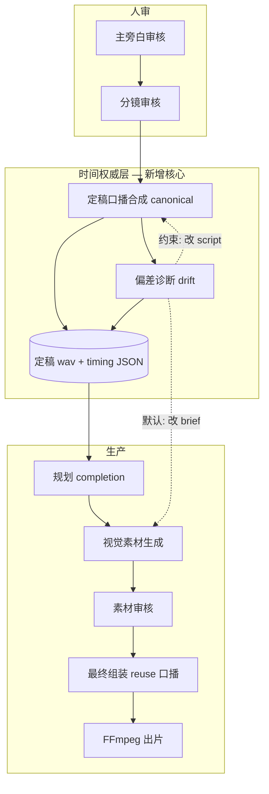

# 会话复盘：Narration Timing Authority — 口播定稿、音画同步与内容/视觉对齐

> **会话背景**：一次真实生成任务（generation `d6b59479`）暴露了旧管线的系统性问题——预览口播约 25 秒、定稿口播约 31 秒，画面素材却按预览时长制作，最终 FFmpeg 拼接后又被截断，导致末镜丢失、20 秒后出现音画错位。  
> **改造目标**：把「实测口播时长」提升为全片时间轴的唯一权威，让画面跟随口播而不是反过来；在素材生成前完成口播定稿与偏差诊断，避免 assembly 阶段再次合成语音。  
> **文档用途**：供团队复盘「为什么要改、改了什么、以后怎么扩展」；新人可读，不依赖逐字段对照代码。  
> **关联规格**：`docs/superpowers/plans/2026-07-05-narration-timing-authority-plan.md`  
> **验证清单**：`docs/demos/narration-timing-authority-e2e-checklist.md`

---

## 1. 旧实现里到底出了什么问题

### 1.1 两套口播、两个时间点

旧流程在「主旁白审核通过」与「分镜审核通过」之间，会先跑一轮 **预览 TTS**（preview），用它的时长去写分镜上每一镜的起止时间，并驱动后续的 HyperFrames 素材规划。

问题在于：

- 预览合成往往采用 **整段快速朗读** 或较粗粒度的参数，和最终成片用的 **分镜级语音指令**（每镜语速、情绪、音色偏好）不是同一条路径。
- 素材生成阶段按 **预览窗口** 做画面时长；assembly 阶段才用 **正式 TTS** 合成全片口播。
- 结果是：**画面按 A 秒设计，声音实际是 B 秒**，二者在规划层从未对齐。

这是本次事故的直接根因：不是某一镜写错字，而是 **时间权威归属错误**——预览时长被当成了「准定稿」。

### 1.2 素材在前、定稿口播在后

旧顺序大致是：

```text
分镜审核 → 规划（planning）→ 生成各镜视觉素材 → 合成最终口播 → 时间轴对齐 → FFmpeg 出片
```

「最终口播」出现在 **素材已经按错误时长做完之后**。后续只能通过拉伸时间轴、尾部 hold、或截断视频来补救，无法从根上保证每镜画面节奏与口播匹配。

### 1.3 FFmpeg 合成层的叠加伤害

即使时间轴数字「看起来」接近目标时长，旧合成器还存在两类工程问题（P0 紧急修复项）：

| 问题 | 表现 | 后果 |
|------|------|------|
| 分镜时间窗 overlap | 相邻镜 `startSec/endSec` 互相重叠，但拼接仍按各段全长累加 | 视频物理时长大于时间轴声明时长 |
| 视频长于音频时的处理 | 视频轨未 trim，音频 mux 时用 `-shortest` 或类似策略截断 | **末段分镜被无声截掉**，用户看到「最后一镜消失」 |
| 目标时长与分镜窗口矛盾 | 全局 ripple / hold_tail 后，`durationSec` 与 `max(endSec)` 不一致 | 20 秒后口播与画面对齐漂移 |

这些问题在「口播定稿点错误」之上又叠了一层 **合成几何错误**，使 d6b59479 类故障更加可见。

### 1.4 内容与视觉「数字对了但仍不匹配」

即便将来口播秒数写对了，仍可能存在：

- **口播密度问题**：字太多/太少，语速与镜头角色（hook、证明、CTA）不符。
- **画面节奏问题**：动画 beat 仍按「预估秒数」设计，实测口播更短或更长时，画面显得空或赶。
- **素材 spec 时长被放大**：作者工具把「偏好时长」与「权威窗口」取 max，导致 HyperFrames 片段长于实测口播窗口。

旧系统缺少 **预估 vs 实测** 的结构化诊断，也缺少 **默认以口播为准、改画面不改稿** 的响应策略。

### 1.5 失效与恢复不完整

当用户在审核阶段用自然语言修改主旁白或分镜文案时，旧逻辑可能只清 preview，不清 canonical 定稿；checkpoint 仍认为 planning 已完成，resume 时 **跳过 canonical 重合成**，继续用 stale 计划做素材——改字不生效或 silently 错配。

---

## 2. 优化方案总览：Narration Timing Authority

### 2.1 核心思想（一句话）

**在分镜审核通过、画面素材开工之前，用与成片完全相同的路径合成「定稿口播」，并以实测对齐结果作为全片唯一时间权威；assembly 只复用这份口播，不再重新 TTS。**

### 2.2 目标管线（新顺序）

```text
主旁白审核
    ↓
分镜撰写（时间窗仅作结构比例估算，不作定稿）
    ↓
分镜审核通过
    ↓
┌─ 定稿口播合成（canonical TTS）──────────────────────┐
│  输出：定稿 wav + 每镜实测起止时间 + 内容指纹       │
└──────────────────────────┬───────────────────────────┘
                           ↓
┌─ 偏差诊断与密度对齐（drift）────────────────────────┐
│  默认：画面适配口播（改 brief，不改 script）         │
│  例外：字密度越界 / 全片超时 → 改文案并重合成       │
└──────────────────────────┬───────────────────────────┘
                           ↓
规划 completion（plan / timeline 绑定实测时长）
                           ↓
仅视觉素材生成（HyperFrames / 图 / 视频等）
                           ↓
素材审核（可选）
                           ↓
最终组装（复用定稿口播，不 re-TTS）
                           ↓
时间轴编译 + FFmpeg 出片
```

### 2.3 四条（后扩展为七条）不变量

| # | 不变量 | 自然语言解释 |
|---|--------|--------------|
| 1 | **唯一音频权威** | 定稿 wav + 对齐 JSON 是全片口播与每镜窗口的唯一来源 |
| 2 | **同路径合成** | 定稿阶段与 assembly 阶段必须是同一套 TTS 入口、同一套分镜输入 |
| 3 | **音频驱动画面** | 素材时长 ≤ 实测口播窗口；禁止用「用户目标时长」把画面拉超过实测口播 |
| 4 | **Assembly 不 re-TTS** | 最终组装只复制/注册定稿 wav；缺失或过期则 fail-fast，禁止静默重合成 |
| 5 | **预估仅 layout** | canonical 前的时间窗只是排版 hint；canonical 后以实测为准 |
| 6 | **Visual-first** | 大偏差默认改画面 brief，不默认改 script |
| 7 | **Script-on-constraint** | 仅字密度/全片超时等硬约束才走改稿 + 重合成 |

### 2.4 设计决策备忘

- **不新增「口播定稿人工 gate」**：分镜审核通过后 **自动** 跑 canonical + drift，避免多一轮阻塞；偏差通过工作台展示与「一键修正文案」处理。
- **Drift 双 Agent 与人审分离**：密度对齐用 `scene_visual_adaptor` / `scene_script_adaptor`；人审 NL 改稿仍走 `storyboard_writer`，避免职责混淆。
- **TTS 重合成 hybrid**：整段模式必须全量重跑；分段模式预留按镜增量缓存（v1 可先全段 segment 重跑，接口已留 `changed_slot_ids`）。

---

## 3. 分阶段实现说明

### 3.1 Phase P0 — 合成几何紧急修复（与 canonical 可独立合并）

**目的**：即使旧管线未前移定稿点，也不应再出现「末镜丢失、overlap 膨胀」。

**做法摘要**：

1. **分镜片段归一化**：拼接前消除 overlap，clamp 到目标时长，丢弃零长段。
2. **视频 trim**：当视频轨长于目标时长时主动截断，而非把过长视频送入 mux。
3. **时间轴 ripple 归一化**：全局缩放/尾部 hold 后，保证分镜无 overlap 且尾部与口播结束时刻一致。
4. **禁止用「用户目标时长」作为 planned duration 上限** 去拉伸 storyboard（目标时长仅 UI 参考）。

**涉及模块**：FFmpeg 时间轴编译器、口播时间轴同步逻辑。

---

### 3.2 Phase P1 — Canonical 定稿口播（核心）

#### 3.2.1 新产物（落盘文件）

| 产物 | 作用 |
|------|------|
| `narration/canonical.wav` | 定稿全片口播 |
| `narration-timing.json` | 定稿对齐结果（角色标记为 canonical，含内容指纹、合成模式、每镜窗口） |
| `narration/drift-report.json` | 每镜预估 vs 实测诊断 |
| `narration/segments/` + segment 元数据 | 分段 TTS 模式下按镜缓存，支撑增量重合成 |

合约层（`packages/contracts`）新增/扩展了 narration timing、drift report、script draft、generation plan 等 schema，保证前后端与 worker 对「定稿 / 过期 / stale」语义一致。

#### 3.2.2 定稿合成模块（`canonical_narration.py`）

职责：

1. 调用与成片相同的 **主 wav 合成** 入口（支持整段 / 分段两种模式）。
2. 用 segment 时长或 Whisper 对齐，写回 **每镜实测起止时间** 到 script draft。
3. 标记 script 状态为 **canonical**，记录全片口播秒数。
4. 触发 drift 诊断（见 3.3）。
5. 支持 **失效**：改稿、revise fork 时删除 wav/timing/drift/checkpoint，并将 planning 标记为需重跑。

**关键时机**：定稿合成放在 **compositionAuthorBrief 归一化之后、planning completion 之前**（函数 `_synthesize_canonical_after_briefs`），确保 HF 作者 brief 与定稿口播基于同一版分镜。

**Fail-fast**：无 TTS gateway（非 fixture 环境）时不再静默跳过，直接报错 `canonical_tts_gateway_unavailable`。

#### 3.2.3 管线重排

| 旧行为 | 新行为 |
|--------|--------|
| 主旁白审核后跑 preview TTS，驱动分镜时间 | preview 不再作为 timing 来源；分镜撰写用 **结构比例估算** 窗口 |
| 分镜审核后直接 planning → 素材 | 分镜审核后 **先 canonical → drift → planning** |
| assembly 重新 TTS | assembly **reuse-only** 定稿 wav |

Checkpoint 阶段列表新增 `synthesizing_canonical_narration`、`adapting_narration_density`；resume 时 planning 跳过条件增加 **「canonical timing 仍与当前文案指纹一致」**。

#### 3.2.4 Planning 与素材时长绑定

- Planning 读取 **定稿 timing**，不是 preview。
- Timeline 总时长 = **实测口播时长**，不是用户填的目标时长。
- 素材作者解析每镜窗口时：优先 plan 内 storyboard → 定稿 timing → 结构 fallback；**移除 preview timing fallback**。
- 素材 spec 时长：**cap 在权威窗口内**，禁止 `max(作者偏好, 窗口)` 放大。

#### 3.2.5 Assembly reuse-only

TTS provider 在最终组装阶段：

1. 尝试从 `narration/canonical.wav` 复制到 `generated/master.wav`。
2. 校验内容指纹与当前 script 一致。
3. 缺失或 stale → 报错 `canonical_narration_unavailable`，提示重跑定稿阶段，**禁止** fallback 重新调用 TTS API。

#### 3.2.6 失效与 Revise

以下操作会 **invalidate** 定稿口播：

- 审核阶段 NL 修改主旁白 / 分镜（`script_draft_revise`）
- Drift 路径 B 用户「修正本镜文案并重合成口播」
- Revise fork 中 storyboard 范围变更

失效会清除：定稿 wav、timing、drift、segment 缓存，并 **unmark planning_completion**，保证 resume 必重跑 canonical → drift → planning。

---

### 3.3 Phase P1.7 — Drift：口播/画面密度对齐

#### 3.3.1 诊断（规则层，无 LLM）

canonical 完成后立即生成 drift 报告。每一镜比较：

- **预估秒数**（定稿前 layout 窗口）
- **实测秒数**（定稿对齐结果）
- **偏差比** = 实测 / 预估
- **字数、字/秒、角色预算带**

并分类根因：`within_budget` / `pace_mismatch` / `word_count_high` / `word_count_low`。

**全片超时**：若实测总时长超过用户目标时长约 5%，会对 **字数最多的镜** 标记为需改稿路径，并写入 `totalDurationOverTarget`。

#### 3.3.2 响应路径 A — Visual-first（默认）

适用：偏差主要来自「说得比预估快/慢」，但字密度仍在合理带内。

**规则层（零 LLM）**：

- 更新该镜 **compositionAuthorBrief.timingContext**（实测/预估/偏差比、motionDensity、beatCount）。
- 按偏差方向 **追加 authorPrompt 片段**（紧凑动画 vs 铺满 beat）。
- 分镜 `startSec/endSec` 已在 canonical 写回，此处以校验为主。

**LLM 层（可选）**：

- Agent **`scene_visual_adaptor`**：大偏差 + HF 镜时重写 brief / 微调 visual。
- **不改** script、masterNarration、voDirective。

环境开关：`VIDEOMAKER_DRIFT_LLM_VISUAL`（默认 true）。

#### 3.3.3 响应路径 B — Script-on-constraint（例外）

适用：字/秒越界、关键镜信息不足、全片超时等 **硬约束**。

- Agent **`scene_script_adaptor`**：按 drift 报告调整该镜 script（及必要 vo 指令），并同步 master 旁白对应片段。
- 之后 **invalidate + 重跑 canonical**（分段模式可只重跑变更镜，接口已预留）。
- 默认 **不自动** 改稿（`VIDEOMAKER_DRIFT_AUTO_SCRIPT=false`），工作台提供 **「修正本镜文案并重合成口播」** 按钮；自动改稿需显式开 env。

适配记录落盘于 `narration/drift-adaptations/`（visual / script 分目录）。

---

### 3.4 校验层 — composition_validator

在「写了模块但从不用」的 review 项修复后，校验已接入两处：

| 检查点 | 检查内容 |
|--------|----------|
| HF 素材提交前 | material spec 时长不得超过该镜权威口播窗口（默认 5% 容差） |
| FFmpeg 渲染前 | 分镜尾部时间与全片口播时长一致，无 overlap / 尾部漂移 |

避免「plan 看起来对齐、spec 或 concat 仍超长」的 silent failure。

---

### 3.5 API 与 Web

**新读接口**：

- 获取定稿 timing
- 获取 drift 报告

**Fix-script 写接口**（202 异步）：

- 创建独立子任务跑 script adaptor + canonical 重合成 + drift 重算
- **阶段门控**：素材生成中、最终组装中、渲染中、素材审核中 → 409 拒绝
- 避免 material 进行中改 script 造成更大错配

**Web**：

- `NarrationDriftPanel`：展示预估 vs 实测、定稿口播试听、一键 fix
- 仅在分镜审核或 canonical/drift 阶段显示，不在素材/渲染阶段展示

---

### 3.6 时间轴 light refresh

素材全部完成后，`sync_timeline_to_narration` 若检测到 **canonical timing 已与 plan 对齐**，则 **跳过** hold_tail / 全局 ripple 等重缩放，仅 refresh 口播 clip 引用——避免 assembly 末尾再次扭曲已正确的窗口。

---

## 4. 架构关系图



**数据权威流向**（简化）：

```text
script draft（文案 + 分镜）
        ↓ 定稿合成
canonical wav + 每镜实测窗口  ←── 唯一音频/窗口权威
        ↓ drift
更新 brief / 可选改 script → 可能重跑定稿
        ↓ planning
generation plan（timeline 绑定实测时长）
        ↓ 素材
HF spec.duration ≤ 镜窗口
        ↓ assembly
复制 canonical wav（不 re-TTS）
        ↓ render
validator 校验 → FFmpeg
```

---

## 5. 关键模块索引（便于代码定位）

| 模块路径 | 职责 |
|----------|------|
| `services/worker/app/pipelines/canonical_narration.py` | 定稿口播合成、失效、写 timing |
| `services/worker/app/pipelines/narration_drift.py` | drift 报告、规则/LLM 适配、fix-script 重合成 |
| `services/worker/app/pipelines/generation_pipeline.py` | 定稿时机（brief 之后）、plan 写入 drift URI |
| `services/worker/app/pipelines/narration_timeline.py` | 时间轴同步、canonical light refresh |
| `services/worker/app/pipelines/composition_validator.py` | 窗口/consistency 校验 |
| `services/worker/app/providers/tts_provider.py` | assembly reuse-only |
| `services/worker/app/providers/canonical_tts_reuse.py` | 定稿 wav 复制与指纹校验 |
| `services/worker/app/providers/hyperframes_material_provider.py` | spec 时长 cap + validator |
| `services/worker/app/render/ffmpeg_backend.py` | 渲染前 storyboard 一致性校验 |
| `services/worker/app/render/timeline_compiler/` | P0 overlap/trim 修复 |
| `services/worker/app/runtime/checkpoint.py` | 新阶段、resume 条件 |
| `services/api/app/routers/generations.py` | timing/drift/fix-script API |
| `apps/web/features/narration-drift/` | 工作台 drift 面板 |

Agent 与 prompt：

- `scene_visual_adaptor` — 画面节奏适配
- `scene_script_adaptor` — 约束触发改稿

---

## 6. 环境变量与默认策略

| 变量 | 默认 | 含义 |
|------|------|------|
| `VIDEOMAKER_DRIFT_LLM_VISUAL` | `true` | 大偏差 HF 镜是否调用画面适配 Agent |
| `VIDEOMAKER_DRIFT_AUTO_SCRIPT` | `false` | 是否自动改稿并重合成（否则用户一键 fix） |
| `VIDEOMAKER_DRIFT_MAX_SCRIPT_PASSES` | `1` | 每镜自动/手动 script 修正次数上限 |
| `VIDEOMAKER_TTS_SEGMENT_INCREMENTAL` | `false` | 分段 TTS 是否跳过未变更镜（v1.1 可默认 true） |
| `VIDEOMAKER_COMPOSITION_BRIEF_MODE` | `require` | 分镜必须带 composition brief，定稿在 brief 归一化后 |

---

## 7. 验证方式

**自动化（worker）**：

```powershell
cd services/worker
python -m pytest tests/test_narration_drift.py tests/test_narration_timing_resume.py tests/test_composition_validator.py tests/test_canonical_tts_reuse.py tests/test_narration_timeline.py -q
```

**合约**：

```powershell
cd packages/contracts
npm run check
npm run validate:schemas
```

**端到端**：见 `docs/demos/narration-timing-authority-e2e-checklist.md`（canonical 阶段事件、drift 面板、fix-script 202、assembly 无 re-TTS、改稿 stale 后 resume）。

---

## 8. 我们解决了什么、还没做什么

### 8.1 已解决

- 预览 TTS 与定稿 TTS 双轨导致的 **素材/口播时长系统性偏差**
- Assembly 重复 TTS 带来的 **成本与不一致**
- FFmpeg overlap / 截断导致的 **末镜丢失与 20s 后错位**（P0）
- 缺 drift 诊断时的 **「秒数对但节奏不对」**
- 改稿后 resume **跳过定稿** 的 stale 问题
- spec 时长 **放大超过口播窗口**
- fix-script **同步阻塞、无阶段门控** 的 API/UX 问题

### 8.2 已知后续（规格中已留接口）

- 分段 TTS **增量 segment 缓存**默认开启（v1.1）
- script 修正后可选 **全片 Whisper 再对齐**（默认关）
- Evaluation 面板 ingest drift 统计（L1 可选）
- 是否在 drift 过大时 **自动 pause** 在素材前（当前选择：不新增 gate，靠工作台）

---

## 9. 可复述给团队的三句话

1. **以前**：画面按「预览口播」做，声音按「正式口播」合成，两套时间打架。  
2. **现在**：分镜审完先定稿口播，实测窗口是唯一权威；画面 brief 和 HF 时长跟着口播走。  
3. **例外**：只有字太多/太少或全片超时才改文案并重合成；assembly 只复制定稿 wav，不再 secretly 重打 TTS。

---

## 10. 相关文档

- 实施计划（字段级规格）：`docs/superpowers/plans/2026-07-05-narration-timing-authority-plan.md`
- E2E 清单：`docs/demos/narration-timing-authority-e2e-checklist.md`
- 项目总览 env 说明：`AGENTS.md` § Drift / Canonical narration
