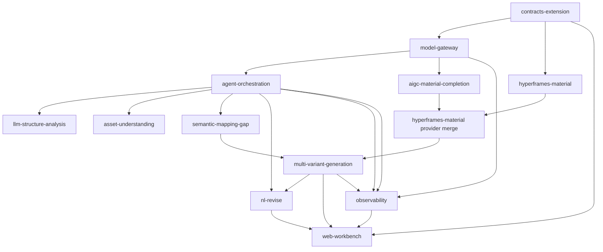

# P1 Execution Order And Agent Prompts

本文档定义 P1 各专项计划的**依赖关系、执行波次、并行策略**，以及在新 Cursor 会话中交给 Agent 执行时**可直接复制粘贴的提示词**。

**Master plan:** [`2026-05-29-videomaker-p1-implementation-plan.md`](./2026-05-29-videomaker-p1-implementation-plan.md)

**前置条件：** P0 已合并到 `main`；每个专项使用独立 worktree + feature 分支；`.worktrees/` 已在 `.gitignore`。

---

## 1. 依赖关系图



**说明：** `hyperframes-material` 模板与工具可在 Wave 2 与 `model-gateway` 并行；与 `aigc-material` 的 **completion_registry 注册**在 Wave 4 前合并协调。`observability` 的 **model-gateway status API** 应尽早合并，供 web Phase B Task 7 使用。

---

## 2. 执行波次（Waves）

### Wave 0 — 串行（必须先完成）

| 顺序 | 计划 | 分支 | 合并目标 |
| --- | --- | --- | --- |
| 1 | contracts-extension | `feature/p1-contracts-extension` | `main` |

**Gate：** `packages/contracts` 的 `npm run check` + `validate:schemas` 通过后再开 Wave 1 worktree。

---

### Wave 1 — 并行（contracts 已合并）

| 计划 | 分支 | 并行组 |
| --- | --- | --- |
| model-gateway | `feature/p1-model-gateway` | **A** |
| hyperframes-material（模板 + Tool，不含 registry 合并） | `feature/p1-hyperframes-material` | **A** |
| web-workbench（仅 contracts 类型 + fixture UI） | `feature/p1-web-workbench` | **B**（可选提前） |

**Gate：** model-gateway 合并后再开 Wave 2 的 agent-orchestration。

---

### Wave 2 — 串行 + 并行

| 顺序 | 计划 | 分支 | 说明 |
| --- | --- | --- | --- |
| 2a | agent-orchestration | `feature/p1-agent-orchestration` | **必须**在 gateway 之后 |
| 2b | llm-structure-analysis | `feature/p1-llm-structure-analysis` | 与 2c、2d 并行 |
| 2c | asset-understanding | `feature/p1-asset-understanding` | 与 2b、2d 并行 |
| 2d | semantic-mapping-gap | `feature/p1-semantic-mapping-gap` | 建议在 2c 之后或 rebase 含 2c |

**Gate：** 三条 intelligence 分支合并后，进入 Wave 3。

---

### Wave 3 — 并行（intelligence 已合并）

| 计划 | 分支 | 并行组 |
| --- | --- | --- |
| aigc-material-completion | `feature/p1-aigc-material` | **C** |
| hyperframes-material（provider 注册 + 与 registry 集成） | rebase/merge `feature/p1-hyperframes-material` | **C** |

**Gate：** 两个都合并；`completion_registry` 同时注册 AIGC + HF providers。

---

### Wave 4 — 串行

| 顺序 | 计划 | 分支 |
| --- | --- | --- |
| 4 | multi-variant-generation | `feature/p1-multi-variant-generation` |

**Gate：** API 返回 `generations[]`（多 taskId）；latest  reload 策略落地。

---

### Wave 5 — 分阶段（observability 前置 + web 两阶段）

| 子波 | 计划 | 分支 | 说明 |
| --- | --- | --- | --- |
| **5a** | observability（**至少 Task 4** model-gateway status） | `feature/p1-observability` | 可在 multi-variant 之后或与之并行开发；**status API 必须先于 web Phase B** |
| **5b** | nl-revise | `feature/p1-nl-revise` | 依赖 Wave 4 |
| **5c** | web-workbench **Phase A** 收尾 | `feature/p1-web-workbench` | evidence、variant picker、NL fixture；可与 5b 并行 |
| **5d** | web-workbench **Phase B** | 同上分支继续 | multi-task 进度、artifact 预览、gateway 状态面板；依赖 5a + Wave 4 + material |

**Gate 5d：** `GET /api/settings/model-gateway` 可用；multi-variant 响应为数组；worker 在 material 阶段推送 `artifactRefs`。

---

### Wave 6 — 收尾

| 计划 | 分支 |
| --- | --- |
| observability 完整（agent-runs + Langfuse 可选，若 5a 仅做了 status） | `feature/p1-observability` |
| integration/p1-demo-flow | `integration/p1-demo-flow` |

**integration 任务：** 端到端 demo、`docs/demos/p1-demo-checklist.md`、删除残留 P0 规则代码；验证 web Phase A+B 与双 task 进度。

---

## 3. 推荐合并顺序（线性）

```text
1.  feature/p1-contracts-extension
2.  feature/p1-model-gateway
3.  feature/p1-hyperframes-material        (可 step 2 并行开发，step 7 前 merge)
4.  feature/p1-agent-orchestration
5.  feature/p1-llm-structure-analysis
6.  feature/p1-asset-understanding
7.  feature/p1-semantic-mapping-gap
8.  feature/p1-aigc-material
9.  feature/p1-multi-variant-generation
10. feature/p1-observability          (至少 model-gateway status，供 web Phase B)
11. feature/p1-nl-revise
12. feature/p1-web-workbench         (Phase A 可提前；Phase B 在 10+9 之后)
13. feature/p1-observability         (补全 agent-runs / Langfuse，若 step 10 未做)
14. integration/p1-demo-flow
```

---

## 4. 并行开发规则

**禁止并行：**

- 未合并的 contracts schema 变更与其他分支同时改同一 schema 文件。
- 在 `agent-orchestration` 未合并时删除 `structure_pipeline.py` 的其他分支仍引用它。
- `TaskEvent.stage` 枚举变更不同步 `apps/web` 进度文案。

**安全并行：**

- Wave 1：`model-gateway` + `hyperframes-material` + `web` fixtures。
- Wave 2：`llm-structure` + `asset-understanding` + `semantic-mapping`（不同文件为主）。
- Wave 3：`aigc-material` + HF provider 集成（需沟通 `completion_registry.py`）。
- Wave 5b/5c：`nl-revise` + web Phase A。
- Wave 5d 前：确保 `observability` 的 model-gateway status 已合并。

**Web 两阶段：**

- **Phase A**（Wave 1 可启动）：fixture UI，不依赖 live multi-task API。
- **Phase B**（Wave 5d）：依赖 multi-variant + model-gateway status + material artifactRefs。

---

## 5. 新会话 Agent 提示词（复制粘贴）

> 将 `{PLAN_FILE}` 替换为对应计划文件名；worktree 路径按本机调整。每个会话**只执行一个**专项计划。

---

### 5.1 Contracts Extension

```text
你是 VideoMaker 项目的 P1 contracts-extension 专项实现 Agent。

请先阅读：
- D:\VideoMaker\AGENTS.md
- D:\VideoMaker\docs\superpowers\specs\2026-05-27-videomaker-design.md
- D:\VideoMaker\docs\superpowers\plans\2026-05-29-videomaker-p1-implementation-plan.md
- D:\VideoMaker\docs\superpowers\plans\2026-05-29-p1-contracts-extension-plan.md
- D:\VideoMaker\docs\superpowers\plans\2026-05-29-p1-execution-order-and-prompts.md

你的任务：
1. 从 main 创建 worktree：D:\VideoMaker\.worktrees\p1-contracts，分支 feature/p1-contracts-extension。
2. 严格按 contracts-extension plan 使用 TDD 执行；这是 P1 Wave 0，必须最先完成。
3. 只修改 plan 允许的文件：packages/contracts/** 及 plan 中列出的 worker schema_loader 测试。
4. 不要修改 services/api、services/worker 业务逻辑、apps/web（除 schema_loader 测试期望）。
5. 新增 EditIntent、MaterialSpec、AgentRunLog schema；扩展 TaskEvent、AssetInventory、GapReport、RenderTimeline；添加 variants/registry.yaml。
6. 锁定决策：默认 enabled variants 为 high_click、high_conversion。

完成前必须运行：
cd D:\VideoMaker\.worktrees\p1-contracts\packages\contracts
npm run check
npm run validate:schemas

cd ..\..\services\worker
python -m pytest tests/test_schema_loader.py -v

全部通过后提交（仅当用户要求 commit 时）。完成后告知应合并到 main 再开始 Wave 1。
```

---

### 5.2 Model Gateway

```text
你是 VideoMaker 项目的 P1 model-gateway 专项实现 Agent。

请先阅读：
- D:\VideoMaker\AGENTS.md
- D:\VideoMaker\docs\superpowers\plans\2026-05-29-videomaker-p1-implementation-plan.md
- D:\VideoMaker\docs\superpowers\plans\2026-05-29-p1-model-gateway-plan.md
- D:\VideoMaker\docs\superpowers\plans\2026-05-29-p1-execution-order-and-prompts.md

前置：feature/p1-contracts-extension 已合并到 main。从最新 main 创建 worktree。

你的任务：
1. Worktree：D:\VideoMaker\.worktrees\p1-gateway，分支 feature/p1-model-gateway。
2. 实现 ModelGateway：OpenAI 兼容 text/vision/TTS/image + 可插拔 video submit/poll。
3. 禁止引入 LiteLLM。
4. 修改 llm_tool.py 接入 gateway；保留 fixture_mode 供 CI。
5. 只修改 plan 允许的文件：services/worker/app/gateway/**、llm_tool.py、相关 tests。

完成前必须运行：
cd D:\VideoMaker\.worktrees\p1-gateway\services\worker
python -m pytest tests/test_model_gateway.py tests/test_openai_compatible_providers.py tests/test_llm_tool.py -v
python -m compileall app
```

---

### 5.3 Agent Orchestration

```text
你是 VideoMaker 项目的 P1 agent-orchestration 专项实现 Agent。

请先阅读：
- D:\VideoMaker\AGENTS.md
- D:\VideoMaker\docs\superpowers\plans\2026-05-29-videomaker-p1-implementation-plan.md
- D:\VideoMaker\docs\superpowers\plans\2026-05-29-p1-agent-orchestration-plan.md
- D:\VideoMaker\docs\superpowers\plans\2026-05-29-p1-execution-order-and-prompts.md

前置：contracts-extension + model-gateway 已合并到 main。

你的任务：
1. Worktree：D:\VideoMaker\.worktrees\p1-agents，分支 feature/p1-agent-orchestration。
2. 实现 AgentRunner、PromptLoader、AgentRunStore。
3. 用 Agent + fixture 替换 structure_pipeline 及 generation 确定性语义逻辑。
4. 删除 structure_pipeline.py；LLM 失败不得回退规则模式。
5. 允许修改：services/worker/app/agents/**、pipelines/**、llm_tool fixtures、packages/prompts/agents/**、相关 tests。

完成前必须运行：
cd D:\VideoMaker\.worktrees\p1-agents\services\worker
python -m pytest -v
python -m compileall app

cd ..\..\services\api
python -m pytest -v
```

---

### 5.4 LLM Structure Analysis

```text
你是 VideoMaker 项目的 P1 llm-structure-analysis 专项实现 Agent。

请先阅读：
- D:\VideoMaker\AGENTS.md
- D:\VideoMaker\docs\superpowers\plans\2026-05-29-p1-llm-structure-analysis-plan.md
- D:\VideoMaker\docs\superpowers\plans\2026-05-29-p1-execution-order-and-prompts.md

前置：agent-orchestration 已合并。可与 asset-understanding、semantic-mapping-gap 并行。

你的任务：
1. Worktree：D:\VideoMaker\.worktrees\p1-structure，分支 feature/p1-llm-structure-analysis。
2. 实现 multimodal StructureAnalyst：structure_inputs.py、structure_validator.py、vision profile。
3. 强化 structure_analyst.md prompt 与 evidence 校验。
4. 只修改 plan 允许的文件范围。

完成前必须运行：
cd D:\VideoMaker\.worktrees\p1-structure\services\worker
python -m pytest tests/test_structure_inputs.py tests/test_structure_validator.py tests/test_structure_analyst_agent.py tests/test_p0_demo_pipeline.py -v
```

---

### 5.5 Asset Understanding

```text
你是 VideoMaker 项目的 P1 asset-understanding 专项实现 Agent。

请先阅读：
- D:\VideoMaker\AGENTS.md
- D:\VideoMaker\docs\superpowers\plans\2026-05-29-p1-asset-understanding-plan.md
- D:\VideoMaker\docs\superpowers\plans\2026-05-29-p1-execution-order-and-prompts.md

前置：agent-orchestration 已合并。

你的任务：
1. Worktree：D:\VideoMaker\.worktrees\p1-assets，分支 feature/p1-asset-understanding。
2. 实现 ContentStrategist、asset_understanding.py、highlight 打分与 visualTags/suggestedSegmentRoles。
3. 接入 generation pipeline 的 analyzing_assets 阶段。
4. 只修改 plan 允许的文件。

完成前必须运行：
cd D:\VideoMaker\.worktrees\p1-assets\services\worker
python -m pytest tests/test_asset_understanding.py tests/test_generation_plan.py -v
```

---

### 5.6 Semantic Mapping And Gap Planning

```text
你是 VideoMaker 项目的 P1 semantic-mapping-gap 专项实现 Agent。

请先阅读：
- D:\VideoMaker\AGENTS.md
- D:\VideoMaker\docs\superpowers\plans\2026-05-29-p1-semantic-mapping-gap-plan.md
- D:\VideoMaker\docs\superpowers\plans\2026-05-29-p1-execution-order-and-prompts.md

前置：agent-orchestration 已合并；建议 rebase 含 asset-understanding。

你的任务：
1. Worktree：D:\VideoMaker\.worktrees\p1-gap，分支 feature/p1-semantic-mapping-gap。
2. 实现 SlotMapper、GapPlanner Agent 与 gap_selection.py 提供商选择算法（master plan §8.4）。
3. matchReason 必须为自然语言；VideoGenQuota 接口预留（quota=1）。
4. 只修改 plan 允许的文件。

完成前必须运行：
cd D:\VideoMaker\.worktrees\p1-gap\services\worker
python -m pytest tests/test_gap_selection.py tests/test_slot_mapper_agent.py tests/test_generation_plan.py -v
```

---

### 5.7 AIGC Material Completion

```text
你是 VideoMaker 项目的 P1 aigc-material-completion 专项实现 Agent。

请先阅读：
- D:\VideoMaker\AGENTS.md
- D:\VideoMaker\docs\superpowers\plans\2026-05-29-p1-aigc-material-completion-plan.md
- D:\VideoMaker\docs\superpowers\plans\2026-05-29-p1-execution-order-and-prompts.md

前置：model-gateway + semantic-mapping-gap 已合并。

你的任务：
1. Worktree：D:\VideoMaker\.worktrees\p1-aigc，分支 feature/p1-aigc-material。
2. 实现 ImageGenTool、VideoGenTool、TTSTool、completion_registry、VideoGenQuota（每 generation 最多 1 次 video）。
3. 接入 generation_pipeline generating_material 阶段；失败不 fallback。
4. 只修改 plan 允许的文件。

完成前必须运行：
cd D:\VideoMaker\.worktrees\p1-aigc\services\worker
python -m pytest tests/test_image_gen_tool.py tests/test_video_gen_quota.py tests/test_completion_registry.py -v
```

---

### 5.8 HyperFrames Material

```text
你是 VideoMaker 项目的 P1 hyperframes-material 专项实现 Agent。

请先阅读：
- D:\VideoMaker\AGENTS.md
- D:\VideoMaker\docs\superpowers\plans\2026-05-29-p1-hyperframes-material-plan.md
- D:\VideoMaker\docs\superpowers\plans\2026-05-29-p1-execution-order-and-prompts.md

前置：contracts-extension + agent-orchestration 已合并（可与 model-gateway 早期并行做模板）。

你的任务：
1. Worktree：D:\VideoMaker\.worktrees\p1-hf-material，分支 feature/p1-hyperframes-material。
2. 实现 HyperFramesMaterialTool、benefit-card/title-lower-third/ken-burns 模板、MaterialAuthor Agent。
3. 实现 hyperframes_material_provider；在 aigc 分支 merge 后注册到 completion_registry。
4. 只修改 plan 允许的文件。

完成前必须运行：
cd D:\VideoMaker\.worktrees\p1-hf-material\services\worker
python -m pytest tests/test_hyperframes_material_tool.py -v
python -m compileall app
```

---

### 5.9 Multi-Variant Generation

```text
你是 VideoMaker 项目的 P1 multi-variant-generation 专项实现 Agent。

请先阅读：
- D:\VideoMaker\AGENTS.md
- D:\VideoMaker\docs\superpowers\plans\2026-05-29-p1-multi-variant-generation-plan.md
- D:\VideoMaker\docs\superpowers\plans\2026-05-29-p1-web-workbench-plan.md  （Frontend Contract 章节）
- D:\VideoMaker\docs\superpowers\plans\2026-05-29-p1-execution-order-and-prompts.md

前置：semantic-mapping-gap + aigc-material + hyperframes-material 已合并。

你的任务：
1. Worktree：D:\VideoMaker\.worktrees\p1-variants，分支 feature/p1-multi-variant-generation。
2. POST generation-plan 返回 generations[]（每 variant 独立 generationId + taskId）；默认 high_click + high_conversion。
3. 实现 latest generation  reload（Option A 或 B，见 plan）供前端多 tab 恢复。
4. 每 generationId 独立 VideoGenQuota=1。
5. 修改 API + worker；更新 test_p0_flow_routes 期望。

完成前必须运行：
cd D:\VideoMaker\.worktrees\p1-variants\services\api
python -m pytest tests/test_multi_variant_generation.py tests/test_p0_flow_routes.py -v

cd ..\worker
python -m pytest tests/test_variant_overrides.py -v
```

---

### 5.10 Natural Language Revise

```text
你是 VideoMaker 项目的 P1 nl-revise 专项实现 Agent。

请先阅读：
- D:\VideoMaker\AGENTS.md
- D:\VideoMaker\docs\superpowers\plans\2026-05-29-p1-nl-revise-plan.md
- D:\VideoMaker\docs\superpowers\plans\2026-05-29-p1-execution-order-and-prompts.md

前置：multi-variant-generation 已合并。

你的任务：
1. Worktree：D:\VideoMaker\.worktrees\p1-revise，分支 feature/p1-nl-revise。
2. 实现 EditIntentParser、IntentApplier、revise_pipeline、POST /api/generations/{id}/revise。
3. 新 generationId，不覆盖源 generation；持久化 edit-intent.json。
4. 只修改 plan 允许的文件。

完成前必须运行：
cd D:\VideoMaker\.worktrees\p1-revise\services\api
python -m pytest tests/test_revise_generation.py -v

cd ..\worker
python -m pytest tests/test_intent_applier.py tests/test_revise_pipeline.py -v
```

---

### 5.11 Web Workbench P1

```text
你是 VideoMaker 项目的 P1 web-workbench 专项实现 Agent。

请先阅读：
- D:\VideoMaker\AGENTS.md
- D:\VideoMaker\docs\superpowers\plans\2026-05-29-p1-web-workbench-plan.md
- D:\VideoMaker\docs\superpowers\plans\2026-05-29-p1-multi-variant-generation-plan.md  （若做 Phase B Task 10）
- D:\VideoMaker\docs\superpowers\plans\2026-05-29-p1-execution-order-and-prompts.md

说明：本计划分 Phase A（fixture UI）与 Phase B（进度/诊断/多 task）。同一会话请只做当前阶段，避免 scope 过大。

Phase A 前置：contracts-extension 已合并（Wave 1 可开始）。
Phase B 前置：multi-variant + observability model-gateway status + material 阶段 artifactRefs。

你的任务：
1. Worktree：D:\VideoMaker\.worktrees\p1-web，分支 feature/p1-web-workbench。
2. Phase A：VariantPicker/Tabs、StructureEvidence、AIGC badges、NL revise（fixture）、apiClient + fixture-resolver。
3. Phase B：stageLabels 全覆盖、ModelGatewayStatusPanel、TaskArtifactPreview、useMultiTaskProgress、AgentRunsDrawer（可选）、P1 formatTaskError。
4. 只修改 apps/web/**；不要改 worker/api。
5. ProjectWorkbench 从单 taskId 迁移为 activeGenerations[]（Phase B）。

完成前必须运行：
cd D:\VideoMaker\.worktrees\p1-web\apps\web
npm run typecheck
npm run test
npm run build
```

**Phase A 专用提示（Wave 1/5c）：** 只执行 web-workbench plan 的 Task 1–6，跳过 Task 7–13。

**Phase B 专用提示（Wave 5d）：** 在 Phase A 已 merge 的 worktree 上执行 Task 7–13；确认 GET /api/settings/model-gateway 与 generations[] API 可用。

---

### 5.12 Observability

```text
你是 VideoMaker 项目的 P1 observability 专项实现 Agent。

请先阅读：
- D:\VideoMaker\AGENTS.md
- D:\VideoMaker\docs\superpowers\plans\2026-05-29-p1-observability-plan.md
- D:\VideoMaker\docs\superpowers\plans\2026-05-29-p1-web-workbench-plan.md  （ModelGatewayStatusPanel 消费方）
- D:\VideoMaker\docs\superpowers\plans\2026-05-29-p1-execution-order-and-prompts.md

前置：agent-orchestration + model-gateway 已合并。

分阶段执行（推荐）：
- **阶段 1（Wave 5a，优先）：** 仅 Task 4 GET /api/settings/model-gateway + tests — 供 web Phase B。
- **阶段 2（Wave 6）：** agent-runs API、ObservabilitySink、Langfuse 可选。

你的任务：
1. Worktree：D:\VideoMaker\.worktrees\p1-obs，分支 feature/p1-observability。
2. 实现 model_gateway_status.py；响应不得含 API Key。
3. 实现 GET /api/generations/{id}/agent-runs（阶段 2）。
4. Langfuse 默认关闭；不影响任务恢复。

完成前必须运行：
cd D:\VideoMaker\.worktrees\p1-obs\services\api
python -m pytest tests/test_model_gateway_status_route.py tests/test_agent_runs_route.py -v

cd ..\worker
python -m pytest tests/test_observability_sink.py -v
```

---

### 5.13 Integration P1 Demo Flow

```text
你是 VideoMaker 项目的 P1 integration 专项 Agent。

请先阅读：
- D:\VideoMaker\AGENTS.md
- D:\VideoMaker\docs\superpowers\plans\2026-05-29-videomaker-p1-implementation-plan.md
- D:\VideoMaker\docs\superpowers\plans\2026-05-29-p1-execution-order-and-prompts.md
- D:\VideoMaker\docs\demos\p0-demo-checklist.md

前置：Wave 1–5 全部专项已合并到 main（observability 可选）。

你的任务：
1. Worktree：D:\VideoMaker\.worktrees\p1-integration，分支 integration/p1-demo-flow。
2. 端到端验证：样例 LLM 结构 → 双 variant 生成 → NL revise → 渲染；修复集成缝隙。
3. 新增 docs/demos/p1-demo-checklist.md（按 master plan §17）。
4. 清理残留 P0 规则代码与死测试 import。
5. 运行全模块验证矩阵（contracts、api、worker、web）。

不要添加新功能；仅集成与修复。
```

---

## 6. 快速参考表

| Wave | 计划文件 | 分支 | 可并行 |
| --- | --- | --- | --- |
| 0 | p1-contracts-extension-plan.md | feature/p1-contracts-extension | — |
| 1 | p1-model-gateway-plan.md | feature/p1-model-gateway | HF material, web Phase A |
| 1 | p1-hyperframes-material-plan.md | feature/p1-hyperframes-material | gateway |
| 1 | p1-web-workbench-plan.md (Phase A) | feature/p1-web-workbench | gateway, HF |
| 2 | p1-agent-orchestration-plan.md | feature/p1-agent-orchestration | — |
| 2 | p1-llm-structure-analysis-plan.md | feature/p1-llm-structure-analysis | asset, gap |
| 2 | p1-asset-understanding-plan.md | feature/p1-asset-understanding | structure, gap |
| 2 | p1-semantic-mapping-gap-plan.md | feature/p1-semantic-mapping-gap | structure, asset |
| 3 | p1-aigc-material-completion-plan.md | feature/p1-aigc-material | HF merge |
| 4 | p1-multi-variant-generation-plan.md | feature/p1-multi-variant-generation | — |
| 5a | p1-observability-plan.md (status API) | feature/p1-observability | nl-revise |
| 5b | p1-nl-revise-plan.md | feature/p1-nl-revise | web Phase A |
| 5c | p1-web-workbench-plan.md (Phase A 收尾) | feature/p1-web-workbench | nl-revise |
| 5d | p1-web-workbench-plan.md (Phase B) | feature/p1-web-workbench | — |
| 6 | p1-observability-plan.md (agent-runs 补全) | feature/p1-observability | integration prep |
| 6 | integration/p1-demo-flow | integration/p1-demo-flow | — |

---

## 7. 会话执行建议

1. **一次一会话一计划** — 避免单会话 scope 膨胀。
2. **每波 merge 后再开下一波 worktree** — 从 `main` pull 最新。
3. **completion_registry 冲突** — aigc 与 hyperframes 分支合并时，由后合并者负责集成两个 provider 并跑全量 worker pytest。
4. **用户未要求不要 commit** — 完成验证后可在会话内提交，便于 PR。
