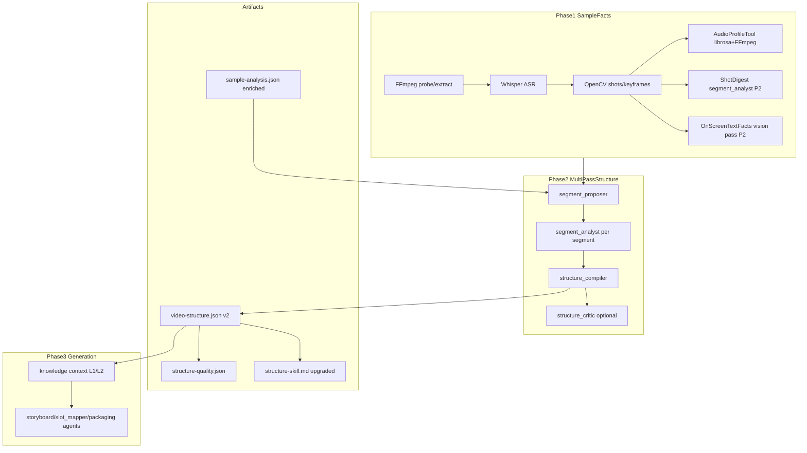
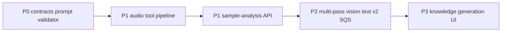

---
name: 样例分析深度优化
overview: 分四阶段（P0–P3）升级样例分析链路：先加厚 SampleFacts（音频/vision 屏上文字事实/证据摘录）与反模板校验，再拆分多 Pass 结构 Agent 并扩展 VideoStructure v2，最后升级知识沉淀与生成 Agent 注入，并改版 Workbench 展示与质量门禁。不引入独立 OCR 二进制工具，屏上文字由专用 vision 文本抽取 Pass 产出。
todos:
  - id: p0-contracts-prompt
    content: "P0: 扩展 evidence 字段 + 重写 structure_analyst prompt + structure_validator 反模板校验 + fixture/测试"
    status: pending
  - id: p1-audio-librosa
    content: "P1: librosa + audio_profile_tool + analyzing_audio；>8 keyframes 时 keyframe_batch_analyst 分批 vision + extracting_visual_facts stage"
    status: pending
  - id: p1-vision-text-api
    content: "P1: GET /sample-analysis 路由 + structure_inputs 传入 audioProfile；P2 segment_analyst 产出 onScreenTextFacts（不建 ocr_tool）"
    status: pending
  -     id: p2-multipass-v2
    content: "P2: VideoStructure v2 schema + segment_proposer/analyst/compiler/critic + structure_analysis_pipeline + warnings checklist"
    status: pending
  - id: p3-knowledge-generation-ui
    content: "P3: 升级 knowledge_author/context_resolver/generation prompts + promote 门禁 + Workbench 分字段展示 + E2E checklist + AGENTS.md"
    status: pending
isProject: false
---

# 样例分析深度优化落地计划

**目标：** 将样例分析从「英文模板式 VideoStructure 填充」升级为「可回放事实 + 可迁移创作规格 + 可沉淀知识 + 可指导生成」的完整链路。

**范围：** P0–P3 全量；**librosa + numpy 为 worker 必选依赖**（无 librosa 回退路径不实现）。

**主计划文档（实施后写入）：** `[docs/superpowers/plans/2026-06-05-sample-analysis-depth-plan.md](docs/superpowers/plans/2026-06-05-sample-analysis-depth-plan.md)`

**分支策略：** 从 `main` 建 worktree `.worktrees/sample-analysis-depth`，分支 `feature/sample-analysis-depth`；P0–P3 在同一 feature 内按 checkpoint 交付，每阶段可独立 PR（建议拆 3–4 个 PR 便于 review）。

---

## 现状基线（问题锚点）


| 环节     | 现状                                          | 文件                                                                                                                                                                                                     |
| ------ | ------------------------------------------- | ------------------------------------------------------------------------------------------------------------------------------------------------------------------------------------------------------ |
| 感知层    | metadata + Whisper + OpenCV shots/keyframes | `[services/worker/app/pipelines/sample_pipeline.py](services/worker/app/pipelines/sample_pipeline.py)`                                                                                                 |
| 结构层    | 单次 `structure_analyst` LLM                  | `[services/worker/app/agents/structure_analyst.py](services/worker/app/agents/structure_analyst.py)`                                                                                                   |
| Prompt | 英文、禁止 verbatim、asr evidence 仅时间范围           | `[packages/prompts/agents/structure_analyst.md](packages/prompts/agents/structure_analyst.md)`                                                                                                         |
| 校验     | 证据格式 + 镜头对齐，无反模板                            | `[services/worker/app/validation/structure_validator.py](services/worker/app/validation/structure_validator.py)`                                                                                       |
| 知识     | `knowledge_author` 只吃薄 VideoStructure       | `[packages/prompts/agents/knowledge_author.md](packages/prompts/agents/knowledge_author.md)`                                                                                                           |
| 前端     | 结构证据/样例分析均展示 `visualSummary`                | `[apps/web/features/structure-evidence/EvidenceCard.tsx](apps/web/features/structure-evidence/EvidenceCard.tsx)`, `[SampleAnalysisView.tsx](apps/web/features/sample-analysis/SampleAnalysisView.tsx)` |


---

## 目标架构




**分层原则：**

- **SampleFacts**（算法 + 确定性）：写入 `sample-analysis.json`，LLM 必须 cite，不得凭空概括。
- **CreativeStructure**（LLM 解释）：写入 `video-structure.json`，version 升级为 `p1-v2`。
- **KnowledgeSkill**（人类可读）：`knowledge_author` 消费 Facts + Structure。
- **QualityGate**：确定性 `structureMeta.warnings[]`（非 SQS 加权打分）+ 低质量阻止 promote

---

## 质量门禁：反模板校验 vs SQS（简化决策）

**用户关切：** 两者是否重复、是否多此一举？

| 机制 | 作用 | 结论 |
|------|------|------|
| **反模板校验**（`structure_validator` 硬规则） | LLM 输出后 **pass/fail**，失败进入 repair loop，**阻止写入薄结构** | **保留（精简版）** — Prompt  alone 无法保证；正是当前英文套话 bug 的兜底 |
| **SQS 加权打分**（5 维度 0–1 分数） | UI 徽章 + promote 阈值 | **取消独立 SQS** — 与 validator/critic 重叠，维护成本高、阈值难调 |

**精简后方案：**

1. **P0 — Validator 硬规则（必做）**：最小字段长度、英文模板 blacklist、`visualSummary`/`scriptSummary` 非 trivial 重复、v2 后 `transcriptExcerpt` 非空。失败 → 现有 repair 循环。
2. **P2 — `structure_critic`（可选一次 repair）**：补全 v2 深字段、驳回仍泛化的 segment；与 validator 分工：validator=格式+底线，critic=语义深度。
3. **P3 — 确定性 warnings（替代 SQS）**：结构写盘后，[`structure_quality.py`](services/worker/app/validation/structure_quality.py) 仅输出 `warnings[]` checklist（如「slot 全为 usage_scene」「summary 为 segment 拼接」），**不算 weighted score**。写入 `analysis/structure-meta.json` 或 `video-structure.analysisQuality.warnings`。
4. **Promote 门禁**：`criticalWarnings.length === 0` 或「无 blacklist 类 warning」即可 promote，不用 0.5/0.6 分数。

**不做：** 独立 numeric SQS、Workbench 分数徽章（改为 warnings 列表）。

---

## 关键帧超过 8 张时的处理（修订：分批 vision，而非丢弃）

**问题：** 全片均匀抽 8 张再 **丢弃** 其余帧，对镜头多 / 时长长的样例 **确实可能分析不全**——后半段、短 CTA 画面容易被漏掉。固定 cap=8 **作为单次 vision 请求的输入上限合理**，但作为全片唯一感知手段则过于草率。

**结论：可行且推荐 —— 当每镜头最佳帧数量 > 8 时，增加多次模型调用，采用 Map-Reduce，而不是提高单次上限或继续均匀丢弃。**

### 策略 A — 分批视觉事实抽取（P1 末 / P2 初落地，Monolithic 过渡方案）

```text
bestPerShot[] = 每镜头 score 最高 1 张（按 timeSec 排序，不丢弃）
batches = chronological_chunks(bestPerShot, batchSize=8)

for each batch in batches:
  vision_call keyframe_batch_analyst   # 窄任务，非完整 VideoStructure
    输入：该批 ≤8 张图 + 对应 timeSec/shotId + transcript 片段
    输出：keyframeBatchDigests[] — 客观画面事实 + onScreenTextFacts[]

merge → sample-analysis.json
final structure_analyst / structure_compiler  # 纯文本或轻 vision
  输入：全量 transcript + shots + audioProfile + 全部 batchDigests（无图或仅概览 2 张）
  输出：VideoStructure v2
```

| 项目 | 说明 |
|------|------|
| **单次 vision 上限** | 保持 **8 张/调用**（provider 稳定、成本可控） |
| **额外调用次数** | `ceil(nKeyframes / 8) - 1`；例：20 镜头 → 3 次 vision + 1 次 compile |
| **新 Agent** | `keyframe_batch_analyst`（或 P2 前合并进 `segment_analyst` 的 batch 模式） |
| **新 checkpoint stage** | `extracting_visual_facts`（可 resume） |
| **禁止** | 多次完整 `structure_analyst` 各出一份 VideoStructure 再合并（易冲突、难校验） |

**与「再加一次 structure 调用」的区别：** 额外调用应是 **窄任务事实抽取**，最后一次才是 **结构编译**；不是重复跑两遍整片 structure_analyst。

### 策略 B — P2 按 segment 分 vision（长期主路径）

分段后每段通常 ≤4 张 keyframe，**天然低于 8**，无需全片 batch；`structure_compiler` 纯文本汇总。长片覆盖问题由 segment 边界保证，batch 策略作为 segment 数很少、镜头很多的兜底。

### artifact vs LLM

- **磁盘 / `keyframes.json`**：始终保留 **全部** keyframes（UI 证据、promote 审计）
- **LLM**：按 batch 或 segment **分批看完**，facts 写入 `sample-analysis.json`，不依赖均匀采样丢弃

### 配置

- `VIDEOMAKER_VISION_BATCH_SIZE=8`（单次 vision 图片上限，默认 8，不建议 >12）
- `VIDEOMAKER_VISION_BATCH_MAX_CALLS=6`（安全阀，防止超长片 vision 调用爆炸；超出则按时间分段并写 warning）

### 现状代码（待改）

[`structure_inputs.py`](services/worker/app/agents/structure_inputs.py) 的 `_evenly_sample(..., 8)` 在 batch 方案落地后 **仅用于**「单 batch 内仍超 8 的极端情况」，不再用于全片只送 8 张。

---

## 感知层能力边界（OpenCV / Vision LLM / 为何不单独上 OCR）

| 步骤 | 实际做什么 | 不做什么 |
|------|------------|----------|
| **OpenCV**（[`opencv_tool.py`](services/worker/app/tools/opencv_tool.py)） | 镜头切分（HSV 直方图差分）；按 sharpness/entropy 选代表关键帧 | 不识别画面语义、不读字幕、不做 OCR |
| **Whisper** | 音频转写（口播内容 + 时间轴） | 不读烧录字幕/花字（若未说出口） |
| **structure_analyst vision**（现状） | 最多 8 张 keyframe 多模态输入，一次性输出整片 VideoStructure | 任务过重、输出偏抽象；屏上文字未结构化落盘；证据不可 deterministic 校验 |

**结论：不必新增 PaddleOCR/Tesseract 独立 OCR 工具。** 原因：

1. **与现有 vision 能力重叠**：屏上文字属于「看图读字」，ModelGateway vision 已具备；问题在于缺少**窄任务、结构化、可写入 SampleFacts 的专用 Pass**，而不是缺少 OCR 引擎。
2. **短视频花字对传统 OCR 不友好**：描边/渐变/艺术字下 Tesseract 误识率高；中文场景 PaddleOCR 又要额外二进制与 CI 负担。
3. **架构分层**：SampleFacts 需要的是 `onScreenTextFacts[]`（时间 + keyframe + 可见原文 + confidence），可由 **`segment_analyst` vision** 或独立 **`keyframe_text_extractor` agent**（仅 JSON 读字，禁止创作发挥）在 **P2** 产出；`evidence.source: ocr` 保留 enum 名，语义改为「屏上文字事实」。

**P1 仍缺、且 OpenCV/Vision 都补不上的：** 只有 **audioProfile**（BGM/旁白/静音/节奏）——必须 librosa + Whisper 交叉，与 OCR 无关。

---

## 契约变更（`[packages/contracts](packages/contracts)` 先行）

### 1. 新增 `sample-audio-profile.schema.json` + TS 类型

```typescript
// 写入 sample-analysis.json.audioProfile
type AudioProfile = {
  hasVoiceover: boolean;
  hasBgm: boolean;
  silenceRegions: TimeRange[];
  speechRegions: TimeRange[];        // 来自 Whisper，附 avgEnergy
  bgmCandidateRegions: TimeRange[];  // 高 energy 且与 speech 不重叠
  energyTimeline: { timeSec: number; rmsDb: number }[];  // 100ms 步长
  onsetTimes: number[];              // librosa onset
  tempoBpm?: number;
  metrics: {
    voiceoverCoveragePct: number;
    silenceCoveragePct: number;
    bgmBedLikely: boolean;
  };
};
```

### 2. 扩展 `sample-analysis.json`（无独立 schema 也可在 consolidator 内嵌）

- `keyframeBatchDigests[]`（P1 末 / P2）: `{ batchIndex, startSec, endSec, frames[], visualFacts, onScreenTextFacts[] }` — 分批 vision 产出

### 3. VideoStructure v2（`[video-structure.schema.json](packages/contracts/schemas/video-structure.schema.json)`）

`**version` 枚举新增 `p1-v2**`；向后兼容：读取 `p0-v1` 的旧结构仍可在 UI 降级展示。

**NarrativeSegment 扩展（optional 字段，v2 分析必填）：**

- `transcriptExcerpt: string` — 事实摘录（≤120 字）
- `rhetoricalDevices: string[]`
- `emotionTone: string`
- `voStyle: { pace, energy, persona }`
- `visualSpec: { framing, subject, cameraMove, onScreenText[], colorMood, density }`
- `retentionRole?: string`

**StructureSlot 扩展：**

- `durationSharePct: number`
- `migrationTemplate: string`
- `packagingRequirements: string[]`
- `antiPatterns: string[]`

**StructureEvidence 扩展：**

- `timeRange?: { startSec, endSec }`
- `excerpt?: string` — asr 口播摘录，或屏上文字摘录（对应 `source: ocr` 的 on-screen text facts）
- `artifactRef?: string` — keyframe 相对路径

**VideoStructure 顶层新增：**

- `analysisQuality?: { warnings: string[]; locale: string }` — **无 numeric score**（见下文「质量门禁简化」）

### 4. TaskStage 扩展（`[task-event.schema.json](packages/contracts/schemas/task-event.schema.json)`）

在 `transcribing` 与 `detecting_shots` 之间/之后插入：

- `analyzing_audio`（P1）
- `extracting_visual_facts`（P1 末：keyframes>8 时分批 vision；≤8 时单 batch）
- `analyzing_segments`（P2，segment 级 vision + 屏上文字）
- `compiling_structure`（P2）
- `critiquing_structure`（P2，可选失败软跳过）

**移除原计划中的 `extracting_ocr` stage**（屏上文字并入 P2 segment vision，不单独 checkpoint）。

同步更新 `[services/worker/app/runtime/checkpoint.py](services/worker/app/runtime/checkpoint.py)` 的 `ANALYSIS_STAGES`。

---

## Phase P0 — Prompt、校验、证据摘录、中文输出（1–2 天）

**目标：** 不扩 schema 也能显著减少英文套话；为 P1+ 打基础。

### Worker


| 任务            | 细节                                                                                                                                                                             |
| ------------- | ------------------------------------------------------------------------------------------------------------------------------------------------------------------------------ |
| 重写 Prompt     | `[structure_analyst.md](packages/prompts/agents/structure_analyst.md)`：默认中文；`scriptSummary` 写话术手法；`visualSummary` 必须含景别/主体/运镜/字幕至少 3 项；evidence.asr 允许 `摘录 + 时间范围`             |
| 反模板校验（精简硬规则） | `[structure_validator.py](services/worker/app/validation/structure_validator.py)`：最小长度、blacklist 短语、`visualSummary` ≠ `scriptSummary`（token overlap）；**失败即 repair，不算分** |
| locale 注入     | `build_structure_analyst_inputs` 增加 `locale`（默认 `zh`；后续可读 project brief）                                                                                                       |
| evidence 校验升级 | asr evidence 需匹配 `摘录` 或 transcript 子串；新增 `audio` evidence 校验规则（P1 后启用）                                                                                                         |
| fixture 更新    | `[structure_analyst.json](services/worker/tests/fixtures/agents/structure_analyst.json)` 改为中文深度样例                                                                              |


### 前端（最小）


| 任务                   | 文件                                                                                                          |
| -------------------- | ----------------------------------------------------------------------------------------------------------- |
| 证据卡展示 excerpt        | `[EvidenceCard.tsx](apps/web/features/structure-evidence/EvidenceCard.tsx)` 优先 `evidence.excerpt`，转写区展示真实摘录 |
| 样例分析展示 scriptSummary | `[SampleAnalysisView.tsx](apps/web/features/sample-analysis/SampleAnalysisView.tsx)` 增加「口播手法」区块             |


### 测试

- `test_structure_validator.py`：反模板 reject/accept cases
- `test_structure_analyst_agent.py`：中文 fixture 通过校验
- `structure-evidence.test.tsx`：excerpt 渲染

---

## Phase P1 — SampleFacts 加厚：音频为主（3–4 天）

**目标：** 为 LLM 提供 BGM/旁白/静音/节奏事实。**P1 不引入 OCR 或独立 vision 文本工具**（屏上文字推迟到 P2 `segment_analyst`）。

### 依赖

`[services/worker/pyproject.toml](services/worker/pyproject.toml)` 增加：

```toml
"librosa>=0.10",
"numpy>=1.26",
"soundfile>=0.12",  # librosa 读 wav
```

### 新模块


| 模块                      | 路径                                                | 职责                                                                                     |
| ----------------------- | ------------------------------------------------- | -------------------------------------------------------------------------------------- |
| AudioProfileTool        | `services/worker/app/tools/audio_profile_tool.py` | FFmpeg `silencedetect` + librosa RMS/onset/beat；与 Whisper segments 交叉 → `audioProfile` |
| Perception consolidator | `services/worker/app/perception/sample_facts.py`  | 合并 metadata/transcript/shots/keyframes/audio → 写 `sample-analysis.json`            |


### Pipeline 改动

`[sample_pipeline.py](services/worker/app/pipelines/sample_pipeline.py)`：

1. `transcribing` 完成后 → **`analyzing_audio`**（需 `audio.wav`）
2. `consolidating` 写入 enriched `sample-analysis.json`（含 `audioProfile`）

`[structure_inputs.py](services/worker/app/agents/structure_inputs.py)`（P1 增量）：

- 传入 `audioProfile`
- P1 末：`extracting_visual_facts` 写入 `keyframeBatchDigests`；**不再**对全片只做 evenly_sample 丢弃
- P2：`segment_analyst` 消费 segment 内 keyframes + 已有 batchDigests 交叉引用

### structure_analyst Prompt（P1 增量，P2 前仍用 monolithic agent）

- 要求每 segment 至少 1 条 `source: audio` evidence（引用 `audioProfile` 区间）
- `rhythm.beatPoints` 应对齐 `audioProfile.onsetTimes`（±0.3s）
- **P1 不要求 `source: ocr`**（待 P2 写入 `onScreenTextFacts` 后再强制）

### API

- 可选：`GET /api/samples/{id}/analysis` 返回 **完整 sample-analysis**（今日 alias 到 structure，需拆分）
  - 新路由：`GET /api/samples/{id}/sample-analysis` → 读 artifact `sample-analysis.json`
  - 保留 `/structure` 不变

### 测试

- `test_audio_profile_tool.py`：静音段、speech 覆盖、bgmCandidate 启发式
- `test_sample_pipeline.py`：新 stage checkpoint resume
- fixture wav + 合成 transcript 对齐

---

## Phase P2 — 多 Pass 结构 Agent + VideoStructure v2（5–8 天）

**目标：** 分段深分析 → 编译结构；拒绝 monolithic 模板输出。

### 新 Agents


| Agent                | Prompt 文件                                       | 输出                                                              |
| -------------------- | ----------------------------------------------- | --------------------------------------------------------------- |
| `segment_proposer`   | `packages/prompts/agents/segment_proposer.md`   | 候选 segment 边界 + role + confidence                               |
| `segment_analyst`    | `packages/prompts/agents/segment_analyst.md`    | 单段 `visualSpec`（含 `onScreenText[]`）、`voStyle`、`transcriptExcerpt`、local evidence；**窄任务读 keyframe 屏上原文**写入 `onScreenTextFacts` |
| `structure_compiler` | `packages/prompts/agents/structure_compiler.md` | 完整 VideoStructure v2                                            |
| `structure_critic`   | `packages/prompts/agents/structure_critic.md`   | 驳回泛化句 / 补全字段（repair 一次）                                         |


### 编排

新模块 `[services/worker/app/pipelines/structure_analysis_pipeline.py](services/worker/app/pipelines/structure_analysis_pipeline.py)`：

```text
extracting_structure (parent stage)
  → analyzing_segments (parallel per segment, max N=4)
  → compiling_structure
  → critiquing_structure（soft-fail，可选语义 repair）
  → write video-structure.json + analysisQuality.warnings
```

`[p0_demo_pipeline.py](services/worker/app/pipelines/p0_demo_pipeline.py)` 中 `run_structure_analyst` 替换为 `run_structure_analysis_pipeline`。

**并行策略：** segment_analyst 按 segment 独立调用；失败单段可 retry，不整片失败。

### 质量 warnings（替代 SQS）

模块 [`structure_quality.py`](services/worker/app/validation/structure_quality.py) — **确定性 checklist**，输出 `warnings: string[]`，无 weighted score：

- slot role 全同 / intent 过短
- summary 与 segment 高度重复
- v2 必填深字段缺失
- locale 非中文占比过高

- 写入 `video-structure.analysisQuality.warnings` 或 sidecar `structure-meta.json`
- Workbench 展示 warning 列表；**promote 门禁**：存在 `critical` 类 warning 时拒绝

### Coercer 升级

`[structure_coercer.py](services/worker/app/validation/structure_coercer.py)`：

- 支持 v2 字段默认值
- 修复 slot role 全变 `usage_scene`：优先保留 LLM role，仅非法值才 map

---

## Phase P3 — 知识库、生成注入、前端全面改版（4–6 天）

### knowledge_author 升级

`[knowledge_author.md](packages/prompts/agents/knowledge_author.md)` 输入扩展：

- `videoStructure` (v2)
- `sampleAnalysis`（含 `audioProfile`, `onScreenTextFacts`）
- `structureQuality` → 改为 `analysisQuality.warnings` checklist

新增 Skill 章节：

- `## 口播手法`
- `## 画面语言`
- `## 包装清单`
- `## 节奏与音频设计`
- `## 迁移示例`（同结构换 topic）

`[knowledge/index_builder.py](services/worker/app/knowledge/index_builder.py)` frontmatter 增：`visualStyle`, `voPersona`, `hasBgm`, `rhetoricalPattern`。

**Promote 门禁：** 无 `critical` warnings（非 numeric score）。

### 生成 Agent 接线


| Agent                | 消费的新字段                            | 文件                                                                                 |
| -------------------- | --------------------------------- | ---------------------------------------------------------------------------------- |
| `content_strategist` | voStyle, emotionTone              | prompt + runner inputs                                                             |
| `slot_mapper`        | migrationTemplate, constraints    | `[packages/prompts/agents/slot_mapper.md](packages/prompts/agents/slot_mapper.md)` |
| `storyboard_writer`  | visualSpec, packagingRequirements | `[storyboard_writer.md](packages/prompts/agents/storyboard_writer.md)`             |
| `packaging_designer` | packaging profile + **onScreenText 花字样式** | packaging prompt |


`[context_resolver.py](services/worker/app/knowledge/context_resolver.py)`：L1 解析新 MD 章节；L2 注入 `audioProfile` 摘要 + slot migrationTemplate。

### 前端 Workbench


| 面板   | 改动                                                                                                                                       |
| ---- | ---------------------------------------------------------------------------------------------------------------------------------------- |
| 结构证据 | 展示 transcriptExcerpt、**屏上文字**（onScreenText / evidence excerpt）、audio 区间、关键帧 |
| 样例分析 | 展示 rhetoricalDevices、voStyle、visualSpec、retentionRole                                                                                    |
| 结构槽  | durationSharePct、migrationTemplate、packagingRequirements                                                                                 |
| 质量提示 | 展示 `analysisQuality.warnings` 列表（无分数徽章） |
| 知识草稿 | 展示新 skill 章节                                                                                                                             |


新增 API 调用：`getSampleAnalysis()` → `/api/samples/{id}/sample-analysis`。

### AGENTS.md 更新

在 `[AGENTS.md](AGENTS.md)` Post-P1 扩展表增加本计划条目与 env/路由说明。

---

## 执行顺序与 PR 拆分建议




| PR  | 内容                                              | 可验证 E2E                        |
| --- | ----------------------------------------------- | ------------------------------ |
| PR1 | P0 + contracts locale/evidence 小扩展              | 重跑样例分析 → 中文 + 非模板              |
| PR2 | P1 audio + librosa + **batch vision facts（>8 帧多调用）** | sample-analysis 含 audioProfile + keyframeBatchDigests |
| PR3 | P1 sample-analysis API + structure_inputs audioProfile | 证据含 audio timeline |
| PR4 | P2 multi-pass + onScreenTextFacts + v2 schema + warnings checklist | analysisQuality.warnings + 屏上文字 evidence |
| PR5 | P3 knowledge + generation + UI                  | promote 门禁 + 生成 storyboard 更具体 |


---

## 验证命令（每 PR 必跑）

```powershell
cd packages/contracts
npm run check
npm run validate:schemas

cd services/worker
python -m pytest
python -m compileall app

cd services/api
python -m pytest
python -m compileall app

cd apps/web
npm run typecheck
npm run test
```

**E2E 手册（新建）：** `docs/demos/sample-analysis-depth-e2e-checklist.md`

1. 上传 30–60s 竖屏样例（含口播 + BGM）
2. 完成 analyze → 检查 `sample-analysis.json` 含 `audioProfile`
3. 样例分析 Tab：口播手法 ≠ 结构证据主文案
4. 结构槽：role 多样化 + migrationTemplate 非空
5. 无 critical warnings；promote 知识库成功
6. 发起 generation → storyboard `visual` 含具体镜头语言

---

## 风险与边界


| 风险                        | 缓解                                             |
| ------------------------- | ---------------------------------------------- |
| librosa 安装体积 / Windows CI | 在 worker README 与 AGENTS.md 文档化；CI 缓存 pip      |
| vision 读字幻觉 | segment_analyst 窄 prompt；warnings 校验 excerpt 与 onScreenTextFacts 子串匹配 |
| 多 Pass / 分批 vision 成本 | `VIDEOMAKER_VISION_BATCH_MAX_CALLS` 上限；batch 仅窄任务 facts，最后一次 compile |
| v2 破坏旧样例                  | `version` 字段 + UI 降级；不强制重分析                    |
| 版权                        | 保持 transcriptExcerpt 长度上限；Prompt 禁止大段 verbatim |


**明确不做（本计划外）：**

- Demucs 人声/BGM 源分离（留 `VIDEOMAKER_AUDIO_SEPARATION=1` 未来扩展点）
- **传统 OCR 引擎**（PaddleOCR/Tesseract）— 除非后续评测证明 vision 读字不达标
- 全片 re-analyze 批量迁移工具（仅新 analyze 走 v2）

---

## 关键文件清单（Allowed To Change）

**Create:**

- `docs/superpowers/plans/2026-06-05-sample-analysis-depth-plan.md`
- `docs/demos/sample-analysis-depth-e2e-checklist.md`
- `packages/contracts/schemas/sample-audio-profile.schema.json`
- `services/worker/app/tools/audio_profile_tool.py`
- `services/worker/app/agents/keyframe_batch_analyst.py` + `packages/prompts/agents/keyframe_batch_analyst.md`
- `services/worker/app/perception/sample_facts.py`
- `services/worker/app/pipelines/structure_analysis_pipeline.py`
- `services/worker/app/validation/structure_quality.py`
- `services/worker/app/agents/segment_proposer.py` (+ analyst, compiler, critic)
- `packages/prompts/agents/segment_*.md`, `structure_compiler.md`, `structure_critic.md`
- `apps/web/features/structure-quality/StructureQualityWarnings.tsx`（warning 列表，非 score 徽章）
- 对应 `tests/test_*.py` 与 web tests

**Modify:**

- `[packages/contracts/schemas/video-structure.schema.json](packages/contracts/schemas/video-structure.schema.json)`
- `[packages/contracts/src/types.ts](packages/contracts/src/types.ts)`
- `[services/worker/app/pipelines/sample_pipeline.py](services/worker/app/pipelines/sample_pipeline.py)`
- `[services/worker/app/pipelines/p0_demo_pipeline.py](services/worker/app/pipelines/p0_demo_pipeline.py)`
- `[services/worker/app/agents/structure_inputs.py](services/worker/app/agents/structure_inputs.py)`
- `[services/worker/app/validation/structure_validator.py](services/worker/app/validation/structure_validator.py)`
- `[services/worker/app/validation/structure_coercer.py](services/worker/app/validation/structure_coercer.py)`
- `[packages/prompts/agents/structure_analyst.md](packages/prompts/agents/structure_analyst.md)` → P2 后 deprecated 或仅 fixture
- `[services/api/app/routers/samples.py](services/api/app/routers/samples.py)`
- 前端 evidence / analysis / slot / knowledge 面板
- `[AGENTS.md](AGENTS.md)`