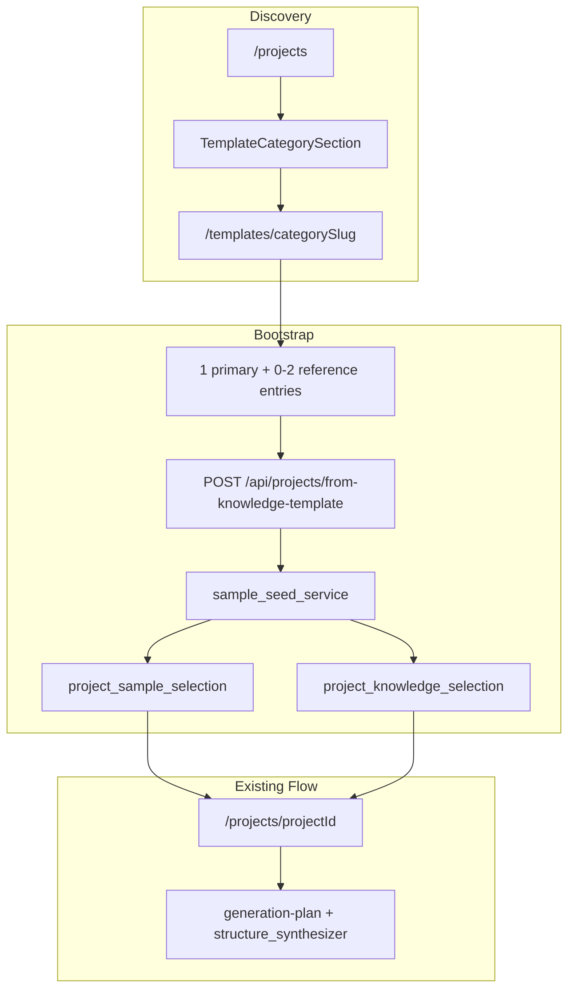

# Knowledge Category Template Bootstrap Plan

> **Status:** Planned 2026-06-09. Category 聚合发现 + 样例 import 开项目。  
> **UI SSOT：** [2026-06-09-knowledge-template-ui-spec.md](../specs/2026-06-09-knowledge-template-ui-spec.md)  
> **设计系统：** [2026-05-28-ui-ux-design-system.md](../specs/2026-05-28-ui-ux-design-system.md) §5.2.1

**Goal:** 让用户从首页发现「爆款结构模板」（category 聚合层），进入详情页浏览该 category 下所有 entry 及其关联样例，选择 **1 主 + 最多 2 参考** entry 后一键创建项目并 import 对应样例，随后走现有 brief → generation 流程（详情页不上传，上传留在工作台）。

**Architecture decision (locked):**

- 不合并 entry；`category` / `categorySlug` 为聚合键，每个 `KnowledgeEntry` 仍为 1:1 源样例成员。
- 不做「同类多样例一 entry」；详见会话决策与 [knowledge-deposition-plan](./2026-06-03-knowledge-deposition-plan.md)。



---

## 0. UI 设计说明（实现必读）

完整布局、组件 anatomy、选中态、responsive、testid 见 **[UI 规范](../specs/2026-06-09-knowledge-template-ui-spec.md)**。

| 主题 | 要点 |
|------|------|
| 美学 | **Editorial Template Shelf** — 真实 poster 封面，与「我的创意库」hash 渐变区分 |
| 首页插入点 | `WorkflowStrip` 与 `ProjectGrid` 之间 |
| 详情布局 | lg+ 左 `TemplateSelectionDock` sticky + 右 `TemplateEntryGrid`；mobile 底部 `TemplateSelectionSheet` |
| 选用 | 主 entry 边框 `primary`；参考 entry 边框 `ai`；上限 2 参考 |
| 创建后 | 跳转工作台；可选 toast「已导入 N 条样例」 |
| 反模式 | 详情页不展示 full skill MD；不用 categorySlug 作页面标题 |

---

## 1. Contracts

路径：[`packages/contracts`](../../../packages/contracts)

新增类型（JSON Schema + `npm run check`）：

| Type | 用途 |
|------|------|
| `KnowledgeCategorySummary` | 首页卡片：`category`, `categorySlug`, `entryCount`, `summary`, `coverUrl`, `slotPatterns[]`, `updatedAt` |
| `KnowledgeCategoryDetail` | 详情：`category`, `categorySlug`, `entries: KnowledgeCategoryEntryCard[]` |
| `KnowledgeCategoryEntryCard` | 成员：`entryId`, `title`, `summary`, `style`, `slotPattern`, `hookType`, `tempo`, `durationBucket`, `sourceProjectId`, `sourceSampleId`, `posterUrl`, `previewUrl`, `importable`, `importBlockReason?` |
| `CreateProjectFromKnowledgeTemplateRequest` | `name`, `categorySlug`, `primaryEntryId`, `referenceEntryIds`（max 2） |
| `CreateProjectFromKnowledgeTemplateResponse` | `project`, `importedSamples[]`, `sampleSelection`, `knowledgeSelection` |

约束：

- `referenceEntryIds.length <= 2`
- `primaryEntryId` ∉ `referenceEntryIds`
- 所有 entry：`status=published`, `entryKind=structure`, 同一 `categorySlug`

---

## 2. API — Category 聚合与详情

路由：[`services/api/app/routers/knowledge.py`](../../../services/api/app/routers/knowledge.py)  
Store：[`services/api/app/services/knowledge_store.py`](../../../services/api/app/services/knowledge_store.py)

### 2.1 `GET /api/knowledge/categories`

`list_category_summaries()`：

- `GROUP BY category_slug` where `status='published' AND entry_kind='structure'`
- 展示名：组内最新 `category`；`entryCount`；`summary`（最新 entry）；`coverUrl` via [`pick_sample_poster_url`](../../../services/api/app/services/sample_keyframes.py)
- 排序：`updated_at DESC`

### 2.2 `GET /api/knowledge/categories/{categorySlug}`

`get_category_detail()` → `KnowledgeCategoryEntryCard[]`：

- `posterUrl` / `previewUrl`：[`sample_media_path`](../../../services/api/app/services/media_paths.py)（跨项目只读预览）
- `importable`：源 video 存在、源项目存在、`sourceSampleId` 非空
- 排除 `composition_pattern`

磁盘路径用 [`category_slug`](../../../services/shared/knowledge/paths.py)；UI 展示用 `category` 字段。

---

## 3. API — 从模板创建项目

### 3.1 `POST /api/projects/from-knowledge-template`

建议：[`services/api/app/routers/projects.py`](../../../services/api/app/routers/projects.py)  
编排：[`services/api/app/services/knowledge_template_bootstrap.py`](../../../services/api/app/services/knowledge_template_bootstrap.py)（新建）

Steps：

1. 校验 entry 同属 slug、published、importable
2. `ProjectStore.create_project(name)`
3. 每 entry → `sample_seed_service.import_sample_from_knowledge_entry`
4. [`SampleSelectionStore`](../../../services/api/app/services/sample_selection_store.py)：`primarySampleId` + `referenceSampleIds`，`mode=user_override`
5. [`KnowledgeStore.save_selection`](../../../services/api/app/services/knowledge_store.py)：`primaryEntryId` + `referenceEntryIds`，`appliedAsStructure=false`，`mode=user_override`
6. 返回 project + selections + imported summaries

**不调用** `apply_entry_to_project`。

失败：**transactional rollback**（删 project + 已复制文件）。

### 3.2 `sample_seed_service.py`

路径：[`services/api/app/services/sample_seed_service.py`](../../../services/api/app/services/sample_seed_service.py)（新建）

复制源 `projects/{src}/samples/{id}/` → 新项目 sample；merge entry [`structureJsonUri`](../../../services/api/app/services/knowledge_store.py)；重写 `projectId` / `sourceVideoId` / `id`；`status=analyzed`，`source_kind=local`。

---

## 4. Frontend

**UI 规范：** [2026-06-09-knowledge-template-ui-spec.md](../specs/2026-06-09-knowledge-template-ui-spec.md)

### 4.1 首页

| 文件 | 说明 |
|------|------|
| [`apps/web/app/projects/page.tsx`](../../../apps/web/app/projects/page.tsx) | 插入 `TemplateCategorySection` |
| [`apps/web/components/home/template-category-section.tsx`](../../../apps/web/components/home/template-category-section.tsx) | 区块 + loading/empty/error |
| [`apps/web/components/home/template-category-card.tsx`](../../../apps/web/components/home/template-category-card.tsx) | 单 category 卡片 |

### 4.2 详情页

| 文件 | 说明 |
|------|------|
| [`apps/web/app/templates/[categorySlug]/page.tsx`](../../../apps/web/app/templates/[categorySlug]/page.tsx) | 路由页 |
| [`apps/web/features/knowledge-template/CategoryTemplateHero.tsx`](../../../apps/web/features/knowledge-template/CategoryTemplateHero.tsx) | 类别 Hero |
| [`apps/web/features/knowledge-template/TemplateSelectionDock.tsx`](../../../apps/web/features/knowledge-template/TemplateSelectionDock.tsx) | Desktop 选用 + 创建 |
| [`apps/web/features/knowledge-template/TemplateEntryCard.tsx`](../../../apps/web/features/knowledge-template/TemplateEntryCard.tsx) | Entry 样例卡 |
| [`apps/web/features/knowledge-template/TemplateSelectionSheet.tsx`](../../../apps/web/features/knowledge-template/TemplateSelectionSheet.tsx) | Mobile 底栏 + Sheet |

复用：[`SampleThumbnail`](../../../apps/web/components/sample-thumbnail.tsx)、[`SelectionCurrentZone`](../../../apps/web/features/project-input/SelectionPanelZones.tsx)、[`SamplePreviewDialog`](../../../apps/web/components/sample-preview-dialog.tsx)。

### 4.3 API Client

[`apps/web/lib/apiClient.ts`](../../../apps/web/lib/apiClient.ts)：`listKnowledgeCategories`, `getKnowledgeCategory`, `createProjectFromKnowledgeTemplate`。

### 4.4 工作台衔接

[`ProjectWorkbench.tsx`](../../../apps/web/features/workbench/ProjectWorkbench.tsx) — bootstrap 后无需改生成链路；确认 [`SampleSelectionPanel`](../../../apps/web/features/project-input/SampleSelectionPanel.tsx) 与 [`KnowledgeSelectionPanel`](../../../apps/web/features/knowledge/KnowledgeSelectionPanel.tsx) 展示 `user_override`。

---

## 5. 模块边界

| 模块 | 本计划 |
|------|--------|
| `KnowledgeEntry` 1:1 | 不变 |
| `KnowledgeLibraryView` | 不变；discovery 独立入口 |
| `apply_entry_to_project` | 本流程不使用 |
| `structure_synthesizer` | 2 参考时自动可用 |
| 详情页上传 | 不做 |

---

## 6. 测试与验证

### API

| 文件 | 覆盖 |
|------|------|
| [`services/api/tests/test_knowledge_category_routes.py`](../../../services/api/tests/test_knowledge_category_routes.py) | categories / detail / from-template |
| [`services/api/tests/test_sample_seed_service.py`](../../../services/api/tests/test_sample_seed_service.py) | 复制 + ID 重写 |

### Web

| 文件 | 覆盖 |
|------|------|
| [`apps/web/tests/projects-home.test.tsx`](../../../apps/web/tests/projects-home.test.tsx) | 首页模板区块 |
| `apps/web/tests/category-template-detail.test.tsx`（新建） | 1+2 选用上限 |

```powershell
cd packages/contracts && npm run check && npm run validate:schemas
cd services/api && python -m pytest tests/test_knowledge_category_routes.py tests/test_sample_seed_service.py
cd apps/web && npm run typecheck && npm run test
```

### E2E

[`docs/demos/knowledge-category-template-e2e-checklist.md`](../../demos/knowledge-category-template-e2e-checklist.md)

---

## 7. 文档索引

| 文档 | 路径 |
|------|------|
| 本计划 | `docs/superpowers/plans/2026-06-09-knowledge-category-template-bootstrap-plan.md` |
| UI 规范 | `docs/superpowers/specs/2026-06-09-knowledge-template-ui-spec.md` |
| 设计系统 §5.2.1 | `docs/superpowers/specs/2026-05-28-ui-ux-design-system.md` |
| 知识沉淀（前置） | `docs/superpowers/plans/2026-06-03-knowledge-deposition-plan.md` |
| AGENTS.md | Post-P1 扩展表一行 |

---

## 8. 风险与后续

- 封面依赖源项目 → 后续 promote 时 copy `cover.jpg` 到 knowledge entry 目录
- 中文 category → `cat-{hash}` slug；UI 始终显示 `category` 文本
- 未来官方 `KnowledgeTemplate` 实体可演进 API，不破坏 entry 1:1

---

## 9. 实施顺序

1. Contracts + `sample_seed_service` + tests（TDD）
2. Category list/detail API + tests
3. `from-knowledge-template` + rollback tests
4. 首页 `TemplateCategorySection`（按 UI spec）
5. 详情页 + `TemplateSelectionDock` / Sheet
6. E2E checklist + AGENTS.md
