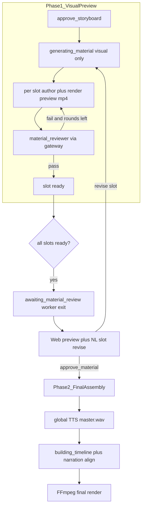
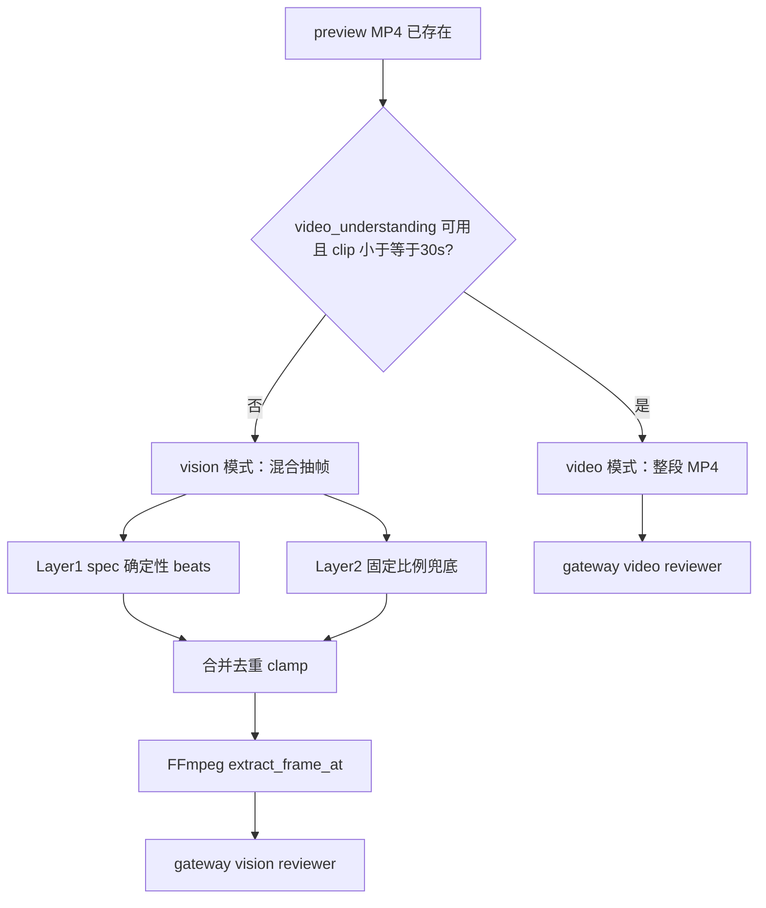

# Material Review Gate 落地实施计划

**Date:** 2026-06-29  
**Status:** planned  
**Branch:** `feature/material-review-gate`（从 `main` 新建 worktree）  
**E2E:** `docs/demos/material-review-gate-e2e-checklist.md`

## 背景与目标

当前链路在 [`p0_demo_pipeline.py`](../../services/worker/app/pipelines/p0_demo_pipeline.py) 中：`approve-storyboard` 后进入 `generating_material`，**一口气跑完所有 visual slot + 全局 `__master__` TTS**，再 `building_timeline` → FFmpeg 成片。文本层 review（`awaiting_master_review` / `awaiting_storyboard_review`）已存在，但 **slot 级可视化素材无 review**。

本计划将链路拆为两阶段：



**核心原则：**

- Review 对象是 **slot 预览 MP4 + MaterialSpec**，不是 `script-draft` 文本分镜
- **Agent review 范围**：默认仅 **HF 终端 slot**（含 `source_then_polish` finish）；其余 visual slot 只做硬门槛
- **Review 输入**：video 模式优先（整段 MP4）；vision 模式用 **spec 语义 beats + 固定比例兜底** 混合抽帧，不要求 author 输出 keyframe 时间
- **专门 `material_reviewer` agent**（参考 [`structure_critic.py`](../../services/worker/app/agents/structure_critic.py)），与 lint/schema 硬门槛分离
- Review **统一走 ModelGateway**（`video_understanding` → `vision` → `text_only` 降级），不单独配 Key
- **自动 repair 均在 author 同 session 内完成**：
  - **ReAct**：新增 `review_material_preview` tool（+ 可选 `render_material_preview`）
  - **ACP**：MCP `render_material_preview` + `review_material_preview`，in-session followup（**不保留**「新 session + `existingMaterialSpec`」auto-repair fallback）
- **人工 gate NL 改片**：同 `generationId` 原地 regen（用户触发的新 author session，与 auto-repair 区分）

---

## Review 范围

**默认：agent review 仅覆盖「HF 参与创意/包装」的 slot，不对全部分镜做 LLM 视觉 review。**

与现有 gap 补全链路（[`revise_material_edit.classify_slot_material_chain`](../../services/worker/app/pipelines/revise_material_edit.py)、[`hyperframes_material_provider`](../../services/worker/app/providers/hyperframes_material_provider.py)）对齐：

| Slot 补全形态 | 典型 provider 链 | Agent review | 说明 |
|---------------|------------------|--------------|------|
| 纯素材复用 | `asset_reuse`，无 `-finish` | **否** | 仅裁剪/复用用户素材；mapping 阶段已决策 |
| 纯 Stock | `stock_media_search`，无 HF 终端 | **否**（v1） | 选片相关性在 stock 层；无 HF 包装则不做创意 review |
| AIGC 生视频/图 | `video_generation` / `image_generation`，无 HF | **否**（v1） | 成本高；后续可单独加轻量 review |
| HF 原生分镜 | 终端 `hyperframes_material`（`hf_only` 等） | **是** | author + composition 是主要创意产出 |
| 素材 + HF 包装 | `source_then_polish`：stock/reuse/image → `-finish` HF | **是** | Pexels/用户素材经 HF 优化后的终端 clip |
| Packaging 类 | 通常终端 `hyperframes_material` | **是** | 字幕/包装/动效层 |

### 判定规则（worker 侧）

比仅匹配 provider 名更准确：结合 **终端 action** 与 **slot 链类型**（复用 [`SlotChainKind`](../../services/worker/app/pipelines/revise_material_edit.py)）：

```python
def slot_needs_agent_review(action: dict, slot_chain: SlotChainKind) -> bool:
    terminal_provider = str(action.get("provider") or action.get("strategy") or "")
    if terminal_provider != "hyperframes_material":
        return False
    if slot_chain in {
        SlotChainKind.HF_ONLY,
        SlotChainKind.STOCK_THEN_HF,
        SlotChainKind.REUSE_THEN_HF,
        SlotChainKind.IMAGE_THEN_HF,
    }:
        return True
    return is_finish_action(str(action.get("id") or ""))
```

Env `VIDEOMAKER_MATERIAL_REVIEW_PROVIDERS`（default `hyperframes_material`）作为 **allowlist**；上式为 **精确 gate**，避免对纯 reuse/stock 误调 reviewer。

### 非 agent review slot 的处理

仍执行 **Python 硬门槛**（低成本、全覆盖 visual slot）：

- 输出文件存在且 size > 0
- 时长与 storyboard/`slotTiming` 偏差 < 15%
- （可选）纯 `asset_reuse`：probe 有视频轨

硬门槛失败 → slot 标记 `hardGateFailed=true`；report 可设 `reviewInputs.mode=skipped`；**不调用** gateway reviewer。进入人工 gate 时 UI 展示 warning。

### 与 author review tools 的关系

- **Agent review（LLM + vision/video）**：仅 `slot_needs_agent_review==true` 的 slot 在 ReAct/ACP session 内调用 `review_material_preview`。
- **其余 slot**：author session 不调用 review tools；worker 写 stub report（`approved=true`, `reviewInputs.mode=skipped`）或仅硬门槛记录。

---

## Review 输入策略（video 优先 + 混合抽帧 + Gateway 路由）

### 路由优先级（`resolve_material_review_route`）



新模块 [`material_review.py`](../../services/worker/app/pipelines/material_review.py)，参考 [`resolve_analysis_route_preview`](../../services/shared/model_gateway/analysis_route.py)：

| 路由 | 条件 | Gateway profile | 输入 |
|------|------|-----------------|------|
| `video` | `videoUnderstanding` configured + hasApiKey；clip ≤30s 且 ≤50MB | `video_understanding` | 整段 MP4（[`build_video_structure_messages`](../../services/worker/app/gateway/model_gateway.py)）+ 文本 brief |
| `vision` | `vision` configured + hasApiKey | `vision` | 混合抽帧 JPEG（见下）+ 文本 brief + `frameTimestamps` |
| `text_only` | 以上皆不可用 | `text` | MaterialSpec JSON + lint 摘要（`reviewInputs.mode=text_only`） |

**video 与 vision 互斥**：video 模式 **不传** JPEG，避免重复 token。短 slot 优先 video，可覆盖 GSAP 动效时序，弥补抽帧遗漏。

### Vision 模式：混合抽帧（非纯固定比例）

**不强制 author 输出 keyframe 时间戳**；也 **不在 author 阶段让 LLM 猜测时间点**（易幻觉、难测）。在 preview MP4 + 已产出 MaterialSpec 上 **Python 确定性** 计算采样点：

**Layer 1 — 从 MaterialSpec 解析语义 beats（优先）**

从 spec 只读解析，可单元测试：

- `composition.timelineScript`：`tl.to(t, …)` / `tl.from(…)` / `.call()` 等时间点
- `composition.bodyHtml`：`<video data-start="…">`、`data-duration`
- 归一化到 `[0, durationSec]`，去重，clamp

**Layer 2 — 固定比例兜底**

语义 beats 不足 `VIDEOMAKER_MATERIAL_REVIEW_MAX_FRAMES`（default 4）时补足：

- 默认比例：`[0.05, 0.35, 0.65, 0.95] × duration`（跳过首尾 5% 减轻 fade 黑场）
- clip 极短（≤1s）退化为 1 帧 `@ 0.5×duration`

**合并规则**

1. `FFmpegTool.probe(preview_mp4)` → `durationSec`
2. 合并 Layer1 + Layer2，按时间排序
3. 间距 < 0.3s 的帧合并为一个
4. 截断到 `max_frames`
5. 新增 `FFmpegTool.extract_frame_at(video, jpg, time_sec)`：`ffmpeg -y -ss {t} -i {video} -frames:v 1 -q:v 2 {jpg}`
6. 落盘：`generations/{id}/material-reviews/{slotId}/frames/frame-{idx}-{timeMs}.jpg`
7. 编码：[`structure_inputs._encode_keyframes`](../../services/worker/app/agents/structure_inputs.py) + [`build_structure_messages`](../../services/worker/app/gateway/model_gateway.py)
8. 文本 payload 附带 `frameTimestamps[]` 与 `beatSources[]`（`spec_timeline` \| `spec_html` \| `ratio_fill`）

**无关帧缓解（可选硬过滤）**

- 抽帧后若亮度/方差低于阈值，丢弃该帧并用同层下一候选时间点替代
- report 记录实际使用的 `frameTimestamps` 与 `beatSources`，便于 UI 解释采样依据

### 为何不采用「LLM 输出潜在关键帧」

| 方案 | 问题 |
|------|------|
| Author 生成时输出 keyframe 时间 | 未渲染前易幻觉；增加 schema 负担；与 repair 不稳定 |
| Reviewer 前先问 LLM 要抽帧时间 | 多一次 LLM、仍可能 hallucinate |
| **Spec 解析 + 比例兜底 + video 优先** | 核心 beat 可覆盖；可测；无 author 负担；短视频用 video 兜底遗漏 |

Report 字段：`reviewInputs.mode`、`videoPath?`、`framePaths?`、`frameTimestamps?`、`beatSources?`。

### Review 后端

- **默认**：内部 `material_reviewer` agent + ModelGateway（与 `structure_critic` 同模式）
- **不在 v1 范围**：独立外部 ACP agent 专职 review（`VIDEOMAKER_MATERIAL_REVIEW_BACKEND=acp` 留 env 占位即可，不实现）

---

## Author 内 Session 自动 Repair（ReAct + ACP 统一语义）

### 目标 workflow（author 侧闭环）

```text
draft spec → lint pass
  → render preview（scratch / generated）
  → review_material_preview（gateway reviewer）
  → 若未 approved 且 rounds < max：按 report.suggestions 改 spec，重复
  → submit / write_material_spec
```

Worker 在 author session **结束后**仅做：将 spec + preview 写入 `generated/`、更新 `material-review-state`、非 HF provider 的 post-render 硬门槛校验。**不在 ACP session 外再做 auto-repair 循环。**

### ReAct 链路

**文件：** [`composition/author/react_agent.py`](../../services/composition/composition/author/react_agent.py)、[`composition/author/tools.py`](../../services/composition/composition/author/tools.py)

新增 tools：

| Tool | 行为 |
|------|------|
| `render_material_preview` | build + HF CLI 渲染 scratch 短 MP4；返回 `{ previewPath, durationSec }` |
| `review_material_preview` | 调 `material_review.run_slot_review(preview_path, spec, brief...)`；返回 `MaterialReviewReport` JSON |

`submit_material_spec` 前 **skill_view 要求不变**；可选 gate：`review_material_preview.approved === true` 才允许 submit（或 soft-warning + 最后一轮强制）。

Repair：review 失败 → append user message `{ reviewReport, validationErrors }` → 继续同 `messages` session（与 lint repair 同构）。

### ACP 链路（MCP tools，同 session，无 new-session fallback）

**文件：** [`composition/mcp/handlers.py`](../../services/composition/composition/mcp/handlers.py)、[`composition/mcp/server.py`](../../services/composition/composition/mcp/server.py)、[`worker/app/composition/acp/author.py`](../../services/worker/app/composition/acp/author.py)

新增 MCP tools（Python 桥，内部调同一套 `material_review.py`）：

| MCP tool | 对应 ReAct tool |
|----------|-----------------|
| `render_material_preview` | 同上 |
| `review_material_preview` | 同上 |

更新 ACP task instructions（[`_build_acp_task_instructions`](../../services/worker/app/composition/acp/author.py)）：

```text
Workflow: skill_view → draft → composition_lint_draft
  → render_material_preview → review_material_preview
  → 若未通过：按 report 修改 spec 后重复（同 session，max_turns 内）
  → write_material_spec（仅 review approved 或达 max rounds 后人工 gate 兜底）
```

**明确删除/禁止：** auto-repair 场景下 **不得** 新开 ACP session 并依赖 `existingMaterialSpec` + `editInstruction`（该模式仅保留给 **人工 gate NL revise** 与 **成片后 scene revise**）。

In-session followup 复用现有 lint repair 机制（[`_build_in_session_followup`](../../services/worker/app/composition/acp/author.py)、`conn.prompt` 同 `session_id`）。

### Env

| Env | Default | 含义 |
|-----|---------|------|
| `VIDEOMAKER_MATERIAL_REVIEW_ENABLED` | `true` | 关闭则 author 跳过 review tools |
| `VIDEOMAKER_MATERIAL_REVIEW_MAX_ROUNDS` | `1` | 单 slot author session 内 auto-repair 上限 |
| `VIDEOMAKER_MATERIAL_REVIEW_PROVIDERS` | `hyperframes_material` | agent review allowlist（精确判定见 **Review 范围** § `slot_needs_agent_review`） |
| `VIDEOMAKER_MATERIAL_PREVIEW_RENDER_MAX_SEC` | `30` | scratch preview 渲染超时 |
| `VIDEOMAKER_MATERIAL_REVIEW_MAX_FRAMES` | `4` | vision 抽帧数 |

---

## 用户流程

1. 用户完成 master/storyboard 脚本审核（现有流程不变）。
2. Worker 进入 `generating_material`，**仅 visual slot**（跳过 `__master__` TTS）。
3. 每个 **HF 终端 slot**（见 Review 范围）：author session 内 lint → render preview → gateway review → 不通过则 **同 session repair**（最多 N 轮）→ 产出 spec + preview MP4。
4. 非 HF slot（纯 reuse/stock/aigc）：仅硬门槛 + stub/skipped report，**不调用** review tools。
5. 全部 slot ready 后 pause：`awaiting_material_review`。
6. 前端展示 per-slot preview + report；用户可 NL 修改单 slot（**新 author session**，见下）。
7. `approve-material` → Phase2：global TTS + timeline + FFmpeg 成片。

**Dual-variant：** 两 task 各自 pause/resume。

---

## 契约与产物（Contracts First）

### 新增 Schema（[`packages/contracts`](../../packages/contracts)）

| Schema | 用途 |
|--------|------|
| `material-review-report.schema.json` | 单 slot review 输出 |
| `material-review-state.schema.json` | generation 级 gate 状态 |
| `material-slot-revise-request.schema.json` | 人工 gate 内 slot NL 修改 |

**MaterialReviewReport 字段：**

- `slotId`, `generationId`, `reviewedAt`
- `approved: boolean`
- `scores: { briefAlignment, visualHierarchy, copyPolicy, motionQuality }`（1–5，可选）
- `issues: string[]`, `suggestions: string[]`
- `reviewInputs: { mode: "video" | "frames" | "text_only" | "skipped", framePaths?, videoPath?, frameTimestamps?, beatSources? }`
- `agentReviewRound`, `provider`, `previewArtifactRef?`

### TaskEvent stages

[`task-event.schema.json`](../../packages/contracts/schemas/task-event.schema.json) 新增：`reviewing_material`、`awaiting_material_review`。

### 存储路径

```text
generations/{generationId}/
  material-review-state.json
  material-reviews/{slotId}/report.json
  material-reviews/{slotId}/frames/       # vision 模式 JPEG
  generated/{actionId}.mp4
  generated/{actionId}/material-spec.json
```

### Checkpoint

[`checkpoint.py`](../../services/worker/app/runtime/checkpoint.py)：`awaiting_material_review`、`assembling_final`；`awaitingGate=material_review`。

---

## Worker 实现

### 1. 管线切分

[`p0_demo_pipeline.py`](../../services/worker/app/pipelines/p0_demo_pipeline.py)：`run_generating_material(visual_only=True)` 后 pause；approve 后 `run_assembling_final()`（TTS + timeline + render）。

[`generation_pipeline.run_generating_material`](../../services/worker/app/pipelines/generation_pipeline.py)：`visual_only` 过滤 `MASTER_TTS_SLOT_ID`。

### 2. `material_review.py` + `material_reviewer` agent

- [`material_reviewer.py`](../../services/worker/app/agents/material_reviewer.py)
- [`material_reviewer.md`](../../packages/prompts/agents/material_reviewer.md)
- `resolve_material_review_route(store, preview_path) -> video|vision|text_only`
- `extract_spec_review_beats(spec) -> list[float]`（Layer1 语义 beats）
- `sample_review_timestamps(duration, spec_beats, max_frames) -> list[float]`（混合 Layer1+2）
- `run_slot_review(...)` → 硬门槛 + gateway 调用 + schema 校验（仅 `slot_needs_agent_review`）
- `build_repair_feedback(report) -> str`（供 author tools / ACP followup 使用）

硬门槛（Python）：MP4 存在且 size>0；duration 与 `slotTiming` 偏差 <15%；lint 已通过。

### 3. Author tools + MCP（auto-repair 唯一路径）

见上文 **Author 内 Session 自动 Repair**。`hyperframes_material_provider` **移除**「ACP session 结束后 worker 侧 re-author 循环」设计；保留：

- ACP/ReAct 返回 spec 后 **一次** `render_material` 写入 `generated/{actionId}.mp4`
- 持久化 spec/report/state
- 若 author 已在 session 内 render+review，worker 可复用 scratch preview（hash 一致则 skip 重渲染）

### 4. Gate 内人工 slot revise（用户触发，可新 session）

[`material_slot_revise.py`](../../services/worker/app/pipelines/material_slot_revise.py)：

- API 写 `material-slot-revise-queue.json`
- `invalidate_material_for_slots` 单 slot
- Resume 重跑该 slot **完整 author session**（此时允许 ACP **新 session** + `existingMaterialSpec` + `editInstruction`，因为是 **用户 NL 改片**，不是 auto-repair）
- Re-pause `awaiting_material_review`

### 5. `material_review_state.py`

load/save、approve 校验、slot 状态机。

---

## API

| 方法 | 路径 | 行为 |
|------|------|------|
| GET | `/api/generations/{id}/material-review` | MaterialReviewState + reports |
| POST | `/api/generations/{id}/material-slots/{slotId}/revise` | gate 内 NL → queue → retry |
| POST | `/api/generations/{id}/approve-material` | approve + clear gate + retry |

---

## Web

- `MaterialReviewPanel`：preview 播放、report 摘要、slot NL revise、approve 成片
- `ProjectWorkbench`：`awaiting_material_review` 时展示；gate 内启用 in-place revise
- `parallelMaterialActivity`：解析 `Material review` / `Material preview ready` SSE

---

## Revise 边界

| 场景 | 路径 | Session |
|------|------|---------|
| Author auto-repair | ReAct/ACP tools | **同 session** |
| Gate 内用户 NL 改片 | `material-slots/{slotId}/revise` | **新 author session**（允许 existingMaterialSpec） |
| 成片后改片 | `revise/plan` structured | fork generation |

---

## 测试策略（TDD）

### Contracts

```powershell
cd packages/contracts && npm run check && npm run validate:schemas
```

### Worker

| 测试文件 | 覆盖 |
|----------|------|
| `test_material_review.py` | spec beats 解析、混合抽帧、route 降级、硬门槛、video/vision 互斥、slot 范围判定 |
| `test_material_reviewer_agent.py` | fixture reviewer JSON |
| `test_react_review_tools.py` | render+review tools、同 session repair |
| `test_mcp_material_review_tools.py` | MCP handlers、ACP in-session followup |
| `test_material_review_gate.py` | pipeline pause/resume、visual_only |
| `test_material_slot_revise.py` | 人工 gate regen（新 session） |
| `test_hyperframes_material_provider.py` | 无 worker 侧 ACP auto-repair 循环 |

### API / Web

`test_material_review_routes.py`、`material-review-panel.test.tsx`、`taskMilestones.test.ts`

---

## 实施顺序


1. Contracts + TaskEvent stages
2. `material_review.py` + reviewer agent + FFmpeg + gateway route
3. **ReAct tools + MCP tools + ACP instructions**（auto-repair 闭环）
4. `hyperframes_material_provider` 简化 + `visual_only` pipeline + material gate
5. API + 人工 gate slot revise
6. Web MaterialReviewPanel
7. E2E checklist + AGENTS.md

---

## 明确不在范围

- ACP cross-slot session resume
- 外部 ACP agent 专职 review（gateway 以外）
- Author 在生成阶段输出 keyframe 时间轴（改为 spec 确定性解析 + 混合抽帧）
- Gate 内改 master narration / 全局时长
- **ACP auto-repair 新 session fallback**（已明确移除）

> **Post-P1（2026-06-30）：** Fork revise `material_regen` 的 Material Review Gate 见 `docs/superpowers/plans/2026-06-30-revise-material-review-gate-plan.md`。

---

## 风险与缓解

| 风险 | 缓解 |
|------|------|
| ACP render+review 超时 | scratch 低分辨率 preview；`PREVIEW_RENDER_MAX_SEC`；Codex 走 terminal lint 同类 note |
| LLM 成本 | 默认仅 HF 终端 slot agent review；`MAX_ROUNDS=1`；CI `HUMAN_REVIEW_MODE=false` |
| Vision 抽帧漏/错帧 | video 模式优先；vision 用 spec beats + 比例兜底；可选亮度过滤 |
| MCP tool 与 worker render 重复 | spec hash 一致则 skip 二次 render |
| Preview 无配音 | UI 标注「素材预览（无最终配音）」 |
| 人工 revise vs auto-repair 混淆 | 代码与文档区分：auto-repair 仅 in-session tools；revise queue 才允许新 session |

---

## 验收标准（E2E）

- [ ] 纯 `asset_reuse`/纯 stock slot **不调用** agent reviewer（report.mode=skipped），仅硬门槛
- [ ] `source_then_polish` / HF 终端 slot 走 agent review；vision 路由时 report 含 `beatSources`
- [ ] 进度视图可播放 slot preview MP4
- [ ] Agent review 低分 slot 在 **同一 ReAct/ACP session** 内 auto-repair ≤N 轮；report 可查看
- [ ] ACP 路径 **无** auto-repair 新 session（日志/trace 可证 single session_id）
- [ ] Gate 内 NL 改片：generationId 不变，preview 更新
- [ ] `approve-material` 后 master.wav + 最终 MP4
- [ ] `VIDEOMAKER_HUMAN_REVIEW_MODE=false` 跳过 gate
- [ ] Dual-variant 独立 pause/resume
