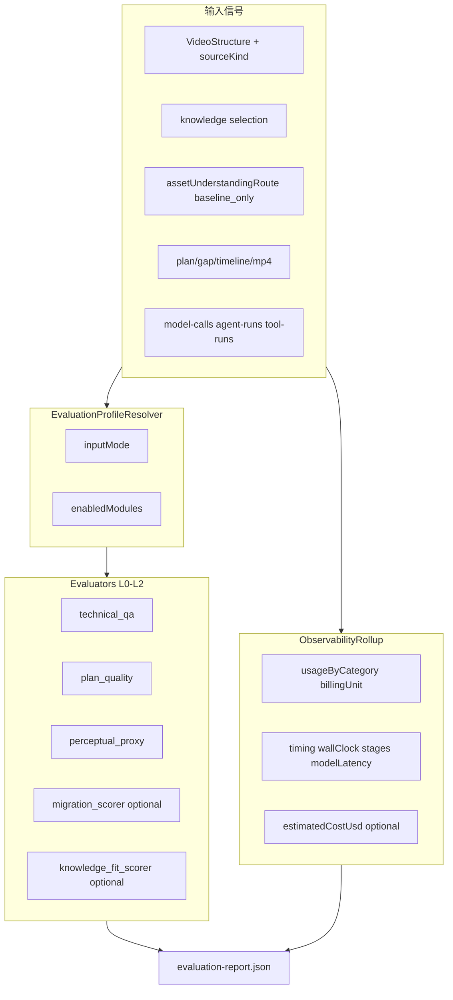

# VideoMaker 评测与可观测性汇总落地计划

> **Status:** 待实施  
> **范围锁定：** L0–L2 质量评测 + 可插拔 migration/knowledge_fit；**不含 L3 定向 VLM**  
> **讨论收敛（2026-07-04）：** 非文本模型按各自计费维度统计；阶段耗时三层结构；支持历史任务补跑评估

**Goal：** 建立可插拔的双模式评测体系，并为每条 generation（及可选 sample analysis）产出统一的 `evaluation-report.json`，内含质量分与 **分模型类别用量 + 分阶段耗时**，经 API 与工作台展示。

**参考基线：** OpenMontage `final_review`、`slideshow_risk`、`bench_runner`；VideoMaker 已有 `model-calls`、`agent-runs`、`structure_quality`、material review `report.json`。

---

## 架构总览



---

## 计费与用量设计（硬规则）

**禁止**将 TTS / 生图 / 生视频折算为 token。报告按 `billingUnit` 分开展示，**不提供**跨类别「总 token」误导性指标。

| 类别 | `billingUnit` | 汇总指标 | 单条 model-call `usageUnits.kind` |
|------|---------------|----------|-------------------------------------|
| `text_chat` | `tokens` | calls, promptTokens, completionTokens, totalTokens, latencyMs | `tokens` |
| `vision_chat` | `tokens` | 同上（profile=vision / video_understanding） | `tokens` |
| `tts` | `chars` | calls, **totalChars**, latencyMs | `chars` |
| `image_gen` | `images` | **successfulImages**, failedCalls, latencyMs | `images` |
| `video_gen` | `video_seconds` | **successfulJobs**, **totalDurationSec**, jobs[], latencyMs | `video_seconds` |

### `usageByCategory.video_gen` 结构（用户要求）

```json
"video_gen": {
  "billingUnit": "video_seconds",
  "successfulJobs": 1,
  "totalDurationSec": 5.2,
  "requestedDurationSec": 5,
  "latencyMs": 180000,
  "jobs": [
    {
      "jobId": "job-abc",
      "slotId": "hook_visual",
      "model": "doubao-seedance-2-0",
      "requestedDurationSec": 5,
      "actualDurationSec": 5.2,
      "outputBytes": 1048576,
      "latencyMs": 180000
    }
  ]
}
```

- `requestedDurationSec`：submit 时 `options.durationSec`（Wan/SeedDance 已有）
- `actualDurationSec`：成片落盘后 **ffprobe**（权威）；缺失时标 `observability.warnings: ["video_duration_estimated"]` 并仅用 requested

### Chat token 采集补强（仅 text/vision）

现状：Chat 经 `ModelGateway` 且响应含 OpenAI 风格 `usage` 时会写 `tokenUsage`；但仅认 `prompt_tokens`/`completion_tokens`，百炼等 `input_tokens`/`output_tokens` 会丢失。

**M1 必做：**

1. 共享 `normalize_chat_usage(raw)`：`prompt_tokens|input_tokens` → `prompt`；`completion_tokens|output_tokens` → `completion`；保留 `total_tokens`
2. 写入 `usageUnits: { kind: "tokens", prompt, completion, total?, raw? }`
3. **Rollup 权威来源为 `model-calls` 求和**，不依赖 `agent-runs` 末次 token（多轮 agent 会低估）
4. ACP material author 无 gateway model-calls → `observability.notes: ["acpAuthorUntracked"]`

### `model-call-log` schema 扩展（向后兼容）

新增可选 `usageUnits`；保留现有 `tokenUsage`（仅 chat，由 usageUnits 填充）。

---

## 耗时设计（三层，复盘导向）

报告 `observability.timing` **必须**包含三块，不能只有总耗时：

### 1. `wallClock`（用户等待视角）

```json
"wallClock": {
  "totalMs": 842000,
  "queuedMs": 12000,
  "activeMs": 620000,
  "humanWaitMs": 210000,
  "startedAt": "...",
  "endedAt": "..."
}
```

- `humanWaitMs`：`awaiting_master_review` / `awaiting_storyboard_review` / `awaiting_material_review` 累计
- 数据源：SQLite `task_events`（API 补全）+ checkpoint 起止交叉校验

### 2. `stages[]`（管线阶段 — 复盘主表）

写入 [`GenerationCheckpoint`](../../services/worker/app/runtime/checkpoint.py)（`mark_stage_complete` 时记录）：

```json
"stages": [
  {
    "stage": "generating_material",
    "startedAt": "...",
    "endedAt": "...",
    "durationMs": 320000,
    "status": "completed",
    "breakdown": [
      { "slotId": "hook_visual", "durationMs": 120000 }
    ]
  },
  {
    "stage": "awaiting_material_review",
    "durationMs": 180000,
    "status": "paused",
    "kind": "human_gate"
  }
]
```

- 与 `GENERATION_STAGES` / `TaskEvent.stage` 枚举对齐
- `generating_material` 可选 per-slot `breakdown`（默认 3 路并行复盘）
- `kind: "human_gate"` 与 active 阶段区分

样例分析：同一结构，`ANALYSIS_STAGES` 写入 `samples/{id}/analysis/evaluation-report.json`（M5 或 M2b）。

### 3. `modelLatency`（模型调用视角，与 stages 正交）

从 `model-calls` 按 `usageByCategory` 汇总各类 `latencyMs` 之和；用于回答「时间花在 LLM 还是 video poll」，不等于 stage 墙钟。

---

## 评估报告使用方式

| 模式 | 触发 | 产物 |
|------|------|------|
| **同步全量** | generation `emit(succeeded)` 前（worker） | `evaluation-report.json` |
| **分段 partial** | `_pause_for_review` 各 gate（可选） | `evaluation-report.partial.json` |
| **Run 级** | 双变体全部终态（API） | `generation-runs/{runId}/evaluation-summary.json` |
| **历史按需** | `GET .../evaluation` 且文件不存在 | API **lazy build**（读 artifacts + logs，不重跑 pipeline） |
| **历史强制重算** | `POST .../evaluation/rebuild` | 覆盖已有 report（规则升级后用） |

**历史补跑限制：**

- `OBSERVABILITY_CAPTURE=off` 时用量不完整 → `observability.incomplete: true`
- 无最终 MP4 → 跳过 L0 `technical_qa`
- ACP 素材 → 外部 agent 用量不可追溯

---

## EvaluationProfile（可插拔）

| `inputMode` | 条件 | `enabledModules` |
|-------------|------|------------------|
| `sample_migration` | 真实 sample structure（`sourceKind != "knowledge"`） | `core` + `migration` |
| `knowledge_guided` | knowledge 伪 sample / structure-from-knowledge | `core` + `knowledge_fit` |
| `greenfield` | 无 reference structure，brief-only | `core`  only |

---

## Phase 1 — Contracts 与内核骨架

### 1.1 JSON Schema（`packages/contracts`）

| Schema | 用途 |
|--------|------|
| `evaluation-profile.schema.json` | inputMode、enabledModules、referenceStructureId? |
| `evaluation-report.schema.json` | profile、verdict、scores、modules、observability |
| `observability-summary.schema.json` | usageByCategory + timing（generation/sample 共用） |
| `usage-units.schema.json` | billingUnit / usageUnits 枚举 |
| `stage-timing.schema.json` | stage 条目 + breakdown + human_gate kind |

### 1.2 共享包 `services/shared/evaluation/`

```
profile_resolver.py
observability_rollup.py   # usage + timing 聚合
usage_normalize.py        # normalize_chat_usage + rollup 分类
report_builder.py
schemas.py
```

---

## Phase 2 — 可观测性汇总（M1 主体）

### 2.1 用量采集补强（Gateway / model_call_store）

| 子任务 | 内容 |
|--------|------|
| M1a | `billingUnit` 契约 + `usageUnits` schema |
| M1b | TTS `chars`、image `images` 写入 usageUnits |
| M1c | video：`requestedDurationSec` on submit；成功后 ffprobe `actualDurationSec`；jobs[] |
| M1d | chat `normalize_chat_usage` 多厂商字段 |
| M1e | checkpoint `stageTimings` + human_gate + material per-slot breakdown |
| M1f | `observability_rollup.py` 产出 usageByCategory + timing 三层 |

### 2.2 USD 估算（可选，同 M1）

[`price_table.yaml`](../../services/shared/evaluation/price_table.yaml)：

- text/vision：per 1K tokens
- tts：per 1K chars
- image：per image
- video：**per second**（`totalDurationSec`），非 per job 固定价

---

## Phase 3 — L0/L1/L2（无 VLM）

### L0 `final_video_qa.py`

ffprobe、4 点抽帧、volumedetect、narration 时长漂移 → `modules.technical_qa`

### L1 `plan_quality.py`

generation-plan / gap / lint / material review / variant 规则 + `plan_slideshow_risk`

### L2 `perceptual_proxy.py`

关键帧算法指标 + material scores + stock 相关度；`scoreKind: "proxy"`

---

## Phase 4 — migration / knowledge_fit + bench

- `migration_scorer.py`：slotCoverage、rhythmDrift、hookPreservation 等
- `knowledge_fit_scorer.py`：模板契合 + promoteReady
- `tests/bench_runner.py`：合成 fixture 回归

---

## Phase 5 — 集成

### Worker

[`videomaker_pipeline.py`](../../services/worker/app/pipelines/videomaker_pipeline.py) L1709 前 `build_evaluation_report()`。

### API

```http
GET  /api/generations/{generation_id}/evaluation          # 无则 lazy build
POST /api/generations/{generation_id}/evaluation/rebuild
GET  /api/projects/{project_id}/generation-runs/{run_id}/evaluation-summary
```

扩展 `model_calls` 摘要：含 `tokenUsage` + `usageUnits`（调试；报告仍以 evaluation 为准）。

### Web

[`EvaluationPanel.tsx`](../../apps/web/features/evaluation/EvaluationPanel.tsx)：

- 质量分（按 profile 显隐 migration/knowledge）
- 用量五类分卡（视频展开 jobs 表）
- timing：wallClock + stages 条形图（human_gate 区分样式）

### 文档

- 本文件
- [`docs/demos/evaluation-system-e2e-checklist.md`](../../docs/demos/evaluation-system-e2e-checklist.md)
- [`AGENTS.md`](../../AGENTS.md) Evaluation 小节

---

## 环境变量

| Env | 默认 | 含义 |
|-----|------|------|
| `VIDEOMAKER_EVAL_ENABLED` | `true` | 完成时写 report |
| `VIDEOMAKER_EVAL_PARTIAL_ON_GATE` | `true` | gate 写 partial |
| `VIDEOMAKER_EVAL_LAZY_BUILD` | `true` | GET 缺失时现场构建 |
| `VIDEOMAKER_EVAL_TECHNICAL_BLOCK` | `false` | L0 critical 是否 block |
| `VIDEOMAKER_EVAL_PRICE_TABLE` | 内置 yaml | USD 估算表 |
| `VIDEOMAKER_EVAL_DURATION_DRIFT_MAX` | `0.25` | 成片时长漂移阈值 |

**排除：** `VIDEOMAKER_EVAL_VLM_*`

---

## 实施里程碑

| 里程碑 | 交付 |
|--------|------|
| **M1** | contracts + usageUnits 采集补强 + timing 三层 + ObservabilityRollup |
| **M2** | L0 + report_builder + worker hook + GET/POST evaluation API |
| **M3** | L1/L2 + EvaluationPanel |
| **M4** | migration/knowledge_fit + bench_runner |
| **M5** | run summary + partial reports + sample analysis eval + E2E |

---

## 验收标准

1. 三种 `inputMode` 均有 `evaluation-report.json`；greenfield 无 `migration` 模块。
2. `usageByCategory` 五类 `billingUnit` 正确；**无**跨类总 token 行。
3. TTS 为 `totalChars`；生图为 `successfulImages`；生视频为 jobs 条数 + 每条秒数 + `totalDurationSec`。
4. `timing` 含 `wallClock`（含 humanWaitMs）、`stages[]`（含 human_gate）、`modelLatency`。
5. 历史任务 `POST .../evaluation/rebuild` 不重跑 pipeline 即可出报告。
6. `OBSERVABILITY_CAPTURE=off` 的历史任务报告标 `incomplete`。
7. bench_runner 全绿；contracts + worker + api + web 测试通过。

---

## Out of scope

- L3 VLM / 成片创意 judge
- Langfuse 改造
- L4 人工标定集 UI
- 修改 generation Agent prompt
