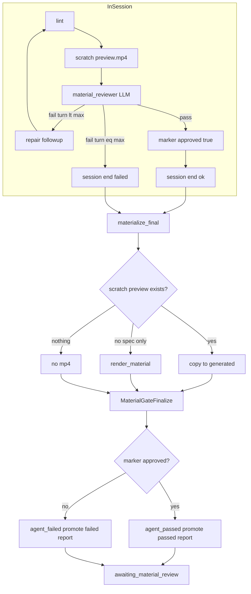

# Material Gate Finalize 实施计划

**Date:** 2026-07-04（rev 2：materialize 与 promote 分离；失败也出片）  
**Status:** planned  
**Branch:** `feature/material-gate-finalize`（从 `main` 新建 worktree）  
**Supersedes（部分）:** [`2026-06-29-material-review-gate-plan.md`](2026-06-29-material-review-gate-plan.md) 中「worker 在 author session 结束后再跑 material_reviewer」的语义；in-session review + 人工 gate 主流程不变。  
**E2E:** [`docs/demos/material-review-gate-e2e-checklist.md`](../../demos/material-review-gate-e2e-checklist.md)

## 背景

Material Review Gate（2026-06-29）已在首次生成链路插入 `awaiting_material_review`。实现上 in-session 与 post-session **均调用** `material_reviewer`，post-session 无 repair，且 UI 只读 `material-reviews/`，导致重复 LLM、结论分裂、in-session 被架空（generation `5d5f3ec4`）。

底片 staging 修复已缩小 scratch/final 漂移。本计划完成架构收口：**审片只在 in-session**；session 后 **零 LLM**；**终态就位与审片通过解耦**。

## 产品决策（rev 2 已确认）

1. **In-session**：scratch preview + LLM review + 同 session repair（`turn < max_turns` 时失败继续 repair，**不**写 `generated/`）
2. **Session 结束后**：**Material Gate Finalize** — 零审片；负责终态 MP4 就位 + promote 报告 + gate state
3. **双决策分离**（核心）：
   - **`should_materialize_final()`（宽）**：只要有 scratch `preview.mp4` 或可 render 的 spec，就把 MP4 就位到 `generated/`，供前端播放与 NL 改片
   - **`should_promote_as_passed()`（严）**：仅 `marker.approved == true` 且 `specHash` 一致 → `agent_passed`，允许 `approve-material`
4. **失败也出片**：打满 `max_turns` 仍 review 失败 → session 结束后 **仍 copy** 最后一轮 `preview.mp4` 到 `generated/`，状态 `agent_failed`；用户可看视频后 NL revise，或 **人工 override 批准**（见 § 人工批准策略）
5. **人工 override**：`agent_failed` / `review_unavailable` 不阻断 `approve-material`；仅 **无 MP4 / hard_gate_failed / pending** 阻断
5. **Preview copy 优先**：成功与失败路径均优先 copy，避免同内容重复 HF render

## 时序：Session 内 vs Session 外

```text
┌─ In-session（ACP/ReAct author）──────────────────────────────┐
│  lint → scratch preview.mp4 → LLM review                     │
│    ├─ 通过 → marker.approved=true → submit spec → session 结束 │
│    ├─ 未通过且 turn < max_turns → repair followup → 下一轮    │
│    └─ 未通过且 turn == max_turns → session 失败结束            │
│         （scratch 保留最后一轮 preview + marker 可能 approved:false）│
│  ※ 此阶段不写 generated/                                     │
└──────────────────────────┬───────────────────────────────────┘
                           ▼
┌─ Material Gate Finalize（session 后，零 LLM）─────────────────┐
│  1. materialize_final → copy/render → generated/{action_id}.mp4 │
│  2. promote report → material-reviews/                         │
│  3. gate state → agent_passed | agent_failed | skipped         │
└──────────────────────────┬───────────────────────────────────┘
                           ▼
              awaiting_material_review（人工 gate）
```

**In-session 轮次上限：** `VIDEOMAKER_COMPOSITION_ACP_MAX_TURNS`（默认 **5**，与 lint repair 共用）；ReAct：`VIDEOMAKER_COMPOSITION_REACT_MAX_TURNS`（代码默认 12）。`VIDEOMAKER_MATERIAL_REVIEW_MAX_ROUNDS` 未单独实现。

## 目标链路



## 命名

| 旧 | 新 |
|----|-----|
| post-session review | **material gate finalize** |
| `material_review_finalize.py` | `material_gate_finalize.py` |
| `persist_slot_material_review()` | `finalize_slot_material_gate()` |
| `finalize_visual_material_reviews()` | `finalize_visual_material_gate()` |
| `promote_preview_to_generated()` | 保留；语义为 **materialize**（不限 approved） |

## Phase 1 — Materialize Final（`should_materialize_final`）

**Owner files:**

- [`services/worker/app/pipelines/material_gate_promote.py`](../../services/worker/app/pipelines/material_gate_promote.py)（新建）
- [`services/worker/app/providers/hyperframes_material_provider.py`](../../services/worker/app/providers/hyperframes_material_provider.py)

### 1.1 函数职责

```python
def should_materialize_final(
    *, scratch_dir, spec, marker: dict | None
) -> Literal["copy_preview", "render", "skip"]

def materialize_final_to_generated(
    *, scratch_dir, generated_root, action_id, spec, mode
) -> MaterializeResult  # finalPath, finalSource: preview_copy | render
```

### 1.2 Materialize 决策表

| Session 结局 | scratch `preview.mp4` | spec | 动作 | `finalSource` |
|--------------|----------------------|------|------|---------------|
| Review **通过** | 有 | 有 | **copy** | `preview_copy` |
| **max_turns 仍失败** | 有 | 有/ harvest | **copy**（最后一轮失败片） | `preview_copy` |
| Partial harvest | 无 | lint-passed | **render** | `render` |
| Gate NL revise / edit 模式 | — | 有 | **render**（spec 可能与最后 preview 不一致） | `render` |
| 纯 stock/reuse | — | — | 原有 provider 输出 | `render` 或 N/A |
| 无 spec 无 preview | 无 | 无 | **skip** | — |

### 1.3 Copy 映射

```text
acp-author/{slot}/preview.mp4           → generated/{action_id}.mp4
acp-author/{slot}/preview-composition/  → generated/{action_id}/composition/  (若存在)
acp-author/{slot}/material-spec.json    → generated/{action_id}/material-spec.json (若存在)
```

Copy 后可选校验 SHA256（与 marker.report.previewSha256 对比，不一致仅 log/warn，不阻断 failed 路径出片）。

### 1.4 与 repair 的关系

- **Session 内**：review 失败 → **继续 repair**，不 materialize
- **仅当 session 已结束**（成功返回 spec，或失败/partial harvest 进入 worker）才调用 `materialize_final`
- 用户 NL revise → **新 session**，重新走 in-session repair；不在旧 session 上追加 turn

## Phase 2 — Promote Passed（`should_promote_as_passed`）

**Owner file:** [`services/worker/app/pipelines/material_gate_finalize.py`](../../services/worker/app/pipelines/material_gate_finalize.py)

`finalize_slot_material_gate()` **禁止**调用 `run_slot_review()`。

### 2.1 Gate 状态决策

| 条件 | `material-review-state` slot status | report.approved | 默认 `approve-material` |
|------|-------------------------------------|-----------------|-------------------------|
| `marker.approved && specHash 一致` | `agent_passed` | true | ✅ |
| marker 存在但 `approved: false`（含 max_turns 失败） | `agent_failed` | false | ✅ **人工 override**（见下） |
| partial harvest / 无 approved marker | `agent_failed` + `reviewBypass` | false | ✅ override（有片可播时） |
| LLM 基础设施失败（in-session） | `review_unavailable` | false | ✅（现网已有） |
| stock/reuse non-agent + infra OK | `skipped` | true（skipped） | ✅ |
| materialize skip（无 MP4） | `hard_gate_failed` | false | ❌ **不可 override** |
| 尚未 finalize / 无 slot state | `pending` | — | ❌ |

### 2.2 人工批准策略（Human Override）

**原则：** Material gate 是 **人工终审**；in-session / agent 结论是 **建议**，不是硬锁。用户看完 `generated/` 预览后，有权在 agent 判失败时仍继续成片。

**API：** `POST /api/generations/{id}/approve-material`

- 扩展 `material_review_approvable()`：允许 slot status ∈ `{ agent_passed, skipped, review_unavailable, agent_failed }`
- **仍拒绝：** `hard_gate_failed`、`pending`、缺少 slot entry、**终端 MP4 不存在或 size=0**（`action_artifact_satisfied`）
- 可选请求体：`{ "acknowledgeAgentFailedSlotIds": ["slot-3", ...] }` — 当存在 `agent_failed` slot 时 **必须** 显式列出或 `confirmAgentOverride: true`，防止误点（P1 UI；P0 可先放宽为直接允许）

**落盘：**

- generation `material-review-state.json`：`status: approved`，`approvedBy: user`
- 若 override 时含 `agent_failed` slot：写入 `humanOverride: true`，`overriddenSlotIds: [...]`（contracts 可选字段）
- 各 slot entry 可保留 `agent_failed` 不变，或增 `humanApproved: true` 审计字段

**前端（P1）：**

- 存在 `agent_failed` / `reviewBypass` 时，「批准素材并继续成片」前展示确认：“以下 slot Agent 未通过，确认仍继续？”
- 展示 issues 摘要；用户确认后调用 approve（带 ack 字段）

**与 in-session repair 的关系：** override **不**触发 auto-repair；仅跳过 agent 门槛进入 `assembling_final`。用户若仍不满意，应先 NL revise。

### 2.3 Promote 报告

- **Passed：** 从 marker promote；`reviewReuse: in_session`；`reviewPhase: promoted`；`videoPath` → `generated/*.mp4`
- **Failed：** promote marker 内 **最后一轮** report（`approved: false`，含 issues/suggestions）；同样 `videoPath` 指向已 materialize 的 MP4，便于 UI 对照
- **无 marker：** 合成 failed report + `reviewBypass: no_in_session_marker`

**Infra（非审片）：** materialize 后 MP4 存在、size > 0；失败 → `hard_gate_failed`（即使 agent_failed 也可能无播放器 URL）

`finalize_visual_material_gate()`：hash 变化或 regen 后强制重跑；幂等 skip 用 `report_matches_review_artifacts`。

## Phase 3 — Regen 清 Stale

**Files:** [`material_slot_revise.py`](../../services/worker/app/pipelines/material_slot_revise.py)、[`completion_registry.py`](../../services/worker/app/providers/completion_registry.py)、[`material_review_revise.py`](../../services/worker/app/pipelines/material_review_revise.py)

`clear_slot_material_gate_artifacts()` + `invalidate_material_for_slots(..., clear_material_gate=True)`。

## Phase 4 — 旁路策略

| 场景 | materialize | promote status |
|------|-------------|----------------|
| Partial harvest | render if no preview | `reviewBypass: partial_harvest`，不可 approve |
| `VIDEOMAKER_MATERIAL_REVIEW_ACP_IN_SESSION=false` | 视 spec/render | 无 approved marker → 不可 approve（fixture 文档说明） |
| Revise fork / gate NL revise | 新 session 后重新 materialize | affected slot reset |

## Phase 5 — Contracts

[`material-review-report.schema.json`](../../../packages/contracts/schemas/material-review-report.schema.json)：

- `reviewInputs.reviewReuse`: `in_session` | `report_reused`
- `reviewPhase`: `in_session` | `promoted`
- `finalSource`: `preview_copy` | `render`
- `reviewBypass?: string`
- `trace.reviewRoute`: 增加 `promoted`

## Phase 6 — Tests

必覆盖：

- Review **通过**：copy、不 `render_material`、不 `run_slot_review`、`agent_passed`
- **max_turns 失败**：仍 copy、`agent_failed`、report 含 issues、**可** manual approve（override）、**可**解析 preview URL
- **override approve**：含 agent_failed 时 API 202；state 含 `humanOverride`；hard_gate_failed 仍 400
- materialize skip → 无 URL、hard_gate_failed
- Finalize 零 LLM model-call
- Gate revise 清 stale

## Phase 7 — E2E Checklist 增量

- [ ] HF 成功：`finalSource=preview_copy`，`agent_passed`，无第二次 material_reviewer
- [ ] HF max_turns 失败：仍有 `slotPreviewUrls`，`agent_failed`，**manual approve 202**，NL revise 仍可用
- [ ] Partial harvest：有片可播，manual approve 202（或 confirm 后 202），`reviewBypass` 可见
- [ ] hard_gate_failed / 无 MP4：approve 400
- [ ] Gate NL revise 后状态刷新

## Env

| Env | Default | 含义 |
|-----|---------|------|
| `VIDEOMAKER_MATERIAL_GATE_PROMOTE_ONLY` | `true` | Gate finalize 零 post LLM |
| `VIDEOMAKER_COMPOSITION_ACP_MAX_TURNS` | `5` | In-session lint+review 总 turn |
| `VIDEOMAKER_MATERIAL_REVIEW_ACP_IN_SESSION` | `true` | 生产应开启 |

## Out of Scope

- Gate infra auto-regen（P2）
- API 直接暴露 scratch URL（统一 materialize 到 generated）
- 删除 approve-material 契约

## 允许修改的文件

- `services/worker/app/pipelines/material_gate_*.py`
- `services/worker/app/providers/hyperframes_material_provider.py`
- `services/worker/app/pipelines/material_slot_revise.py`
- `services/worker/app/providers/completion_registry.py`
- `services/worker/tests/test_material_gate_*.py`
- `packages/contracts/schemas/material-review-report.schema.json`
- `packages/contracts/src/types.ts`
- `docs/demos/material-review-gate-e2e-checklist.md`

## 显式不修改

- `apps/web`（P2 可选：failed 态提示「可改片不可批准」）
- `services/api/app/routers/generations.py`（仍读 generated 路径）
- In-session ACP turn loop 核心（repair 逻辑不变）
- [`2026-06-29-material-review-gate-plan.md`](2026-06-29-material-review-gate-plan.md) 历史正文
