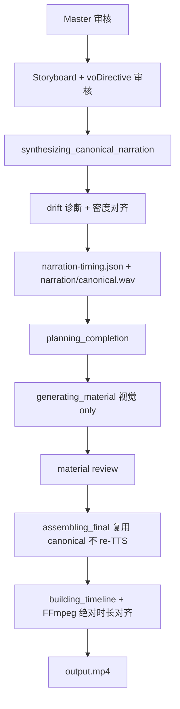

# Narration Timing Authority 改造计划

> **Status:** 待实施  
> **日期:** 2026-07-05  
> **前置分析:** generation `d6b59479` 暴露的根因——preview TTS（25.4s，整段 fast）驱动 HF 素材时长，final TTS（30.8s，6 段 voDirective）在素材后才合成，FFmpeg 顺序 concat ~35s 再 mux 截断至 30.8s → slot-6 丢失、20s 后音画错位。  
> **设计决策（已确认）:** 分镜审核通过后 **自动** 合成 canonical TTS，**不新增** `awaiting_narration_review` gate。  
> **密度对齐决策（2026-07-05 讨论收敛）:** Drift 响应默认 **audio-led visual adapt**（画面适配口播）；仅当字/秒越界或全片超 target 时，才触发单 slot script revise + TTS 重合成。  
> **Drift Agent 决策（2026-07-05 确认）:** 画面 **`scene_visual_adaptor`** + 口播 **`scene_script_adaptor`**（对称独立 Agent）；人审 NL 改脚本仍用 **`storyboard_writer`**（`revise_master` / `revise_storyboard`），不与 drift 路径混用。  
> **TTS 重合成决策（2026-07-05 确认）:** **按合成模式 hybrid** — `single_shot` 必须全量重合成；`segmented` 目标为 **增量 segment 缓存 + 仅重跑变更 slot + 拼接**（v1 可先 segmented 全量 segment，接口预留 `changed_slot_ids`；v1.1 默认开启增量）。

---

## 目标架构



**四条不变量**

1. **唯一音频权威:** `narration/canonical.wav` + `narration-timing.json` 的 `sceneTiming[]`
2. **同路径合成:** canonical 与 assembly 使用同一 `synthesize_master_wav(storyboard=完整分镜, voDirective=完整)`
3. **音频驱动画面:** HF `material-spec.durationSec` = authoritative window 时长；禁止用 `durationTargetSec` 拉伸超过 `narrationDurationSec`
4. **Assembly 不 re-TTS:** `assembling_final` 仅 copy/register + timeline/subtitle 对齐

**密度对齐不变量（新增）**

5. **预估仅 layout:** 分镜 `startSec/endSec` 在 canonical 前来自 structure 比例估算；canonical 后 **以实测 window 为准**
6. **Visual-first:** HF 素材未生成前，大 drift 默认改 `compositionAuthorBrief` + 实测 `durationSec`，**不默认**改 script / 重跑 TTS
7. **Script-on-constraint:** 仅当 WPM/字秒越界、全片超 `durationTarget`、或 slot 角色硬性最低信息量不满足时，才走 script revise 路径

---

## Phase P0 — 紧急修复（可独立合并，不依赖 canonical 前移）

修复当前 slot 丢失与截断，即使用旧管线也不应丢镜。

### P0.1 FFmpeg 合成：消除 overlap 膨胀与 `-shortest` 截断丢镜

**问题位置:** `services/worker/app/render/timeline_compiler/video_builder.py` `_build_timeline_pieces` — overlap 时仍 append 全时长 segment，cursor 用 `segment.end_sec` 但 concat 按 `duration_sec` 累加，总长 > `timeline.durationSec`。

**改动:**

- 新增 `normalize_non_overlapping_segments(segments, target_duration_sec)`：
  - 按 `startSec` 排序；若 `startSec < cursor`，将 `startSec` clamp 到 `cursor`
  - 每段 `endSec = min(endSec, target_duration_sec, next.startSec)`
  - 丢弃 `duration < 0.05s` 的零长段
- `compile_timeline_to_mp4` 在 `extract_scene_segments` 后、build 前调用
- `pad_video_to_duration`：当 `current > target` 时 **trim**（`ffmpeg -t target`），而非 copy 35s 原样
- `mux_video_audio`：保留 `-t target_duration`，但保证输入 video 已 trim 到同长

**测试:** 扩展 `services/worker/tests/test_timeline_compiler_segments.py` — overlap timeline（d6b59479 形态）→ `segmentCount=6` 且 output 时长 = audio 时长，slot-6 可见。

### P0.2 Timeline sync：禁止 durationSec 与 segment 总时长矛盾

**问题位置:** `services/worker/app/pipelines/narration_timeline.py` `_global_proportional_scale` / `_hold_tail` — 可产出 `durationSec=30.8` 但 slot-5 `endSec=32.895` 与 slot-6 overlap。

**改动:**

- `_global_proportional_scale` 末尾增加 **ripple normalize**：保证 storyboard 无 overlap，`max(endSec) == narration_end`
- `sync_timeline_to_narration` 完成后断言（或 warning 写入 plan）：`sum(clip durations) ≈ durationSec ± 0.05`
- `durationTargetSec` **不得**作为 `_planned_duration_sec` 的上限去拉伸；仅作 UI 参考

**测试:** `services/worker/tests/test_narration_timeline.py` 新增 overlap 回归用例。

---

## Phase P1 — Canonical TTS 定稿点（核心改造）

### P1.1 新 artifact 与 contract

| 文件 | 用途 |
|------|------|
| `narration/canonical.wav` | 权威全片口播 |
| `narration-timing.json` | 权威对齐结果 |
| `narration/drift-report.json` | 每 slot 预估 vs 实测诊断（P1.7） |
| `narration/segments/{slotId}.wav` | segmented 模式下 per-slot TTS 缓存（增量重合成） |
| `narration/segment-meta.json` | 每 slot `contentHash`（script + voDirective + ttsOptionsKey）、`durationSec` |

**Schema 扩展** (`packages/contracts`):

- 新增 `narration-timing.schema.json`（推荐 **新 schema**，避免与 preview 语义混淆）:
  - `role: "canonical"`（required）
  - `contentHash`: hash(`masterNarration` + `narrationVoProfile` + storyboard `script`/`voDirective` + `ttsOptionsKey`)
  - `synthesisMode: "single_shot" | "segmented"`
  - `segmentDurations[]`（segmented 时）
  - 保留现有 `sceneTiming`, `durationSec`, `alignmentMethod`, `warnings`
- 新增 `narration-drift-report.schema.json`:
  - `slots[]`: `{ slotId, estimatedSec, measuredSec, driftRatio, charCount, charsPerSec, wpmBudget, rootCause, resolutionPath, warnings[] }`
  - `rootCause`: `pace_mismatch | word_count_low | word_count_high | within_budget`
  - `resolutionPath`: `rules_only | visual_adapt | script_revise | user_pending`
- `script-draft.schema.json`: 新增 `narrationDurationSec`, `narrationTimingStatus: draft|canonical|stale`
- `generation-plan.schema.json`: 新增 `narrationDurationSec`, `narrationTimingUri`, `narrationDriftReportUri?`
- `composition-author-brief.schema.json` 扩展（最小集，服务 drift 路径）:
  - `timingContext?`: `{ measuredDurationSec, estimatedDurationSec, driftRatio, motionDensity: compact|normal|sparse|dense, beatCount? }`

### P1.2 新 worker 模块 `canonical_narration.py`

**路径:** `services/worker/app/pipelines/canonical_narration.py`（新建）

**核心函数 `run_canonical_narration_synthesis(..., changed_slot_ids: set[str] | None = None)`:**

```python
# 伪代码 — 与 final TTS 同路径；扩展 tts_synthesis.synthesize_master_wav
artifact = synthesize_master_wav(
    master_narration=draft["masterNarration"],
    storyboard=draft["storyboard"],
    output_path=generation_root / "narration" / "canonical.wav",
    segment_cache_dir=generation_root / "narration" / "segments",
    changed_slot_ids=changed_slot_ids,  # None = 全量；非空 = 增量（仅 segmented）
)
duration = wav_duration_sec(...)
# timing：优先 segmentDurations + reconcile；可选全片 Whisper（见 P1.2.1）
timing = build_narration_timing_payload(...)
save_narration_timing(generation_root, timing)
draft = apply_narration_timing_to_storyboard(draft["storyboard"], timing["sceneTiming"])
draft["narrationDurationSec"] = duration
draft["narrationTimingStatus"] = "canonical"
save_script_draft(...)
run_narration_drift_resolution(...)
```

- 若 `synthesize_master_wav` 返回 `segmentDurations`，调用现有 `reconcile_storyboard_to_segment_durations` 写回更精确的 per-scene window
- 全片 `contentHash` 不匹配时强制重合成；resume 时若 timing 仍 current 则 skip
- **`changed_slot_ids` 仅 script 路径 B 传入**；首次 canonical 与 invalidate 后全量均为 `None`

#### P1.2.1 TTS 重合成策略（hybrid，扩展 `tts_synthesis.py`）

现有 `synthesize_master_wav` 已分支：**各镜 `voDirective` 等效 → `single_shot`（1 次整段）**；**不等 → `segmented`（逐镜合成 + concat）**。本计划在此基础上增加 **segment 缓存与增量重跑**。

| 模式 | 判定 | 首次 canonical | script 变更后重合成 |
|------|------|----------------|---------------------|
| **`single_shot`** | 全部 scene 的 `canonical_tts_options_key` 相同 | 1 次 API，整段 `masterNarration` | **必须全量**（无 per-slot 边界，无法只换一段） |
| **`segmented`** | 存在不同 voDirective / TTS 选项 | 每镜 1 次 API → 写 `segments/{slotId}.wav` + `segment-meta.json` → concat | **增量（目标）**：仅重跑 `changed_slot_ids` 内 slot，其余读缓存 hash 命中则 skip → 再 concat |

**增量 segmented 流程（`changed_slot_ids={slot-3}`）:**

```text
1. 读 segment-meta.json，比对每 slot contentHash(script + voDirective + ttsOptionsKey)
2. 对 changed_slot_ids ∪ hash 失效 slot：tool.synthesize(scene.script) → segments/{slotId}.wav
3. 其余 slot：复用 segments/{slotId}.wav（不存在则补跑）
4. _concat_wav_bytes(按 storyboard 顺序) → narration/canonical.wav
5. 更新 segment-meta.json + artifact.segmentDurations
6. sceneTiming：reconcile_storyboard_to_segment_durations（默认，低成本）
   可选：VIDEOMAKER_CANONICAL_WHISPER_AFTER_SCRIPT=true 时再跑全片 Whisper
```

**实施分期:**

| 阶段 | 行为 |
|------|------|
| **v1（PR-2/3）** | 接口支持 `changed_slot_ids`；segmented 模式下传非空时仍 **重跑全部 segment**（行为正确、实现简单） |
| **v1.1** | segmented + `VIDEOMAKER_TTS_SEGMENT_INCREMENTAL=true`（默认 true）启用 hash 缓存与 skip |

**Env:**

| Env | 默认 | 含义 |
|-----|------|------|
| `VIDEOMAKER_TTS_SEGMENT_INCREMENTAL` | `false`（v1）→ `true`（v1.1） | segmented 模式下是否跳过未变更 slot 的 TTS |
| `VIDEOMAKER_CANONICAL_WHISPER_AFTER_SCRIPT` | `false` | script 增量重合成后是否额外全片 Whisper（默认仅用 segmentDurations） |

**明确:** `single_shot` **不支持**增量；`changed_slot_ids` 非空时若判定为 single_shot，忽略增量参数并全量重合成 1 次。

### P1.3 管线重排 — `videomaker_pipeline.py`

**删除/降级 preview 阶段（master → storyboard 之间）:**

```text
# 当前
run_narration_preview(...)  # ← 移除作为 timing 来源
```

**新增阶段（storyboard gate 关闭后、planning 前）:**

```text
checkpoint.close_human_gate("awaiting_storyboard_review")
→ run_canonical_narration_synthesis(...)     # stage: synthesizing_canonical_narration
→ run_narration_drift_resolution(...)        # stage: adapting_narration_density（可合并为子步骤）
→ run_planning_from_script_draft(...)
```

**Checkpoint:** `checkpoint.py` `GENERATION_STAGES` 增加 `synthesizing_canonical_narration`；可选 `adapting_narration_density`；`is_generation_stage_done` 检查 `narration-timing.json` + `narration/canonical.wav` + contentHash。

**Storyboard 撰写不再依赖 preview timing:**

- `draft_storyboard_script`: 将 `narration_timing_payload(preview)` 替换为 **structure 比例估算**（`allocate_scene_windows_proportional`）
- LLM 仅作 layout hint；标注 `alignmentMethod: structure_estimate`，**不得**写入 `narration-timing.json`

### P1.4 Planning 与 material 时长绑定

**`run_planning_from_script_draft`:**

- 读取 `narration-timing.json`（非 preview）
- `assemble_generation_plan` 中 storyboard `startSec/endSec` 来自 canonical timing（已在 script-draft 写回）
- `timeline.durationSec = narrationDurationSec`（不用 `durationTargetSec` 作 timeline 上限）

**`resolve_slot_timing_for_material_author`:**

- 优先级: `generation-plan.storyboard` → `narration-timing.json` → structure estimate
- **移除** `load_narration_preview_timing` fallback
- 删除 `prefer_duration > timing` 时放大 window 的逻辑，或限制为 `min(prefer, timing)`

### P1.5 Assembly 改为 reuse-only

**`tts_provider.py` + `videomaker_pipeline.py` assembling_final:**

- `try_reuse_preview_master_wav` 重命名/扩展为 `try_reuse_canonical_master_wav`：
  - 源: `narration/canonical.wav`
  - hash 校验: canonical contentHash
- 若 canonical 缺失或 stale → 报错并提示 re-run canonical stage
- `apply_material_results_to_plan` 中 `sync_timeline_to_narration` 改为 **light refresh**（timing 已 canonical 时 skip scale 分支）

### P1.6 失效与 revise

**`script_draft_revise.py`:**

- master/storyboard NL revise 后: `invalidate_narration_timing()` → `narrationTimingStatus=stale` + 清除 canonical checkpoint
- 与现有 `clear_narration_preview` 合并

**Revise fork:** scoped storyboard regen 后同样 invalidate canonical；resume 时重跑 canonical → drift → material。

---

## Phase P1.7 — 口播/画面密度对齐（Drift 响应）

> 解决 canonical TTS 定稿后「时长数字对了，但话的分量与画面设计仍不匹配」的问题。  
> **默认策略:** audio-led visual adapt；script revise 为约束触发的例外路径。

**Drift 专用双 Agent（与人审 `storyboard_writer` 分离）:**

| Agent | 路径 | 修改面 | TTS |
|-------|------|--------|-----|
| `scene_visual_adaptor` | A（默认） | `compositionAuthorBrief`, `visual?` | 不重跑 |
| `scene_script_adaptor` | B（约束） | `script`, `voDirective?`, `masterNarration` | hybrid 重合成（P1.2.1） |

### P1.7.1 分镜阶段的 WPM 预算（预防）

在 **`storyboard_writer`** 现有 prompt 中增加 **字数预算规则**（`storyboard_from_master` / `revise_storyboard` 阶段），不新增 Agent：

| 输入 | 规则 |
|------|------|
| 场景 `startSec/endSec`（structure 估算 window） | `wordBudget = round(durationSec × wpm / 60)`，中文默认 wpm=240（4 字/秒），hook/CTA 可 ×1.15，金句镜 ×0.85 |
| `voDirective.pace` | fast → wpm×1.2；slow → wpm×0.85 |
| 输出约束 | 每 scene `script` 字数应在 `wordBudget × [0.8, 1.2]` 内；偏离时写入 scene 级 `warnings[]`（可选字段，schema 扩展） |

**修改面:** 仅 `storyboard[].script` 生成约束；**不**改 canonical 前的 timing 权威。

**落盘:** 照常写入 `script-draft.json`；warnings 可选镜像到 `generations/{id}/script-draft-warnings.json`（debug，非必须）。

### P1.7.2 Drift 诊断（规则，无 LLM）

**模块:** `services/worker/app/pipelines/narration_drift.py`（新建）

**触发:** `run_canonical_narration_synthesis` 完成后立即执行。

**每 slot 计算:**

```text
estimatedSec  = storyboard[slot].endSec - startSec   # canonical 写回前的 structure 估算，或保存在 drift 输入快照
measuredSec   = narration-timing.sceneTiming[slot].endSec - startSec
driftRatio    = measuredSec / estimatedSec
charCount     = len(storyboard[slot].script)
charsPerSec   = charCount / measuredSec
wpmBudget     = 来自 P1.7.1 公式
rootCause     = classify_root_cause(driftRatio, charsPerSec, wpmBudget, slotRole)
```

**`classify_root_cause` 决策表:**

| 条件 | rootCause | 默认 resolutionPath |
|------|-----------|---------------------|
| \|drift\| ≤ 0.15 | `within_budget` | `rules_only` |
| 0.15 < \|drift\| ≤ 0.30，字/秒在预算带内 | `pace_mismatch` | `rules_only` → enriched brief |
| \|drift\| > 0.30，字/秒在预算带内 | `pace_mismatch` | **`visual_adapt`**（自动） |
| 字/秒 > 上限（默认 6.0）或 charCount > wpmBudget×1.25 | `word_count_high` | **`script_revise`**（自动若 `VIDEOMAKER_DRIFT_AUTO_SCRIPT=true`，否则 `user_pending`） |
| 字/秒 < 下限（默认 2.0）且 slotRole ∈ {hook, cta, proof} | `word_count_low` | **`script_revise`** 或 `user_pending`（见 env） |
| 字/秒 < 下限，非关键 slot | `word_count_low` | **`visual_adapt`**（短而满的动画） |
| `totalDurationSec > durationTarget × 1.05` | 叠加约束 | 优先对最长 slot 触发 `script_revise` |

**落盘 — `narration/drift-report.json`:**

```json
{
  "generationId": "...",
  "contentHash": "...",
  "durationTargetSec": 30,
  "totalDurationSec": 30.8,
  "slots": [
    {
      "slotId": "slot-3",
      "estimatedSec": 5.0,
      "measuredSec": 2.1,
      "driftRatio": 0.42,
      "charCount": 22,
      "charsPerSec": 10.5,
      "wpmBudget": { "min": 16, "max": 24 },
      "slotRole": "hook",
      "rootCause": "pace_mismatch",
      "resolutionPath": "visual_adapt",
      "warnings": ["drift_large_visual_adapt"]
    }
  ]
}
```

同时写入 task event `stage=adapting_narration_density`；Evaluation L1 可选 ingest drift 统计。

### P1.7.3 路径 A — 规则 + 画面适配（默认，visual-first）

**适用:** `resolutionPath ∈ {rules_only, visual_adapt}`，即 **不改 script、不重跑 TTS**。

**规则层（零 LLM）— `apply_rules_timing_adaptation(slot)`:**

| 修改面 | 字段 | 规则 |
|--------|------|------|
| 时间窗口 | `storyboard[].startSec/endSec` | 已由 canonical timing 写回；此处仅校验 |
| HF 时长 | `finishBrief` / material author `slotTiming.durationSec` | = measuredSec |
| Brief 节奏 | `compositionAuthorBrief.timingContext` | 写入 measured/estimated/driftRatio |
| Brief 密度 | `compositionAuthorBrief.timingContext.motionDensity` | drift<0.7 → `compact`；drift>1.25 → `sparse`（拉长 beat）；否则 `normal` |
| Brief 文案 | `compositionAuthorBrief.authorPrompt` 追加句 | 见下表 |

**authorPrompt 规则追加模板（中文，append-only）:**

| drift | 追加片段 |
|-------|----------|
| < 0.70 | `【时长适配】实测口播 {measuredSec}s（原估 {estimatedSec}s）。动画须紧凑：≤{beatCount} 个视觉 beat，快入快出，禁止长 static hold。` |
| > 1.25 | `【时长适配】实测口播 {measuredSec}s（原估 {estimatedSec}s）。动画须铺满全程：至少 {beatCount} beat 分段出字/转场，避免大块静止。` |
| 0.70–1.25 | 不追加（或仅写 timingContext） |

**LLM 层（可选，大 drift + HF slot）— 新 Agent `scene_visual_adaptor`:**

当 `resolutionPath=visual_adapt` 且 slot 为 HF 终端（`compositionAuthorBrief` 存在）且 `|drift|>0.30` 时，调用 **`scene_visual_adaptor`** 重写 brief（非整表 storyboard_writer）。

**Prompt 文件:** `packages/prompts/agents/scene_visual_adaptor.md`

**System / Role 要点:**

```markdown
# Role
你是 VideoMaker 单镜视觉节奏适配器。canonical TTS 已测定真实口播时长；你的任务是调整该镜 HyperFrames 画面设计，使动画节奏与实测口播匹配。
你 **不得** 修改口播 script、masterNarration、voDirective，也不得改变 slot 数量或 slotId。

# Inputs (user JSON)
- scene: 当前 storyboard 单镜（含 visual, compositionAuthorBrief, script 只读）
- timing: { estimatedSec, measuredSec, driftRatio, charsPerSec, motionDensity }
- slotRole, visualStyleBible（锁定）, structureSlot（visualSpec / packagingRequirements）
- driftReport.warnings[]

# Output (JSON only)
{
  "compositionAuthorBrief": { ... 完整对象，含 timingContext ... },
  "visual": "可选，仅当画面意图需微调时",
  "summary": "一句中文说明如何适配实测时长"
}

# Rules
- measuredSec 是权威时长；authorPrompt 必须显式引用实测秒数与 beat 数。
- drift < 0.7：压缩动效步骤，禁止「慢铺陈」；可改 templatePreference 为更轻量的 composition。
- drift > 1.25：增加 motion beat / 分段展示，禁止单帧长停留。
- 遵守 visualStyleBible.avoid；script 原文不得进入 displayCopyPolicy.allowed 除非原本就在。
- displayCopyPolicy 仅保留 packaging 必需 on-screen 文案；不要把口播 script 贴到画面。
```

**User payload 示例字段:**

```json
{
  "phase": "adapt_visual_timing",
  "scene": { "slotId": "slot-3", "script": "…", "visual": "…", "compositionAuthorBrief": { … } },
  "timing": { "estimatedSec": 5.0, "measuredSec": 2.1, "driftRatio": 0.42, "charsPerSec": 10.5, "motionDensity": "compact", "beatCount": 2 },
  "slotRole": "hook",
  "visualStyleBible": { … },
  "structureSlot": { … }
}
```

**修改面（路径 A 汇总）:**

| 产物 | 可改字段 | 不可改 |
|------|----------|--------|
| `script-draft.json` → `storyboard[]` | `startSec`, `endSec`, `compositionAuthorBrief`, `visual?` | `script`, `masterNarration`, `voDirective`, `id`, `slotId` |
| `generation-plan.json` | 镜像 storyboard 窗口；`completionActions[].finishBrief` | timeline 总时长上限 |
| `narration-timing.json` | **不改** | — |
| material author payload | `slotTiming`, `compositionAuthorBrief`, `finishBrief` | `script` |

**落盘 — 路径 A:**

```text
generations/{generationId}/
  script-draft.json                          # 就地更新 storyboard 单镜
  generation-plan.json                       # planning 阶段再写；含同步后的 storyboard
  narration/drift-report.json                # resolutionPath 更新为 visual_adapt | rules_only
  narration/drift-adaptations/{adaptationId}/
    meta.json                                # { slotId, path: "visual", agent: "scene_visual_adaptor"|null, driftRatio }
    inputs.json
    raw-output.json                          # LLM 路径时有
    normalized.json                          # 归一化后的 brief patch
  narration/drift-adaptations/index.jsonl
```

**AgentRunLog:** `projects/{projectId}/logs/agent-runs/`（`agent=scene_visual_adaptor`）；规则路径仅写 tool-run 级 `drift_rules_applied`（可选）。

**Env:**

| Env | 默认 | 含义 |
|-----|------|------|
| `VIDEOMAKER_DRIFT_LLM_VISUAL` | `true` | \|drift\|>0.30 的 HF slot 是否调用 scene_visual_adaptor |
| `VIDEOMAKER_DRIFT_WARN_THRESHOLD` | `0.15` | 工作台黄标 |
| `VIDEOMAKER_DRIFT_STRONG_THRESHOLD` | `0.30` | 强警告 / 自动 visual adapt |

### P1.7.4 路径 B — 单 slot 文案修正 + TTS 重合成（约束触发）

**适用:** `resolutionPath=script_revise` 或用户在工作台点击 **「修正本镜文案并重合成口播」**。

**不整表重跑 `storyboard_writer`**；使用与 `scene_visual_adaptor` 对称的独立 Agent **`scene_script_adaptor`**。  
**人审 NL 改脚本**（gate 内 `script-draft/nl-revise`）**仍走** `storyboard_writer`（`revise_master` / `revise_storyboard`），与 drift 路径分离。

**Prompt 文件:** `packages/prompts/agents/scene_script_adaptor.md`

**System / Role 要点:**

```markdown
# Role
你是 VideoMaker 单镜口播密度适配器。canonical TTS 已测定真实口播时长；你的任务是在字数预算内调整该镜 spoken script，并同步 masterNarration 对应片段。
你 **不得** 修改 compositionAuthorBrief、visual、其他 slot 的 script，也不得改变 slot 数量或 slotId。

# Inputs (user JSON)
- targetSlotId（required）
- scene: 当前镜（script, voDirective 可改；visual / compositionAuthorBrief 只读）
- masterNarration: 当前全片口播（除 target 片段外语义锁定）
- timing: { estimatedSec, measuredSec, driftRatio, wpmBudget: { min, max }, charsPerSec }
- slotRole, durationTargetSec?（全片上限）
- visualStyleBible（锁定，仅语气参考）
- instruction?（用户一键时可空；系统可注入默认减字/增字指令）

# Output (JSON only)
{
  "script": "本镜新口播文案",
  "voDirective": { ... optional，仅当 pace/energy 需微调 ... },
  "masterNarration": "… 已替换 target 片段后的完整 master …",
  "summary": "一句中文说明改了什么"
}

# Rules
- 新 script 字数必须在 wpmBudget.min–wpmBudget.max（按 measuredSec 或重算 target 窗口）。
- word_count_high → 减字；word_count_low + 关键 slot → 增字；保持 locked master 语气与 avoidMention。
- 修改后：各镜 script（若一并校验）拼接须与 masterNarration 一致；runtime 用 apply_master_narration_to_storyboard 校验 target 镜。
- **不得**输出 storyboard 数组、visual、compositionAuthorBrief。
- voDirective 仅在本镜 TTS 明显过快/过慢时微调；不要把语气写进 script 括号。
- 全片 durationTargetSec 约束下优先减字，不删镜。
```

**User payload 示例:**

```json
{
  "phase": "adapt_script_density",
  "targetSlotId": "slot-3",
  "scene": { "slotId": "slot-3", "script": "…", "voDirective": { … } },
  "masterNarration": "…",
  "timing": {
    "estimatedSec": 5.0,
    "measuredSec": 7.5,
    "driftRatio": 1.5,
    "charsPerSec": 5.1,
    "wpmBudget": { "min": 20, "max": 28 }
  },
  "slotRole": "proof",
  "durationTargetSec": 30,
  "instruction": null
}
```

**默认 instruction（无用户输入时，由 orchestration 注入）:**

```text
镜 {slotId} 实测口播 {measuredSec}s，原估 {estimatedSec}s，当前 {charCount} 字，字/秒 {charsPerSec}。
请将本镜 script 调整至 {wpmBudget.min}–{wpmBudget.max} 字，使口播密度与 {slotRole} 角色匹配，并同步更新 masterNarration 对应片段，保持语气一致。
```

**Orchestration — `narration_drift.py` → `run_slot_script_revise_and_resync()`:**

```text
1. scene_script_adaptor(targetSlotId, timing, …)
2. merge 回 script-draft：storyboard[target].script / voDirective + masterNarration
3. 写 drift-script-adaptations/{adaptationId}/ 调试目录（见下）
4. invalidate_narration_timing(stale)
5. synthesisMode = read from narration-timing.json or infer from storyboard
   - single_shot → run_canonical_narration_synthesis(changed_slot_ids=None)   # 全量 1 次
   - segmented   → run_canonical_narration_synthesis(changed_slot_ids={targetSlotId})  # 增量 segment（v1 可先跑全 segment）
6. 重新 run_narration_drift_resolution（max 1 auto script pass per slot）
7. 继续 planning / material
```

**与 `storyboard_writer.revise_storyboard` 的差异（勿混用）:**

| 维度 | `scene_script_adaptor`（drift） | `storyboard_writer.revise_storyboard`（人审 NL） |
|------|-----------------------------------|--------------------------------------------------|
| 触发 | 系统 drift / 一键 fix-script | 用户 instruction |
| 改 master | **必须**同步片段 | prompt 要求不改 master；现网 merge 也不写 master |
| 改 brief/visual | **禁止** | 允许 |
| 输出 | 单镜 script + master | 完整 storyboard |
| post-validate | 专用：允许 master 更新 | `apply_master_narration_to_storyboard` 锁定旧 master |

**修改面（路径 B 汇总）:**

| 产物 | 可改字段 |
|------|----------|
| `script-draft.json` | `masterNarration`, `storyboard[target].script`, `storyboard[target].voDirective?`, `narrationTimingStatus=stale→canonical` |
| `narration/canonical.wav` | 重合成（single 全量 / segmented 增量） |
| `narration/segments/{slotId}.wav` | segmented 时更新变更 slot |
| `narration/segment-meta.json` | 更新对应 slot hash + durationSec |
| `narration-timing.json` | 全新 sceneTiming, durationSec, contentHash, synthesisMode |
| `narration/drift-report.json` | 重算 |
| `generation-plan.json` | planning 后全量刷新 |

**落盘 — 路径 B:**

```text
generations/{generationId}/
  script-draft.json
  narration/drift-script-adaptations/{adaptationId}/
    meta.json              # { slotId, path: "script", agent: "scene_script_adaptor", driftRatio, synthesisMode, ttsMode: "full"|"incremental" }
    inputs.json
    raw-output.json
    normalized.json
  narration/drift-script-adaptations/index.jsonl
  narration/canonical.wav
  narration/segments/      # segmented 模式
  narration/segment-meta.json
  narration-timing.json
  narration/drift-report.json
```

**API（工作台一键）:**

```http
POST /api/generations/{generation_id}/narration-slots/{slot_id}/fix-script
{ "instruction": "可选用户补充说明" }
→ 202 { "taskId", "adaptationId" }
```

Gate：generation 处于 `adapting_narration_density` 且 `resolutionPath=user_pending` 时可用；material 开始后改 script 需走 `script-draft/nl-revise` + invalidate canonical（P1.6）。

**Env:**

| Env | 默认 | 含义 |
|-----|------|------|
| `VIDEOMAKER_DRIFT_AUTO_SCRIPT` | `false` | 字/秒越界时自动 scene_script_adaptor；false 则仅警告 + 一键 |
| `VIDEOMAKER_DRIFT_MAX_SCRIPT_PASSES` | `1` | 每 slot 每 generation 最多自动 script 次数 |
| `VIDEOMAKER_TTS_SEGMENT_INCREMENTAL` | 见 P1.2.1 | segmented 增量 TTS |

### P1.7.5 渲染前 Validator（门禁）

**模块:** `services/worker/app/pipelines/composition_validator.py`（新建，借鉴 OpenMontage）

在 material author **submit 前**（`composition_lint_draft` 之后）与 **FFmpeg render 前**各执行一次轻量校验：

| 检查 | 失败级别 |
|------|----------|
| HF `material-spec.durationSec` 与 `slotTiming.measuredSec` 偏差 > 0.1s | block |
| `compositionAuthorBrief.timingContext.measuredDurationSec` 缺失（canonical 世代） | warn |
| drift-report 存在 `resolutionPath=user_pending` | warn（不 block，除非 env `VIDEOMAKER_DRIFT_BLOCK_PENDING=true`） |
| 全片 `sum(measuredSec)` 与 `narration-timing.durationSec` 偏差 > 0.2s | block |

**落盘:** `generations/{id}/composition-validation.json`（可选，失败时写 `errors[]`）。

### P1.7.6 产品行为汇总

| drift | 字/秒 | 系统行为 | 用户可见 |
|-------|-------|----------|----------|
| ≤15% | 正常 | 静默，`rules_only` | 无 |
| 15–30% | 正常 | 自动 enriched brief | 黄标「时长偏差 X%」 |
| >30% | 正常 | **自动 visual adapt**（路径 A） | 黄标 + 可展开「已适配画面节奏」 |
| 任意 | 越界 | 强警告；默认 **一键 fix-script** | 红标 + 按钮「修正本镜文案并重合成口播」 |
| 全片超时 | — | 最长 slot 建议减字 | 红标 + target 进度条 |

**明确不做:**

- drift 响应时 **不** 整表重跑 `storyboard_from_master`
- drift 路径 **不** 使用 `storyboard_writer`（含拟议的 `revise_slot_script` phase）
- 路径 A **不** 重跑 TTS
- 不在 material review gate **之后** 静默改 script（需用户确认或走 revise API）

---

## Phase P2 — 体验与文档

### P2.1 Web workbench

**ScriptReviewPanel / Progress 区:**

- Storyboard 审核：标注「分镜时长为预估；定稿口播在审核后自动生成」
- Canonical 阶段：展示 `narration-timing.json` 各镜实测时长 vs 预估（drift 条）
- Drift 红标 slot：按钮 **「修正本镜文案并重合成口播」** → `POST .../narration-slots/{slotId}/fix-script`
- Material 阶段：canonical 音频播放器

**API:**

- `GET /api/generations/{id}/narration-timing`
- `GET /api/generations/{id}/narration-drift` → `drift-report.json`
- `POST /api/generations/{id}/narration-slots/{slotId}/fix-script`
- 媒体路由：`GET .../media/narration/canonical.wav`

### P2.2 文档更新

- 本文件（计划落盘）
- 更新 `docs/demos/narration-alignment-e2e-checklist.md` — canonical + drift 步骤
- 新建 `docs/demos/narration-timing-authority-e2e-checklist.md`
- 更新 `AGENTS.md` Human review + drift env 表
- `2026-06-08-narration-alignment-plan.md` 顶部加 **Superseded by 2026-07-05**（TTS 时机变更）

---

## 测试策略

| 层级 | 文件 | 覆盖 |
|------|------|------|
| Unit | `test_canonical_narration.py` | hash skip、storyboard 写回 |
| Unit | `test_narration_drift.py`（新） | rootCause 分类、visual-first、script 触发条件 |
| Unit | `test_scene_visual_adaptor.py`（新） | prompt 输出 schema、brief timingContext |
| Unit | `test_scene_script_adaptor.py`（新） | WPM 预算、master 同步、禁止改 brief |
| Unit | `test_tts_synthesis.py` | single_shot 全量；segmented changed_slot_ids；segment 缓存 hash |
| Unit | `test_narration_timeline.py` | overlap normalize |
| Unit | `test_timeline_compiler_segments.py` | overlap timeline、trim-to-audio |
| Unit | `test_composition_validator.py`（新） | durationSec 门禁 |
| Integration | `test_generation_resume.py` | canonical + drift 阶段 resume |
| E2E | `docs/demos/narration-timing-authority-e2e-checklist.md` | 6 镜 voDirective 混合；visual adapt；fix-script + segmented 增量 TTS |

**回归命令:**

```powershell
cd services/worker; python -m pytest tests/test_narration_drift.py tests/test_narration_timeline.py tests/test_timeline_compiler_segments.py -q
cd packages/contracts; npm run check; npm run validate:schemas
cd apps/web; npm run typecheck; npm run test
```

---

## 实施顺序建议

```text
PR-1 (P0): FFmpeg overlap + trim + timeline normalize
PR-2 (P1 core): canonical_narration + tts_synthesis(changed_slot_ids 接口) + pipeline reorder + tts reuse
PR-3 (P1.7): narration_drift + scene_visual_adaptor + scene_script_adaptor + validator
PR-3b (v1.1): segmented 增量 TTS 缓存（VIDEOMAKER_TTS_SEGMENT_INCREMENTAL）
PR-4 (P1 contracts + revise invalidation)
PR-5 (P2 web + docs + e2e checklist)
```

PR-1 可与 PR-2 并行；PR-3 依赖 PR-2（需 canonical timing 作为 drift 输入）。

---

## 风险与缓解

| 风险 | 缓解 |
|------|------|
| 存量 generation 无 canonical | resume 补跑 `synthesizing_canonical_narration` |
| visual adapt LLM 成本 | env 关闭 `VIDEOMAKER_DRIFT_LLM_VISUAL`，仅规则 append |
| script 重合成循环 | `VIDEOMAKER_DRIFT_MAX_SCRIPT_PASSES=1` |
| 用户已审文案被自动改 | 默认 `VIDEOMAKER_DRIFT_AUTO_SCRIPT=false`，仅一键触发 |
| segmented 增量 segment 与 concat 参数不一致 | `_concat_wav_bytes` 已有格式校验；segment-meta 存 sample rate |
| single_shot 改一字需全量 TTS | 产品接受；mixed voDirective 场景用 segmented 可增量 |
| segmented TTS 无跨句韵律 | 产品接受；后续可选 voDirective 合并优化 |

---

## 明确不做（本计划范围外）

- 每 slot material 链内嵌 TTS
- 新增 `awaiting_narration_review` gate
- drift 时整表重跑 `storyboard_writer`（`storyboard_from_master`）
- drift 路径扩展 `storyboard_writer.revise_slot_script`（已改为 `scene_script_adaptor`）
- material 已生成后的自动 script 静默修改（须走 revise / 用户确认）
- `compositionAuthorBrief` v2 大结构化（`layerPlan` / `registryHints`）— 本计划仅 `timingContext` 最小扩展

---

## 附录 A — Drift 决策树（实现参考）

```text
canonical TTS 完成
  → 写 narration-timing.json + 写回 storyboard 窗口
  → build drift-report.json

对每个 slot:
  1) 计算 driftRatio, charsPerSec, wpmBudget
  2) if charsPerSec 越界 OR 全片超时:
       if AUTO_SCRIPT: scene_script_adaptor → merge master/script
          → resync TTS（single_shot: 全量；segmented: changed_slot_ids={target}）
          → 重新 drift（一次）
       else: resolutionPath=user_pending，工作台一键 fix-script
     else if |drift| <= 0.15:
       rules_only（timingContext + 正常 material）
     else if |drift| <= 0.30:
       rules + enriched authorPrompt
     else:
       rules + scene_visual_adaptor（若 HF slot 且 DRIFT_LLM_VISUAL）
  3) 更新 script-draft / drift-report.resolutionPath
  4) planning → material author（slotTiming=measuredSec）
```

---

## 附录 B — 新增/修改文件清单

| 路径 | 动作 |
|------|------|
| `packages/contracts/schemas/narration-timing.schema.json` | 新增 |
| `packages/contracts/schemas/narration-drift-report.schema.json` | 新增 |
| `packages/contracts/schemas/composition-author-brief.schema.json` | 扩展 timingContext |
| `packages/prompts/agents/scene_visual_adaptor.md` | 新增 |
| `packages/prompts/agents/scene_script_adaptor.md` | 新增 |
| `packages/prompts/agents/storyboard_writer.md` | 扩展 WPM 预算（**不含** drift revise_slot_script） |
| `services/worker/app/pipelines/canonical_narration.py` | 新增 |
| `services/worker/app/pipelines/narration_drift.py` | 新增 |
| `services/worker/app/pipelines/composition_validator.py` | 新增 |
| `services/worker/app/pipelines/tts_synthesis.py` | 扩展 changed_slot_ids、segment 缓存 |
| `services/worker/app/agents/scene_visual_adaptor.py` | 新增 |
| `services/worker/app/agents/scene_script_adaptor.py` | 新增 |
| `services/api/app/routers/generations.py` | narration-timing / drift / fix-script 路由 |

---

## 附录 C — Drift 双 Agent 与 TTS 模式对照

```text
                    ┌─────────────────────┐     ┌─────────────────────┐
  drift 路径 A      │ scene_visual_adaptor │     │ scene_script_adaptor │  drift 路径 B
  (visual-first)    │ 改 brief / visual    │     │ 改 script + master   │  (constraint)
                    └──────────┬──────────┘     └──────────┬──────────┘
                               │ 不重跑 TTS                   │
                               ▼                              ▼
                    planning → material              resync canonical.wav
                                                         │
                              ┌──────────────────────────┴──────────────────────────┐
                              │ synthesisMode == single_shot → 1× 全量 master TTS    │
                              │ synthesisMode == segmented   → N× segment（增量可选） │
                              └─────────────────────────────────────────────────────┘

  人审 NL（gate 内）──► storyboard_writer.revise_master | revise_storyboard
                        （与 drift Agent 分离；改 master/storyboard 后 invalidate canonical）
```
